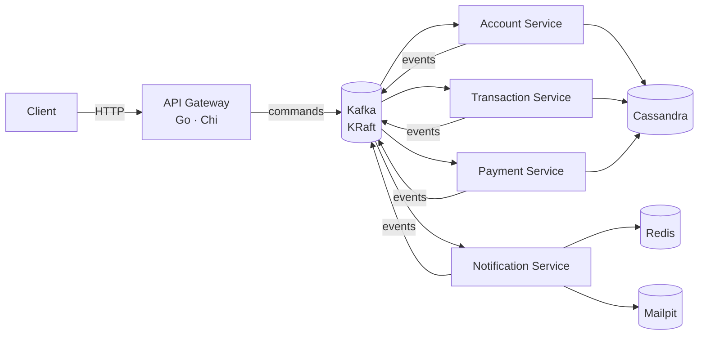

<div align="center">

# Fintech Bank Platform

**Event-driven banking backend in Go** — an HTTP API gateway publishing commands to Kafka, domain microservices consuming them, Cassandra for persistence and Redis for cache.

[](#roadmap)
[](https://github.com/GabeSilvaDev/fintech-bank-platform/actions/workflows/ci.yml)
[](https://go.dev)
[](https://kafka.apache.org)
[](https://cassandra.apache.org)
[](https://redis.io)
[](#development)
[](LICENSE)

**English** · [Português (Brasil)](README.pt-BR.md)

</div>

> **Work in progress.** Infrastructure, shared packages and all five services — the API gateway, the account service, the transaction service, the payment service and the notification service — are in place: commands flow from HTTP to Kafka to Cassandra, deposits, withdrawals and transfers settle as sagas over the account service, PIX, TED and boleto payments settle the same way through a sandbox provider with signed webhooks, and result events turn into e-mail, SMS and push through the notification service, with reads coming back through the gateway. Every service retries its Cassandra or Redis connection at start-up, account credits and debits are idempotent per key, a reconciliation sweeper recovers stuck transactions and payments, and the platform is exercised end to end and under k6 load, on top of its unit, feature and integration tests. Observability is next. See the [roadmap](#roadmap) for what is done and what is planned.

## Architecture



The gateway receives HTTP requests and publishes them as commands on Kafka; each domain service consumes its command topic, persists to Cassandra, and emits result events. The notification service turns those result events into e-mail, SMS and push, using Redis for idempotency and history and Mailpit to catch outgoing e-mail in development.

**Topics** (`pkg/events`): `account.commands`, `transaction.commands`, `payment.commands` for commands; `account.events`, `transaction.events`, `payment.events`, `notification.events` for results; one dead-letter topic per domain. The root compose pre-creates every topic with a `kafka-init` one-shot.

## What exists today

| Component | Path | State |
|---|---|---|
| Infrastructure | `docker-compose.yml` | Kafka 3.7.1 (KRaft), Cassandra 4.1, Redis 7.2, Mailpit, optional Kafka UI and Cassandra Web |
| Shared packages | `pkg/` | `logger`, `errors`, `response`, `validation`, `events`, `env`, `middleware`, `messaging`, `domain`, `cassandra`, `processor`, `retry` — 100 % test coverage, enforced in CI |
| API Gateway | `services/api-gateway/` | Chi router with request-id, real-IP, logging, recovery, CORS and rate-limit middleware; `GET /health`; command endpoints publishing to Kafka through a circuit-breaker-guarded producer; typed config from env; unit + feature tests at 100 % coverage, Kafka integration test in CI; read routes proxied to the account service |
| Account Service | `services/account-service/` | Consumes `account.commands`, retries its Cassandra bootstrap, migrations and keyspace session at start-up (`STARTUP_RETRY_*`), persists customers and accounts in Cassandra (`fintech_accounts`), owns balances with compare-and-set credits/debits that require an `idempotency_key` and apply at most once (`balance_operations`, 30-day TTL), publishes results — including `account.credit_rejected` — on `account.events` and failures on `account.dlq`; read API on `:8082`; unit + feature tests at 100 % of `internal/app`, Cassandra and Kafka integration tests in CI |
| Transaction Service | `services/transaction-service/` | Consumes `transaction.commands` and the account service's replies on `account.events`, retries its Cassandra bootstrap at start-up (`STARTUP_RETRY_*`), records deposits, withdrawals and transfers in Cassandra (`fintech_transactions`), orchestrates each one as a saga over `account.commands` (debit → credit → compensating credit on failure) with per-step idempotency keys, runs a reconciliation sweeper that re-sends the next step of stale non-terminal transactions (`SWEEPER_*`), publishes `transaction.created/completed/failed` and `transaction.transfer_completed/transfer_failed` on `transaction.events`, dead-letters on `transaction.dlq`; read API on `:8083`; unit + feature tests at 100 % of `internal/app`, Cassandra and Kafka integration tests in CI |
| Payment Service | `services/payment-service/` | Consumes `payment.commands` and the account service's replies on `account.events`, retries its Cassandra bootstrap at start-up (`STARTUP_RETRY_*`), stores PIX, TED and boleto payments in Cassandra (`fintech_payments`), reserves funds with `account.debit`, submits to a sandbox provider — PIX settles at once, TED and boleto settle through a signed webhook — refunds rejections with `account.credit`, runs a reconciliation sweeper that re-sends the next step of stale non-terminal payments (`SWEEPER_*`), publishes `payment.created/processed/completed/failed` on `payment.events`, dead-letters on `payment.dlq`; read API and webhook on `:8084`; unit + feature tests at 100 % of `internal/app`, Cassandra and Kafka integration tests in CI |
| Notification Service | `services/notification-service/` | Consumes `account.events`, `transaction.events` and `payment.events` and routes the results as Portuguese e-mail, SMS and push, retrying its Redis ping at start-up (`STARTUP_RETRY_*`), looking up the account service's internal owner endpoint for contacts; delivery commands on `notification.events` are sent over SMTP (Mailpit in development) or sandbox SMS/push providers and recorded in a Redis-backed history, dead-lettering on `notification.dlq`; read API on `:8085`; unit + feature tests at 100 % of `internal/app`, Kafka, Redis and Mailpit integration tests in CI |

### Shared packages

| Package | What it gives every service |
|---|---|
| `logger` | zerolog wrapper with `Config{Level, Pretty, TimeFormat, Output}` and development/production presets |
| `errors` | `AppError` with code, message, HTTP status and details; constructors per status (`BadRequest`, `NotFound`, …) |
| `response` | JSON helpers (`OK`, `Created`, `NoContent`, `BadRequest`, …), `SuccessWithMeta` for pagination, `FromError` to render an `AppError` |
| `validation` | Brazilian and banking validators — CPF, CNPJ, phone, PIX key, agency and account numbers, currency, password strength — as functions and as `validate:"…"` struct tags |
| `events` | Kafka `Event` envelope (id, type, version, source, timestamp, trace id, metadata, payload), topic and event-type catalogs, typed payloads and `NewAccountCommand`-style constructors |
| `env` | typed getters for environment variables |
| `middleware` | request-id, request logging and panic recovery for chi |
| `messaging` | kafka-go producer with publish timeout and a consumer loop with per-message commit that finishes the in-flight message on shutdown (`DrainTimeout`) and restarts with backoff (`RunWithRestart`) |
| `domain` | Shared domain errors (`ErrNotFound`, `ErrConflict`, `ErrAmbiguousWrite`, `Invalid`/`IsInvalid`/`InvalidCode`) and money helpers (`ToCents`, `FromCents`, `Cents`) |
| `cassandra` | `Migrator` that runs the keyspace file first, then every other `.cql` file in order over an `Executor` seam, tracking versions in `schema_migrations`; `MapWriteError` maps ambiguous Cassandra failures to `domain.ErrAmbiguousWrite` |
| `processor` | Idempotent Kafka command processor: dedupes by event id, retries transient errors with backoff, dead-letters the rest, and publishes a dispatcher's reply events |
| `retry` | `Do(ctx, attempts, delay, fn)` retries `fn` with a fixed delay between attempts until it succeeds, the attempts run out or the context is cancelled; used by the four domain services (account, transaction, payment and notification) to wait for Cassandra or Redis at start-up; the API gateway has nothing to wait for |

Usage examples live in [`pkg/README.md`](pkg/README.md).

## Getting started

Requires Docker, Docker Compose and ~4 GB of RAM for the containers. Go 1.25 only if you want to run the services outside Docker.

```bash
git clone https://github.com/GabeSilvaDev/fintech-bank-platform.git
cd fintech-bank-platform
cp .env.example .env

docker compose up -d                  # Kafka + Cassandra + Redis
docker compose --profile ui up -d     # + Kafka UI (:8080) and Cassandra Web (:3000)
docker compose ps                     # wait until everything is healthy (~1–2 min)
```

| Service | Container | Port |
|---|---|---|
| Kafka (KRaft) | `fintech-kafka` | 9092 |
| Cassandra | `fintech-cassandra` | 9042 |
| Redis | `fintech-redis` | 6379 (`REDIS_PORT`) |
| Mailpit | `fintech-mailpit` | 1025 SMTP (`MAILPIT_SMTP_PORT`) · 8025 UI (`MAILPIT_UI_PORT`) |
| Kafka UI *(profile `ui`)* | `fintech-kafka-ui` | 8080 |
| Cassandra Web *(profile `ui`)* | `fintech-cassandra-web` | 3000 |

Redis backs the notification service's idempotency and history; Mailpit catches its outgoing e-mail, with a web UI at http://localhost:8025.

### API Gateway

```bash
cd services/api-gateway
cp .env.example .env
docker compose up -d                  # hot reload with Air, published on :8081
curl http://localhost:8081/health
```

Or natively: `make run` (listens on `SERVER_PORT`, default 8080). Configuration is read from the environment: `SERVER_*` (host, port, timeouts), `CORS_*`, `RATE_LIMIT_REQUESTS` / `RATE_LIMIT_WINDOW`, `KAFKA_BROKERS` / `KAFKA_WRITE_TIMEOUT` / `KAFKA_BATCH_TIMEOUT` / `KAFKA_PUBLISH_TIMEOUT` / `KAFKA_MAX_ATTEMPTS` / `KAFKA_BREAKER_*` and `LOG_LEVEL` / `LOG_PRETTY`.

### Account Service

```bash
cd services/account-service
cp .env.example .env
docker compose up -d                  # hot reload with Air, published on :8082
curl http://localhost:8082/health     # {"success":true,"data":{"status":"healthy","cassandra":"up"}}
```

Connecting to Cassandra, applying migrations in `migrations/*.cql` (against `CASSANDRA_KEYSPACE`, default `fintech_accounts`) and opening the keyspace session are retried at boot up to `STARTUP_RETRY_ATTEMPTS` times (default 30), waiting `STARTUP_RETRY_DELAY` between attempts (default `2s`; a non-positive value falls back to the default). Configuration: `SERVER_*`, `KAFKA_BROKERS` / `KAFKA_GROUP_ID` / `KAFKA_*_TIMEOUT` / `KAFKA_MAX_ATTEMPTS`, `CONSUMER_RETRY_BACKOFF` / `CONSUMER_DRAIN_TIMEOUT`, `CASSANDRA_HOSTS` / `CASSANDRA_KEYSPACE` / `CASSANDRA_CONSISTENCY` / `CASSANDRA_*_TIMEOUT` / `CASSANDRA_MIGRATIONS_PATH`, `STARTUP_RETRY_ATTEMPTS` / `STARTUP_RETRY_DELAY`, `LOG_LEVEL` / `LOG_PRETTY`.

Commands it handles (topic `account.commands`) and the events it answers with (topic `account.events`):

| Command | Result | Dead-letter (`account.dlq`) when |
|---|---|---|
| `account.create` | `account.created` | invalid data, number collision after 5 tries |
| `account.update` | `account.updated` | unknown account, closed account, empty update |
| `account.delete` | `account.deleted` | unknown account, non-zero balance |
| `account.credit` | `account.credited` or `account.credit_rejected` (`account_not_active`, `account_not_found`) — replayed as-is for a repeated `idempotency_key` | invalid amount, currency or idempotency key (`invalid_idempotency_key`, `idempotency_key_reused`), or `ambiguous_write` while that key's outcome is still pending |
| `account.debit` | `account.debited` or `account.debit_rejected` (`insufficient_funds`, `account_not_active`, `account_not_found`) — replayed as-is for a repeated `idempotency_key` | invalid amount, currency or idempotency key (`invalid_idempotency_key`, `idempotency_key_reused`), or `ambiguous_write` while that key's outcome is still pending |

Every `account.credit` and `account.debit` must carry an `idempotency_key` and is applied at most once per `(account_id, idempotency_key)`, tracked in `balance_operations` (30-day TTL, `services/account-service/migrations/007_balance_operations.cql`). A repeated key skips the balance change and replays the stored outcome as the reply — including a stored `insufficient_funds` rejection; a key still reserved by an attempt that crashed before it recorded an outcome is dead-lettered as `ambiguous_write` on every retry until the row expires with the 30-day TTL, since the platform can't tell whether the balance change happened; it needs manual resolution before then, because once the row expires the same key is accepted as new and the balance change would be applied again (which is why the transaction and payment sweepers stop re-sending after `SWEEPER_MAX_AGE`); a key already used for the other kind of operation (a credit retried as a debit, or vice versa) is rejected as `idempotency_key_reused`.

Every command is applied at most once (`processed_events`, 7-day TTL); transient failures are retried with `CONSUMER_RETRY_BACKOFF` and then dead-lettered as `account.command_failed`, with `retries` counting the dispatch attempts. A Cassandra write timeout or unavailable error, a lightweight transaction whose outcome is unknown, a client-side write timeout, or a write whose context was cancelled or expired is dead-lettered right away as `ambiguous_write`, since the write may or may not have been applied and retrying could apply it twice. Because the event id is marked before dispatch, a dead-lettered command replayed as-is is skipped as a duplicate: replays need a new event id. On shutdown the consumer finishes the message in flight (up to `CONSUMER_DRAIN_TIMEOUT`) before committing, and a consumer that stops on an error is restarted with `CONSUMER_RETRY_BACKOFF` while the read API keeps serving.

### Transaction Service

```bash
cd services/transaction-service
cp .env.example .env
docker compose up -d                  # hot reload with Air, published on :8083
curl http://localhost:8083/health     # {"success":true,"data":{"status":"healthy","cassandra":"up"}}
```

Migrations in `migrations/*.cql` run at boot against `CASSANDRA_KEYSPACE` (default `fintech_transactions`); connecting to Cassandra, applying migrations and opening the keyspace session are retried the same way as the account service (`STARTUP_RETRY_ATTEMPTS` / `STARTUP_RETRY_DELAY`). Configuration reuses the account service's variable names, with `SERVER_PORT` defaulting to `8083`, `KAFKA_GROUP_ID` to `transaction-service` and `CASSANDRA_KEYSPACE` to `fintech_transactions`, plus the reconciliation sweeper's `SWEEPER_ENABLED` (default `true`), `SWEEPER_INTERVAL` (default `1m`), `SWEEPER_STALE_AFTER` (default `5m`), `SWEEPER_MAX_AGE` (default `24h`; must be shorter than `720h`, the `balance_operations` TTL, or the service refuses to start) and `SWEEPER_BATCH` (default `100`).

Consumes `transaction.commands` and the account service's replies on `account.events`:

| Topic | Group | Handles |
|---|---|---|
| `transaction.commands` | `KAFKA_GROUP_ID` | `transaction.create` (deposit/withdrawal), `transaction.transfer` |
| `account.events` | `KAFKA_GROUP_ID-replies` | `account.credited`, `account.debited`, `account.debit_rejected`, `account.credit_rejected` |

A transaction is recorded as `pending` with its idempotency key reserved first — a repeated key is a no-op — then driven as a saga over `account.commands`: a deposit or withdrawal asks for a single credit or debit and settles as `completed` or `failed` (`insufficient_funds`, `account_not_active`, `account_not_found`); a transfer debits the source (`pending` → `debited`), credits the counterparty (`debited` → `completed`), and compensates with a credit back to the source if that credit is rejected (`reversing` → `reversed`, or `reversal_failed` plus a `transaction.dlq` entry if the compensation itself is rejected). Every step carries its own idempotency key (`<transaction id>:debit`, `:credit` or `:reversal`) and every status change is a Cassandra lightweight transaction guarded by the expected status, so a duplicate or stale reply is ignored. Results are published on `transaction.events` (`transaction.created`, `transaction.completed`/`transaction.failed`, `transaction.transfer_completed`/`transaction.transfer_failed`); transient failures are retried with `CONSUMER_RETRY_BACKOFF` and then dead-lettered on `transaction.dlq` as `transaction.command_failed`.

If the account service's reply to a step never arrives, the transaction is left stuck; a reconciliation sweeper (`SWEEPER_ENABLED`, on by default) recovers it. Every `SWEEPER_INTERVAL` it scans the whole table, page by page, for non-terminal transactions whose `updated_at` is older than `SWEEPER_STALE_AFTER`, up to `SWEEPER_BATCH` per sweep; each one is "touched" with a lightweight transaction conditioned on the status and `updated_at` it read, so only one service instance acts on it and a transaction another instance already touched simply waits another stale window. Once touched, its next step is re-sent: a `pending` deposit asks for another credit, a `pending` withdrawal or transfer asks for another debit, a `debited` transfer credits the counterparty, and a `reversing` transfer re-sends the reversal credit — reusing the transaction's original per-step idempotency keys, which the account service now deduplicates.

Re-sending stops once a transaction is older than `SWEEPER_MAX_AGE` (measured from `created_at`). The first sweep that finds it past that age touches it one last time and raises a single alert instead of re-sending: a `transaction.command_failed` event on `transaction.dlq` with error code `reconciliation_exhausted` naming the transaction and its status, plus an error-level `reconciliation exhausted` log with the id, status and age. Later sweeps skip it without touching it, so the alert is raised once per transaction. Each sweep scans the whole `transactions` table, on every instance, every `SWEEPER_INTERVAL`; that is fine at this scale, and a separate table holding only the open transactions is the path to keep the sweep proportional to the stuck records once the history grows.

**Known limitations.** Non-terminal transactions (`pending`, `debited` or `reversing`) can be found through `GET /accounts/{account_id}/transactions`; the sweeper described above resolves most of them on its own once they go stale. The exception is a step the account service dead-lettered as `ambiguous_write`: its idempotency key stays `pending` in `balance_operations` until the 30-day TTL expires, so every re-send hits the same `ambiguous_write` outcome until the sweeper reaches `SWEEPER_MAX_AGE` and raises the `reconciliation_exhausted` alert. Such a transaction needs manual resolution: before replaying anything, check the account's balance and the `balance_operations` row for the step's key (`<transaction id>:debit`, `:credit` or `:reversal`) to find out whether the balance change was applied, and resolve it well within the 30 days, since a replay after the key expired is applied again. As with the account service, a dead-lettered event replayed as-is is skipped as a duplicate, so a replay needs a new event id. On first deployment the `-replies` group reads `account.events` from the beginning; that is harmless and one-off, since a reply that does not match a known step is ignored.

**Upgrading to this release.** Transactions that were already stuck before `balance_operations` existed may have had their balance change applied without a key being recorded, so the account service would apply a re-send again. Resolve them by hand before enabling the sweeper (deploy with `SWEEPER_ENABLED=false` until they are).

### Payment Service

```bash
cd services/payment-service
cp .env.example .env
docker compose up -d                  # hot reload with Air, published on :8084
curl http://localhost:8084/health     # {"success":true,"data":{"status":"healthy","cassandra":"up"}}
```

Migrations in `migrations/*.cql` run at boot against `CASSANDRA_KEYSPACE` (default `fintech_payments`); connecting to Cassandra, applying migrations and opening the keyspace session are retried the same way as the account service (`STARTUP_RETRY_ATTEMPTS` / `STARTUP_RETRY_DELAY`). Configuration reuses the transaction service's variable names, with `SERVER_PORT` defaulting to `8084`, `KAFKA_GROUP_ID` to `payment-service`, `CASSANDRA_KEYSPACE` to `fintech_payments` and the same `SWEEPER_*` reconciliation settings (including `SWEEPER_MAX_AGE`, default `24h`, which must be shorter than `720h`), plus `PAYMENT_WEBHOOK_SECRET` (required, at least 16 characters), `PAYMENT_WEBHOOK_URL` (default `http://localhost:8084/webhooks/gateway`), `PAYMENT_WEBHOOK_TOLERANCE` (default `5m`) and `PAYMENT_SETTLEMENT_DELAY` (default `2s`). The `dev-webhook-secret` value in `docker-compose.yml` and `.env.example` is for local development only; anywhere else, replace it with a random secret of at least 16 characters.

Consumes `payment.commands` and the account service's replies on `account.events`:

| Topic | Group | Handles |
|---|---|---|
| `payment.commands` | `KAFKA_GROUP_ID` | `payment.process`, `payment.submit`, `payment.settle` |
| `account.events` | `KAFKA_GROUP_ID-replies` | `account.credited`, `account.debited`, `account.debit_rejected`, `account.credit_rejected` |

A payment is recorded as `pending` with its idempotency key reserved first, then debits the account (`pending` → `debited`) and is submitted to the sandbox provider: PIX settles right away (`completed`), TED and boleto are bound to an external id and wait for a webhook (`debited` → `submitted` → `completed`). A rejection at the debit step fails the payment outright (`failed`, `insufficient_funds`, `account_not_active` or `account_not_found`); a rejection at submission or settlement instead refunds the debit (`refunding`) and lands on `refunded`, or on `refund_failed` plus a `payment.dlq` entry if the refund itself is rejected. Every status change is a Cassandra lightweight transaction guarded by the expected status, and results are published on `payment.events` (`payment.created`, `payment.processed`, `payment.completed`, `payment.failed`).

The sandbox provider reports settlement through a signed webhook: `POST /webhooks/gateway` with body `{external_id, status: settled|rejected, reason}`, headers `X-Timestamp` (unix seconds) and `X-Signature` (hex HMAC-SHA256 of `timestamp + "." + body`), accepted within `PAYMENT_WEBHOOK_TOLERANCE` of the current time. Responses: `202` with the command id, `401 INVALID_SIGNATURE`, `413 PAYLOAD_TOO_LARGE` (body over 64 KiB), `400 INVALID_JSON`, `422 VALIDATION_ERROR`, `503 PUBLISH_FAILED`.

**Sandbox values.**

| Input | Outcome |
|---|---|
| PIX key ending in `@reject.test` | rejected, `pix_key_not_found` |
| TED `bank_code` `999` | rejected, `invalid_destination` |
| Boleto code starting with `999` | rejected, `boleto_not_found` |
| Anything else | settles; TED and boleto settle after `PAYMENT_SETTLEMENT_DELAY` |

If a step's outcome never arrives, a payment is left stuck in `pending`, `debited`, `submitted` or `refunding` — for example when the sandbox loses a scheduled callback because the service restarted before `PAYMENT_SETTLEMENT_DELAY` elapsed. A reconciliation sweeper (`SWEEPER_ENABLED`, on by default) recovers it the same way as the transaction service's: every `SWEEPER_INTERVAL` it scans the whole table for non-terminal payments stale for `SWEEPER_STALE_AFTER`, up to `SWEEPER_BATCH` per sweep, "touching" each one with a lightweight transaction conditioned on the status and `updated_at` it read so only one instance acts on it. A touched `pending` payment is re-debited; a `debited` one gets another `payment.submit`; a `submitted` one is checked against the sandbox provider again — settled completes it, rejected starts a refund, and one still pending simply gets its callback redelivered by the sandbox; a `refunding` payment has its refund credit re-sent. Re-sent commands reuse the payment's original idempotency keys, which the account service now deduplicates.

As in the transaction service, re-sending stops once a payment is older than `SWEEPER_MAX_AGE`: the first sweep past that age touches it one last time and raises a single `payment.command_failed` alert on `payment.dlq` with error code `reconciliation_exhausted` naming the payment and its status, plus an error-level `reconciliation exhausted` log with the id, status and age, and later sweeps skip it without touching it. The sweep scans the whole `payments` table on every instance every `SWEEPER_INTERVAL` — fine at this scale; a table of open payments is the path to scale.

**Known limitations.** Non-terminal payments can be found through `GET /accounts/{account_id}/payments`; the sweeper above resolves most of them on its own once they go stale. The exception is a step the account service dead-lettered as `ambiguous_write`: its idempotency key stays `pending` in `balance_operations` until the 30-day TTL expires, so every re-send hits the same `ambiguous_write` outcome until the sweeper reaches `SWEEPER_MAX_AGE` and raises the `reconciliation_exhausted` alert. Such a payment needs manual resolution: before replaying anything, check the account's balance and the `balance_operations` row for the step's key (`payment:<payment id>:debit` or `:refund`) to find out whether the balance change was applied, and resolve it well within the 30 days, since a replay after the key expired is applied again. Re-submitting a `debited` or `submitted` payment relies on the provider deduplicating submissions by payment id: the sandbox does, but a real provider must be given the payment id as an idempotency key, or a re-sent submission could pay twice. A settlement that arrives before its external id is bound, or while the submission is still being recorded, is retried and dead-lettered as `conflict` if it never lands. As with the other services, a dead-lettered event replayed as-is is skipped as a duplicate, so a replay needs a new event id. On first deployment the service reads `payment.commands` and `account.events` from the beginning.

**Upgrading to this release.** Payments that were already stuck before `balance_operations` existed may have had their debit or refund applied without a key being recorded, so the account service would apply a re-send again. Resolve them by hand before enabling the sweeper (deploy with `SWEEPER_ENABLED=false` until they are).

### Notification Service

```bash
cd services/notification-service
cp .env.example .env
docker compose up -d                  # hot reload with Air, published on :8085
curl http://localhost:8085/health     # {"success":true,"data":{"status":"healthy","redis":"up"}}
```

The Redis ping is retried at boot up to `STARTUP_RETRY_ATTEMPTS` times (default 30), waiting `STARTUP_RETRY_DELAY` between attempts (default `2s`), before the service gives up and exits. Configuration: `SERVER_*`, `KAFKA_BROKERS` / `KAFKA_GROUP_ID` (default `notification-service`) / `KAFKA_*_TIMEOUT` / `KAFKA_MAX_ATTEMPTS`, `CONSUMER_RETRY_BACKOFF` / `CONSUMER_DRAIN_TIMEOUT`, `REDIS_ADDR` / `REDIS_PASSWORD` / `REDIS_DB`, `ACCOUNT_SERVICE_URL` / `ACCOUNT_DIRECTORY_TTL` (default `5m`) / `ACCOUNT_DIRECTORY_TIMEOUT` (default `3s`), `SMTP_ADDR` / `SMTP_FROM` (default `no-reply@fintech.local`) / `SMTP_TIMEOUT` (default `10s`), `NOTIFICATION_HISTORY_SIZE` (default `100`), `NOTIFICATION_MAX_EVENT_AGE` (default `1h`, `0` disables), `STARTUP_RETRY_ATTEMPTS` / `STARTUP_RETRY_DELAY`, `LOG_LEVEL` / `LOG_PRETTY`.

The service runs two kinds of consumer: routing turns domain result events into delivery commands, and delivery sends them and records history.

| Topic | Group | Handles |
|---|---|---|
| `account.events` | `KAFKA_GROUP_ID-accounts` | routes `account.created` |
| `transaction.events` | `KAFKA_GROUP_ID-transactions` | routes `transaction.completed`, `transaction.failed`, `transaction.transfer_completed`, `transaction.transfer_failed` |
| `payment.events` | `KAFKA_GROUP_ID-payments` | routes `payment.completed`, `payment.failed` |
| `notification.events` | `KAFKA_GROUP_ID` | delivers `notification.email`, `notification.sms`, `notification.push`, keyed by user id |

Routing renders one of eight Portuguese templates and turns each result event into the channels below, looking up the account's owner through the account service and skipping accounts it doesn't know about:

| Event | Recipient | Channels |
|---|---|---|
| `account.created` | account owner | e-mail (welcome) |
| `transaction.completed` | account owner | push |
| `transaction.failed` | account owner | push + e-mail |
| `transaction.transfer_completed` | sender and counterparty | push to both |
| `transaction.transfer_failed` | sender | push + e-mail |
| `payment.completed` | account owner | push + e-mail |
| `payment.failed` | account owner | push + e-mail, plus SMS when `status` is `refund_failed` and the owner has a phone |

Transient routing and delivery failures are retried with `CONSUMER_RETRY_BACKOFF` and then dead-lettered as `notification.command_failed` on `notification.dlq`. Contacts come from the account service's internal `GET /accounts/{id}/owner` (`{account_id, user_id, name, email, phone?}`, `404 ACCOUNT_NOT_FOUND`) — not exposed by the gateway — cached in memory for `ACCOUNT_DIRECTORY_TTL`.

Delivery sends e-mail over SMTP — Mailpit in development, with its web UI at http://localhost:8025 — and SMS and push through sandbox providers that just log the message; amounts in templates render as `R$ 1.234,56`. A malformed e-mail recipient is dead-lettered instead of retried, and every SMTP delivery — dial and whole conversation — is bounded by `SMTP_TIMEOUT`. Each event is processed at most once across crashes, because the processed marker is written before delivery: a crash mid-delivery can drop a notification, while an in-process retry after an ambiguous provider error, or a lost dedupe marker (Redis eviction), can repeat one.

Redis keeps a `notification:processed:<event id>` marker for 7 days to dedupe deliveries and a `notification:history:<user id>` list, newest first, capped at `NOTIFICATION_HISTORY_SIZE` and expiring 90 days after the latest notification; the root compose runs Redis with `allkeys-lru` and 128 MB, so deduplication is best-effort once memory pressure evicts old keys. History API: `GET /users/{user_id}/notifications?limit=` (default 20, 1–100, `422` otherwise) → `[{id, channel, recipient, subject?, body, source_event_id?, sent_at}]`, with the recipient masked (`a***@example.com`, `+55*******7766`; push keeps the user id).

Routing consumers read from the earliest retained offset and skip source events older than `NOTIFICATION_MAX_EVENT_AGE` (default `1h`), so a new consumer group or a long outage does not flood customers with stale notifications; the delivery group on `notification.events` also starts from the earliest offset, so a produced delivery command is never missed on redeploy; commands already routed before an outage have no age check and are still delivered late. The 7-day processed-marker TTL must stay longer than Kafka's 24 h log retention, so a replayed event is still recognised as processed.

**Known limitations.** There is no authentication yet: the history endpoint returns message bodies for any user id (recipients masked) and must be limited to the account owner once auth exists. The account service's internal `GET /accounts/{id}/owner` is unauthenticated and not proxied by the gateway; its port is published only for development.

#### Command endpoints

Every write is accepted asynchronously: the gateway validates the body, publishes a command to Kafka and answers `202` with the command id and the trace id (`X-Request-ID`).

| Method | Path | Topic | Event type |
|---|---|---|---|
| `POST` | `/api/v1/accounts` | `account.commands` | `account.create` |
| `PATCH` | `/api/v1/accounts/{id}` | `account.commands` | `account.update` |
| `DELETE` | `/api/v1/accounts/{id}` | `account.commands` | `account.delete` |
| `POST` | `/api/v1/transactions` | `transaction.commands` | `transaction.create` |
| `POST` | `/api/v1/transfers` | `transaction.commands` | `transaction.transfer` |
| `POST` | `/api/v1/payments` | `payment.commands` | `payment.process` |

```bash
curl -s -X POST localhost:8081/api/v1/accounts \
  -H 'Content-Type: application/json' \
  -d '{"user_id":"5d1e7c2a-0a6b-4c1e-9f4e-2b6f7a8c9d01","account_type":"checking","name":"Ana Souza","email":"ana@example.com","document":"52998224725"}'
# {"success":true,"data":{"command_id":"…","trace_id":"…"}}
```

Errors: `400 INVALID_JSON`, `413 PAYLOAD_TOO_LARGE` (body over 1 MiB), `422 VALIDATION_ERROR` (with per-field `details`), `422 EMPTY_UPDATE` (PATCH without fields), `429 RATE_LIMIT_EXCEEDED`, `503 PUBLISH_FAILED` when the broker is unreachable or the circuit is open.

**Transaction flow**: `POST /transactions` (deposit/withdrawal) and `POST /transfers` are accepted with `202`; the transaction service records the transaction as `pending`, asks the account service to debit/credit, and settles it as `completed` or `failed` (`insufficient_funds`, `account_not_active`, `account_not_found`); a transfer whose credit is rejected after the debit is compensated (`reversed`, or `reversal_failed` + `transaction.dlq` when the compensation itself is rejected). The same `idempotency_key` never creates a second transaction.

**Payment flow**: `POST /payments` requires a `ted` object (`bank_code`, `branch`, `account`, `document`) for TED payments — rejected on any other method (`422 ted: excluded`) — and validates `boleto_code`'s check digits (`422 boleto_code: boleto`); the payment service debits the account, submits to a sandbox provider, and settles as `completed` (PIX right away, TED and boleto after a signed webhook) or refunds the debit and settles as `failed`. The same `idempotency_key` never creates a second payment.

#### Read endpoints

Reads are proxied to the account service via `ACCOUNT_SERVICE_URL`, to the transaction service via `TRANSACTION_SERVICE_URL`, to the payment service via `PAYMENT_SERVICE_URL` and to the notification service via `NOTIFICATION_SERVICE_URL` (default `http://localhost:8085`); `502 UPSTREAM_UNAVAILABLE` when the upstream is down.

| Method | Path | Upstream |
|---|---|---|
| `GET` | `/api/v1/accounts/{id}` | `GET /accounts/{id}` → `200` account (`balance` in BRL), `404 ACCOUNT_NOT_FOUND`, `422` |
| `GET` | `/api/v1/users/{user_id}/accounts` | `GET /users/{user_id}/accounts` → `200` list |
| `GET` | `/api/v1/transactions/{id}` | `GET /transactions/{id}` → `200` transaction (`status` pending/debited/completed/failed/reversing/reversed/reversal_failed, balances after each leg), `404 TRANSACTION_NOT_FOUND`, `422` |
| `GET` | `/api/v1/accounts/{account_id}/transactions` | `GET /accounts/{account_id}/transactions?limit=50` → `200` newest first (`limit` 1–200) |
| `GET` | `/api/v1/payments/{id}` | `GET /payments/{id}` → `200` payment (`status` pending/debited/submitted/completed/failed/refunding/refunded/refund_failed), `404 PAYMENT_NOT_FOUND`, `422` |
| `GET` | `/api/v1/accounts/{account_id}/payments` | `GET /accounts/{account_id}/payments?limit=50` → `200` newest first (`limit` 1–200) |
| `GET` | `/api/v1/users/{user_id}/notifications` | `GET /users/{user_id}/notifications?limit=20` → `200` newest first (`limit` 1–100), `422` |

## Development

```bash
# shared packages
cd pkg && make test && make lint            # go test ./... · gofmt check

# api gateway
cd services/api-gateway
make test                                   # unit + feature, coverage of ./internal/...
make test-coverage                          # writes coverage.html
make test-integration                       # needs KAFKA_BROKERS pointing at a broker

# account service
cd services/account-service
make test                                   # unit + feature, coverage of ./internal/app/...
make test-coverage                          # writes coverage.html
make test-integration                       # needs KAFKA_BROKERS and CASSANDRA_HOSTS

# transaction service
cd services/transaction-service
make test                                   # unit + feature, coverage of ./internal/app/...
make test-coverage                          # writes coverage.html
make test-integration                       # needs KAFKA_BROKERS and CASSANDRA_HOSTS

# payment service
cd services/payment-service
make test                                   # unit + feature, coverage of ./internal/app/...
make test-coverage                          # writes coverage.html
make test-integration                       # needs KAFKA_BROKERS and CASSANDRA_HOSTS

# notification service
cd services/notification-service
make test                                   # unit + feature, coverage of ./internal/app/...
make test-coverage                          # writes coverage.html
make test-integration                       # needs KAFKA_BROKERS, REDIS_ADDR, and SMTP_ADDR / MAILPIT_URL pointing at Mailpit
```

### End-to-end and load tests

`scripts/stack.sh` runs the whole platform out of process, for tests that go through the gateway instead of a single service: `up` starts the root infrastructure (Kafka, Cassandra, Redis, Mailpit, plus the `kafka-init` one-shot) under the `fintech-bank-platform` project name and then every service's own compose stack; `wait` polls the gateway's, every domain service's and Mailpit's health endpoints until they answer or `STACK_TIMEOUT` (default 600s) elapses; `logs` dumps the last 200 lines of every service container; `down` tears everything down. It honours `GATEWAY_URL`, `MAILPIT_URL` (built from `MAILPIT_UI_PORT` if unset) and the root compose's own `REDIS_PORT` / `MAILPIT_SMTP_PORT` / `MAILPIT_UI_PORT`.

```bash
scripts/stack.sh up
STACK_TIMEOUT=900 scripts/stack.sh wait
```

`tests/e2e` is a separate Go module (build tag `e2e`) that drives the running stack through the gateway: account creation, deposits/withdrawals/transfers (including a transfer that gets reversed), payments (including sandbox rejections and webhook settlement) and the notifications they trigger. `TestMain` skips the suite if the gateway isn't healthy, unless `E2E_REQUIRED=1` makes that a hard failure instead; `GATEWAY_URL` and `MAILPIT_URL` point it at the stack. The suite fires enough requests to hit the gateway's default rate limit, so `services/api-gateway/docker-compose.yml` now passes `RATE_LIMIT_REQUESTS` through from the environment — raise it when starting the stack (the suite defaults to `GATEWAY_URL=http://localhost:8081` and `MAILPIT_URL=http://localhost:8025`):

```bash
RATE_LIMIT_REQUESTS=100000 scripts/stack.sh up
scripts/stack.sh wait
(cd tests/e2e && E2E_REQUIRED=1 go test -count=1 -tags e2e ./... -v)
scripts/stack.sh down
```

`tests/load` has k6 scenarios exercising the gateway end to end — commands, reads and a raw deposit-throughput benchmark; see [`tests/load/README.md`](tests/load/README.md) for the scripts, scenarios and how to run them.

CI (`.github/workflows/ci.yml`) runs on every push and pull request as seven jobs — `pkg`, `api-gateway` (with a Kafka service container), `account-service`, `transaction-service` and `payment-service` (with Kafka and Cassandra service containers), `notification-service` (with Kafka, Redis and Mailpit service containers) and `e2e` (with `RATE_LIMIT_REQUESTS` raised, running `scripts/stack.sh up`/`wait`, the `tests/e2e` suite and `scripts/stack.sh down`) — running `gofmt` check and the test suites for `pkg`, `api-gateway`, `account-service`, `transaction-service`, `payment-service` and `notification-service`, failing the build if coverage drops below 100 % (of `internal/app` for the account, transaction, payment and notification services).

## Project structure

```
fintech-bank-platform/
├── docker-compose.yml         Kafka · Cassandra · Redis (+ ui profile)
├── .env.example               every variable the platform reads
├── .github/workflows/ci.yml   gofmt + tests + coverage gate
├── scripts/stack.sh           up/down/wait/logs for the whole stack (used by the e2e job)
├── pkg/                       shared Go module
│   ├── logger/  errors/  response/  validation/  events/
│   ├── env/  middleware/  messaging/
│   ├── domain/  cassandra/  processor/  retry/
│   ├── Makefile · Dockerfile · docker-compose.yml
│   └── README.md
├── services/
│   ├── api-gateway/
│   │   ├── cmd/main.go                    entry point
│   │   ├── internal/
│   │   │   ├── config/                    env → typed Config
│   │   │   ├── contracts/                 interfaces for config, context and http
│   │   │   ├── app/handlers/              command endpoints
│   │   │   └── infrastructure/
│   │   │       ├── http/                  server, router, handlers, middleware/
│   │   │       └── messaging/             kafka producer, circuit breaker
│   │   ├── tests/  (unit/ · feature/ · integration/)     testify-style TestCase helpers
│   │   ├── Makefile · Dockerfile · docker-compose.yml · .air.toml
│   │   └── .env.example
│   ├── account-service/
│   │   ├── cmd/main.go                    entry point
│   │   ├── migrations/                    numbered .cql files, applied at boot
│   │   ├── internal/
│   │   │   ├── config/                    env → typed Config
│   │   │   ├── contracts/                 interfaces for config, messaging and repositories
│   │   │   ├── app/
│   │   │   │   ├── models/                domain types
│   │   │   │   ├── services/              account and customer use cases
│   │   │   │   └── handlers/              command dispatcher, DLQ, read endpoints
│   │   │   └── infrastructure/
│   │   │       ├── database/              Cassandra repositories and migrations
│   │   │       └── http/                  server, router, health, read handlers
│   │   ├── tests/  (unit/ · feature/ · integration/)
│   │   ├── Makefile · Dockerfile · docker-compose.yml · .air.toml
│   │   └── .env.example
│   ├── transaction-service/
│   │   ├── cmd/main.go                    entry point
│   │   ├── migrations/                    numbered .cql files, applied at boot
│   │   ├── internal/
│   │   │   ├── config/                    env → typed Config
│   │   │   ├── contracts/                 interfaces for config, messaging and repositories
│   │   │   ├── app/
│   │   │   │   ├── models/                domain types
│   │   │   │   ├── services/              transaction use cases and saga transitions
│   │   │   │   └── handlers/              command and reply dispatchers, read endpoints
│   │   │   └── infrastructure/
│   │   │       ├── database/              Cassandra repositories and migrations
│   │   │       └── http/                  server, router, health, read handlers
│   │   ├── tests/  (unit/ · feature/ · integration/)
│   │   ├── Makefile · Dockerfile · docker-compose.yml · .air.toml
│   │   └── .env.example
│   ├── payment-service/
│   │   ├── cmd/main.go                    entry point
│   │   ├── migrations/                    numbered .cql files, applied at boot
│   │   ├── internal/
│   │   │   ├── config/                    env → typed Config
│   │   │   ├── contracts/                 interfaces for config, messaging and repositories
│   │   │   ├── app/
│   │   │   │   ├── models/                domain types
│   │   │   │   ├── services/              payment use cases and saga transitions
│   │   │   │   └── handlers/              command, reply and webhook dispatchers, read endpoints
│   │   │   └── infrastructure/
│   │   │       ├── database/              Cassandra repositories and migrations
│   │   │       ├── gateway/               sandbox provider simulator
│   │   │       └── http/                  server, router, health, read handlers
│   │   ├── tests/  (unit/ · feature/ · integration/)
│   │   ├── Makefile · Dockerfile · docker-compose.yml · .air.toml
│   │   └── .env.example
│   └── notification-service/
│       ├── cmd/main.go                    entry point
│       ├── internal/
│       │   ├── config/                    env → typed Config
│       │   ├── contracts/                 interfaces for config, messaging, senders and storage
│       │   ├── app/
│       │   │   ├── models/                domain types
│       │   │   ├── services/              routing, rendering and delivery, templates/
│       │   │   └── handlers/              history read endpoint
│       │   └── infrastructure/
│       │       ├── directory/             account service owner client, in-memory cache
│       │       ├── senders/               SMTP and sandbox SMS/push senders
│       │       ├── storage/               Redis client, idempotency store and history
│       │       └── http/                  server, router, health, history handler
│       ├── tests/  (unit/ · feature/ · integration/)
│       ├── Makefile · Dockerfile · docker-compose.yml · .air.toml
│       └── .env.example
└── tests/
    ├── e2e/                    Go module (build tag e2e): accounts, transactions, payments, notifications
    └── load/                   k6 scenarios (commands, reads, throughput) · README.md
```

Each future service follows the same layout: `cmd/`, `internal/{config,contracts,infrastructure,app}` and `tests/`, with `migrations/` (CQL) for the ones that persist to Cassandra.

## Roadmap

- [x] **Sprint 0** — Docker Compose infrastructure (Kafka KRaft, Cassandra, Redis, debug UIs)
- [x] **Shared packages** — logger, errors, response, validation, events, with CI and 100 % coverage
- [x] **Sprint 1 — API Gateway** — HTTP skeleton, middleware, config, Kafka producer with circuit breaker and command endpoints
- [x] **Sprint 2 — Account Service** — customers and accounts in Cassandra, balance with compare-and-set, result events, read API proxied by the gateway
- [x] **Sprint 3 — Transaction Service** — deposits, withdrawals and transfers as sagas over the account service, idempotency keys, compensation, read API proxied by the gateway
- [x] **Sprint 4 — Payment Service** — PIX, TED and boleto as sagas over the account service, sandbox provider with signed webhooks, refunds, read API proxied by the gateway
- [x] **Sprint 5 — Notification Service** — e-mail, SMS and push from result events, templates, Redis-backed idempotency and history, proxied by the gateway
- [x] **Sprint 6** — end-to-end tests, k6 load tests, idempotent balance operations and a reconciliation sweeper for stuck transactions and payments
- [ ] **Sprint 7** — observability (Prometheus, Jaeger) and docs

## License

[MIT](LICENSE) © [Gabriel Silva](https://github.com/GabeSilvaDev)
