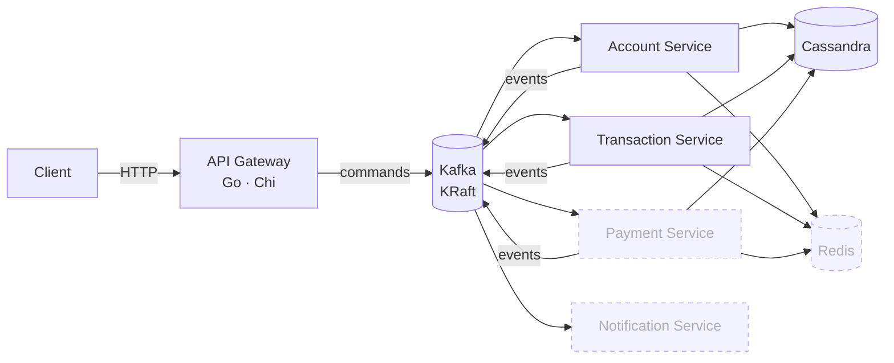

<div align="center">

# Fintech Bank Platform

**Event-driven banking backend in Go** — an HTTP API gateway publishing commands to Kafka, domain microservices consuming them, Cassandra for persistence and Redis for cache.

[](#roadmap)
[](https://github.com/GabeSilvaDev/fintech-bank-platform/actions/workflows/ci.yml)
[](https://go.dev)
[](https://kafka.apache.org)
[](https://cassandra.apache.org)
[](https://redis.io)
[](#development)
[](LICENSE)

**English** · [Português (Brasil)](README.pt-BR.md)

</div>

> **Work in progress.** Infrastructure, shared packages, the API gateway, the account service and the transaction service are in place — commands flow from HTTP to Kafka to Cassandra, deposits, withdrawals and transfers settle as sagas between the two services, and reads come back through the gateway; the payment and notification services are next. See the [roadmap](#roadmap) for what is done and what is planned.

## Architecture



Solid boxes exist today; dashed ones are planned. The gateway receives HTTP requests and publishes them as commands on Kafka; each domain service consumes its command topic, persists to Cassandra, and emits result events. Redis caches hot reads and backs rate limiting.

**Topics** (`pkg/events`): `account.commands`, `transaction.commands`, `payment.commands` for commands; `account.events`, `transaction.events`, `payment.events`, `notification.events` for results; one dead-letter topic per domain. The root compose pre-creates every topic with a `kafka-init` one-shot.

## What exists today

| Component | Path | State |
|---|---|---|
| Infrastructure | `docker-compose.yml` | Kafka 3.7.1 (KRaft), Cassandra 4.1, Redis 7.2, optional Kafka UI and Cassandra Web |
| Shared packages | `pkg/` | `logger`, `errors`, `response`, `validation`, `events`, `env`, `middleware`, `messaging`, `domain`, `cassandra`, `processor` — 100 % test coverage, enforced in CI |
| API Gateway | `services/api-gateway/` | Chi router with request-id, real-IP, logging, recovery, CORS and rate-limit middleware; `GET /health`; command endpoints publishing to Kafka through a circuit-breaker-guarded producer; typed config from env; unit + feature tests at 100 % coverage, Kafka integration test in CI; read routes proxied to the account service |
| Account Service | `services/account-service/` | Consumes `account.commands`, persists customers and accounts in Cassandra (`fintech_accounts`, migrations applied at boot), owns balances with compare-and-set credits/debits, publishes results — including `account.credit_rejected` — on `account.events` and failures on `account.dlq`; read API on `:8082`; unit + feature tests at 100 % of `internal/app`, Cassandra and Kafka integration tests in CI |
| Transaction Service | `services/transaction-service/` | Consumes `transaction.commands` and the account service's replies on `account.events`, records deposits, withdrawals and transfers in Cassandra (`fintech_transactions`, migrations applied at boot), orchestrates each one as a saga over `account.commands` (debit → credit → compensating credit on failure) with per-step idempotency keys, publishes `transaction.created/completed/failed` and `transaction.transfer_completed/transfer_failed` on `transaction.events`, dead-letters on `transaction.dlq`; read API on `:8083`; unit + feature tests at 100 % of `internal/app`, Cassandra and Kafka integration tests in CI |

### Shared packages

| Package | What it gives every service |
|---|---|
| `logger` | zerolog wrapper with `Config{Level, Pretty, TimeFormat, Output}` and development/production presets |
| `errors` | `AppError` with code, message, HTTP status and details; constructors per status (`BadRequest`, `NotFound`, …) |
| `response` | JSON helpers (`OK`, `Created`, `NoContent`, `BadRequest`, …), `SuccessWithMeta` for pagination, `FromError` to render an `AppError` |
| `validation` | Brazilian and banking validators — CPF, CNPJ, phone, PIX key, agency and account numbers, currency, password strength — as functions and as `validate:"…"` struct tags |
| `events` | Kafka `Event` envelope (id, type, version, source, timestamp, trace id, metadata, payload), topic and event-type catalogs, typed payloads and `NewAccountCommand`-style constructors |
| `env` | typed getters for environment variables |
| `middleware` | request-id, request logging and panic recovery for chi |
| `messaging` | kafka-go producer with publish timeout and a consumer loop with per-message commit that finishes the in-flight message on shutdown (`DrainTimeout`) and restarts with backoff (`RunWithRestart`) |
| `domain` | Shared domain errors (`ErrNotFound`, `ErrConflict`, `ErrAmbiguousWrite`, `Invalid`/`IsInvalid`/`InvalidCode`) and money helpers (`ToCents`, `FromCents`, `Cents`) |
| `cassandra` | `Migrator` that runs the keyspace file first, then every other `.cql` file in order over an `Executor` seam, tracking versions in `schema_migrations`; `MapWriteError` maps ambiguous Cassandra failures to `domain.ErrAmbiguousWrite` |
| `processor` | Idempotent Kafka command processor: dedupes by event id, retries transient errors with backoff, dead-letters the rest, and publishes a dispatcher's reply events |

Usage examples live in [`pkg/README.md`](pkg/README.md).

## Getting started

Requires Docker, Docker Compose and ~4 GB of RAM for the containers. Go 1.25 only if you want to run the services outside Docker.

```bash
git clone https://github.com/GabeSilvaDev/fintech-bank-platform.git
cd fintech-bank-platform
cp .env.example .env

docker compose up -d                  # Kafka + Cassandra + Redis
docker compose --profile ui up -d     # + Kafka UI (:8080) and Cassandra Web (:3000)
docker compose ps                     # wait until everything is healthy (~1–2 min)
```

| Service | Container | Port |
|---|---|---|
| Kafka (KRaft) | `fintech-kafka` | 9092 |
| Cassandra | `fintech-cassandra` | 9042 |
| Redis | `fintech-redis` | 6379 |
| Kafka UI *(profile `ui`)* | `fintech-kafka-ui` | 8080 |
| Cassandra Web *(profile `ui`)* | `fintech-cassandra-web` | 3000 |

### API Gateway

```bash
cd services/api-gateway
cp .env.example .env
docker compose up -d                  # hot reload with Air, published on :8081
curl http://localhost:8081/health
```

Or natively: `make run` (listens on `SERVER_PORT`, default 8080). Configuration is read from the environment: `SERVER_*` (host, port, timeouts), `CORS_*`, `RATE_LIMIT_REQUESTS` / `RATE_LIMIT_WINDOW`, `KAFKA_BROKERS` / `KAFKA_WRITE_TIMEOUT` / `KAFKA_BATCH_TIMEOUT` / `KAFKA_PUBLISH_TIMEOUT` / `KAFKA_MAX_ATTEMPTS` / `KAFKA_BREAKER_*` and `LOG_LEVEL` / `LOG_PRETTY`.

### Account Service

```bash
cd services/account-service
cp .env.example .env
docker compose up -d                  # hot reload with Air, published on :8082
curl http://localhost:8082/health     # {"success":true,"data":{"status":"healthy","cassandra":"up"}}
```

Migrations in `migrations/*.cql` run at boot against `CASSANDRA_KEYSPACE` (default `fintech_accounts`). Configuration: `SERVER_*`, `KAFKA_BROKERS` / `KAFKA_GROUP_ID` / `KAFKA_*_TIMEOUT` / `KAFKA_MAX_ATTEMPTS`, `CONSUMER_RETRY_BACKOFF` / `CONSUMER_DRAIN_TIMEOUT`, `CASSANDRA_HOSTS` / `CASSANDRA_KEYSPACE` / `CASSANDRA_CONSISTENCY` / `CASSANDRA_*_TIMEOUT` / `CASSANDRA_MIGRATIONS_PATH`, `LOG_LEVEL` / `LOG_PRETTY`.

Commands it handles (topic `account.commands`) and the events it answers with (topic `account.events`):

| Command | Result | Dead-letter (`account.dlq`) when |
|---|---|---|
| `account.create` | `account.created` | invalid data, number collision after 5 tries |
| `account.update` | `account.updated` | unknown account, closed account, empty update |
| `account.delete` | `account.deleted` | unknown account, non-zero balance |
| `account.credit` | `account.credited` or `account.credit_rejected` (`account_not_active`, `account_not_found`) | invalid amount or currency |
| `account.debit` | `account.debited` or `account.debit_rejected` (`insufficient_funds`, `account_not_active`, `account_not_found`) | invalid amount or currency |

Every command is applied at most once (`processed_events`, 7-day TTL); transient failures are retried with `CONSUMER_RETRY_BACKOFF` and then dead-lettered as `account.command_failed`, with `retries` counting the dispatch attempts. A Cassandra write timeout or unavailable error, a client-side write timeout, or a write whose context was cancelled or expired is dead-lettered right away as `ambiguous_write`, since the write may or may not have been applied and retrying could apply it twice. Because the event id is marked before dispatch, a dead-lettered command replayed as-is is skipped as a duplicate: replays need a new event id. On shutdown the consumer finishes the message in flight (up to `CONSUMER_DRAIN_TIMEOUT`) before committing, and a consumer that stops on an error is restarted with `CONSUMER_RETRY_BACKOFF` while the read API keeps serving.

### Transaction Service

```bash
cd services/transaction-service
cp .env.example .env
docker compose up -d                  # hot reload with Air, published on :8083
curl http://localhost:8083/health     # {"success":true,"data":{"status":"healthy","cassandra":"up"}}
```

Migrations in `migrations/*.cql` run at boot against `CASSANDRA_KEYSPACE` (default `fintech_transactions`). Configuration reuses the account service's variable names, with `SERVER_PORT` defaulting to `8083`, `KAFKA_GROUP_ID` to `transaction-service` and `CASSANDRA_KEYSPACE` to `fintech_transactions`.

Consumes `transaction.commands` and the account service's replies on `account.events`:

| Topic | Group | Handles |
|---|---|---|
| `transaction.commands` | `KAFKA_GROUP_ID` | `transaction.create` (deposit/withdrawal), `transaction.transfer` |
| `account.events` | `KAFKA_GROUP_ID-replies` | `account.credited`, `account.debited`, `account.debit_rejected`, `account.credit_rejected` |

A transaction is recorded as `pending` with its idempotency key reserved first — a repeated key is a no-op — then driven as a saga over `account.commands`: a deposit or withdrawal asks for a single credit or debit and settles as `completed` or `failed` (`insufficient_funds`, `account_not_active`, `account_not_found`); a transfer debits the source (`pending` → `debited`), credits the counterparty (`debited` → `completed`), and compensates with a credit back to the source if that credit is rejected (`reversing` → `reversed`, or `reversal_failed` plus a `transaction.dlq` entry if the compensation itself is rejected). Every step carries its own idempotency key (`<transaction id>:debit`, `:credit` or `:reversal`) and every status change is a Cassandra lightweight transaction guarded by the expected status, so a duplicate or stale reply is ignored. Results are published on `transaction.events` (`transaction.created`, `transaction.completed`/`transaction.failed`, `transaction.transfer_completed`/`transaction.transfer_failed`); transient failures are retried with `CONSUMER_RETRY_BACKOFF` and then dead-lettered on `transaction.dlq` as `transaction.command_failed`.

#### Command endpoints

Every write is accepted asynchronously: the gateway validates the body, publishes a command to Kafka and answers `202` with the command id and the trace id (`X-Request-ID`).

| Method | Path | Topic | Event type |
|---|---|---|---|
| `POST` | `/api/v1/accounts` | `account.commands` | `account.create` |
| `PATCH` | `/api/v1/accounts/{id}` | `account.commands` | `account.update` |
| `DELETE` | `/api/v1/accounts/{id}` | `account.commands` | `account.delete` |
| `POST` | `/api/v1/transactions` | `transaction.commands` | `transaction.create` |
| `POST` | `/api/v1/transfers` | `transaction.commands` | `transaction.transfer` |
| `POST` | `/api/v1/payments` | `payment.commands` | `payment.process` |

```bash
curl -s -X POST localhost:8081/api/v1/accounts \
  -H 'Content-Type: application/json' \
  -d '{"user_id":"5d1e7c2a-0a6b-4c1e-9f4e-2b6f7a8c9d01","account_type":"checking","name":"Ana Souza","email":"ana@example.com","document":"52998224725"}'
# {"success":true,"data":{"command_id":"…","trace_id":"…"}}
```

Errors: `400 INVALID_JSON`, `413 PAYLOAD_TOO_LARGE` (body over 1 MiB), `422 VALIDATION_ERROR` (with per-field `details`), `422 EMPTY_UPDATE` (PATCH without fields), `429 RATE_LIMIT_EXCEEDED`, `503 PUBLISH_FAILED` when the broker is unreachable or the circuit is open.

**Transaction flow**: `POST /transactions` (deposit/withdrawal) and `POST /transfers` are accepted with `202`; the transaction service records the transaction as `pending`, asks the account service to debit/credit, and settles it as `completed` or `failed` (`insufficient_funds`, `account_not_active`, `account_not_found`); a transfer whose credit is rejected after the debit is compensated (`reversed`, or `reversal_failed` + `transaction.dlq` when the compensation itself is rejected). The same `idempotency_key` never creates a second transaction.

#### Read endpoints

Reads are proxied to the account service via `ACCOUNT_SERVICE_URL` and to the transaction service via `TRANSACTION_SERVICE_URL`; `502 UPSTREAM_UNAVAILABLE` when the upstream is down.

| Method | Path | Upstream |
|---|---|---|
| `GET` | `/api/v1/accounts/{id}` | `GET /accounts/{id}` → `200` account (`balance` in BRL), `404 ACCOUNT_NOT_FOUND`, `422` |
| `GET` | `/api/v1/users/{user_id}/accounts` | `GET /users/{user_id}/accounts` → `200` list |
| `GET` | `/api/v1/transactions/{id}` | `GET /transactions/{id}` → `200` transaction (`status` pending/debited/completed/failed/reversing/reversed/reversal_failed, balances after each leg), `404 TRANSACTION_NOT_FOUND`, `422` |
| `GET` | `/api/v1/accounts/{account_id}/transactions` | `GET /accounts/{account_id}/transactions?limit=50` → `200` newest first (`limit` 1–200) |

## Development

```bash
# shared packages
cd pkg && make test && make lint            # go test ./... · gofmt check

# api gateway
cd services/api-gateway
make test                                   # unit + feature, coverage of ./internal/...
make test-coverage                          # writes coverage.html
make test-integration                       # needs KAFKA_BROKERS pointing at a broker

# account service
cd services/account-service
make test                                   # unit + feature, coverage of ./internal/app/...
make test-coverage                          # writes coverage.html
make test-integration                       # needs KAFKA_BROKERS and CASSANDRA_HOSTS

# transaction service
cd services/transaction-service
make test                                   # unit + feature, coverage of ./internal/app/...
make test-coverage                          # writes coverage.html
make test-integration                       # needs KAFKA_BROKERS and CASSANDRA_HOSTS
```

CI (`.github/workflows/ci.yml`) runs on every push and pull request as four jobs — `pkg`, `api-gateway` (with a Kafka service container), `account-service` and `transaction-service` (the last two with Kafka and Cassandra service containers) — running `gofmt` check and the test suites for `pkg`, `api-gateway`, `account-service` and `transaction-service`, failing the build if coverage drops below 100 % (of `internal/app` for the account and transaction services).

## Project structure

```
fintech-bank-platform/
├── docker-compose.yml         Kafka · Cassandra · Redis (+ ui profile)
├── .env.example               every variable the platform reads
├── .github/workflows/ci.yml   gofmt + tests + coverage gate
├── pkg/                       shared Go module
│   ├── logger/  errors/  response/  validation/  events/
│   ├── env/  middleware/  messaging/
│   ├── domain/  cassandra/  processor/
│   ├── Makefile · Dockerfile · docker-compose.yml
│   └── README.md
└── services/
    ├── api-gateway/
    │   ├── cmd/main.go                    entry point
    │   ├── internal/
    │   │   ├── config/                    env → typed Config
    │   │   ├── contracts/                 interfaces for config, context and http
    │   │   ├── app/handlers/              command endpoints
    │   │   └── infrastructure/
    │   │       ├── http/                  server, router, handlers, middleware/
    │   │       └── messaging/             kafka producer, circuit breaker
    │   ├── tests/  (unit/ · feature/ · integration/)     testify-style TestCase helpers
    │   ├── Makefile · Dockerfile · docker-compose.yml · .air.toml
    │   └── .env.example
    ├── account-service/
    │   ├── cmd/main.go                    entry point
    │   ├── migrations/                    numbered .cql files, applied at boot
    │   ├── internal/
    │   │   ├── config/                    env → typed Config
    │   │   ├── contracts/                 interfaces for config, messaging and repositories
    │   │   ├── app/
    │   │   │   ├── models/                domain types
    │   │   │   ├── services/              account and customer use cases
    │   │   │   └── handlers/              command dispatcher, DLQ, read endpoints
    │   │   └── infrastructure/
    │   │       ├── database/              Cassandra repositories and migrations
    │   │       └── http/                  server, router, health, read handlers
    │   ├── tests/  (unit/ · feature/ · integration/)
    │   ├── Makefile · Dockerfile · docker-compose.yml · .air.toml
    │   └── .env.example
    └── transaction-service/
        ├── cmd/main.go                    entry point
        ├── migrations/                    numbered .cql files, applied at boot
        ├── internal/
        │   ├── config/                    env → typed Config
        │   ├── contracts/                 interfaces for config, messaging and repositories
        │   ├── app/
        │   │   ├── models/                domain types
        │   │   ├── services/              transaction use cases and saga transitions
        │   │   └── handlers/              command and reply dispatchers, read endpoints
        │   └── infrastructure/
        │       ├── database/              Cassandra repositories
        │       └── http/                  server, router, health, read handlers
        ├── tests/  (unit/ · feature/ · integration/)
        ├── Makefile · Dockerfile · docker-compose.yml · .air.toml
        └── .env.example
```

Each future service follows the same layout: `cmd/`, `internal/{config,contracts,infrastructure,app}`, `migrations/` (CQL) and `tests/`.

## Roadmap

- [x] **Sprint 0** — Docker Compose infrastructure (Kafka KRaft, Cassandra, Redis, debug UIs)
- [x] **Shared packages** — logger, errors, response, validation, events, with CI and 100 % coverage
- [x] **Sprint 1 — API Gateway** — HTTP skeleton, middleware, config, Kafka producer with circuit breaker and command endpoints
- [x] **Sprint 2 — Account Service** — customers and accounts in Cassandra, balance with compare-and-set, result events, read API proxied by the gateway
- [x] **Sprint 3 — Transaction Service** — deposits, withdrawals and transfers as sagas over the account service, idempotency keys, compensation, read API proxied by the gateway
- [ ] **Sprint 4 — Payment Service** — PIX, TED and boleto flows
- [ ] **Sprint 5 — Notification Service** — e-mail, SMS and push consumers
- [ ] **Sprint 6** — end-to-end tests and load tests
- [ ] **Sprint 7** — observability (Prometheus, Jaeger) and docs

## License

[MIT](LICENSE) © [Gabriel Silva](https://github.com/GabeSilvaDev)
