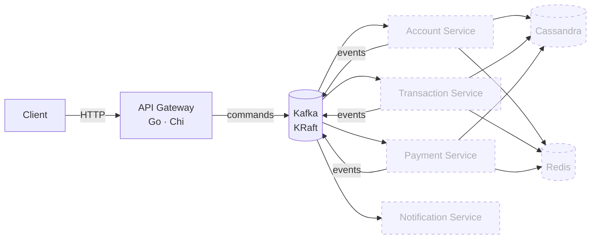

<div align="center">

# Fintech Bank Platform

**Event-driven banking backend in Go** — an HTTP API gateway publishing commands to Kafka, domain microservices consuming them, Cassandra for persistence and Redis for cache.

[](#roadmap)
[](https://github.com/GabeSilvaDev/fintech-bank-platform/actions/workflows/ci.yml)
[](https://go.dev)
[](https://kafka.apache.org)
[](https://cassandra.apache.org)
[](https://redis.io)
[](#development)
[](LICENSE)

**English** · [Português (Brasil)](README.pt-BR.md)

</div>

> **Work in progress.** The infrastructure, the shared packages and the API gateway skeleton are in place; the domain services are next. See the [roadmap](#roadmap) for what is done and what is planned.

## Architecture



Solid boxes exist today; dashed ones are planned. The gateway receives HTTP requests and will publish them as commands on Kafka; each domain service consumes its command topic, persists to Cassandra, and emits result events. Redis caches hot reads and backs rate limiting.

**Topics** (`pkg/events`): `account.commands`, `transaction.commands`, `payment.commands` for commands; `account.events`, `transaction.events`, `payment.events`, `notification.events` for results; one dead-letter topic per domain.

## What exists today

| Component | Path | State |
|---|---|---|
| Infrastructure | `docker-compose.yml` | Kafka 3.7.1 (KRaft), Cassandra 4.1, Redis 7.2, optional Kafka UI and Cassandra Web |
| Shared packages | `pkg/` | `logger`, `errors`, `response`, `validation`, `events` — 100 % test coverage, enforced in CI |
| API Gateway | `services/api-gateway/` | Chi router with request-id, recovery, real-IP, CORS and rate-limit middleware; `GET /health`; typed config from env; unit + feature tests at 100 % coverage |

### Shared packages

| Package | What it gives every service |
|---|---|
| `logger` | zerolog wrapper with `Config{Level, Pretty, TimeFormat, Output}` and development/production presets |
| `errors` | `AppError` with code, message, HTTP status and details; constructors per status (`BadRequest`, `NotFound`, …) |
| `response` | JSON helpers (`OK`, `Created`, `NoContent`, `BadRequest`, …), `SuccessWithMeta` for pagination, `FromError` to render an `AppError` |
| `validation` | Brazilian and banking validators — CPF, CNPJ, phone, PIX key, agency and account numbers, currency, password strength — as functions and as `validate:"…"` struct tags |
| `events` | Kafka `Event` envelope (id, type, version, source, timestamp, trace id, metadata, payload), topic and event-type catalogs, typed payloads and `NewAccountCommand`-style constructors |

Usage examples live in [`pkg/README.md`](pkg/README.md).

## Getting started

Requires Docker, Docker Compose and ~4 GB of RAM for the containers. Go 1.25 only if you want to run the services outside Docker.

```bash
git clone https://github.com/GabeSilvaDev/fintech-bank-platform.git
cd fintech-bank-platform
cp .env.example .env

docker compose up -d                  # Kafka + Cassandra + Redis
docker compose --profile ui up -d     # + Kafka UI (:8080) and Cassandra Web (:3000)
docker compose ps                     # wait until everything is healthy (~1–2 min)
```

| Service | Container | Port |
|---|---|---|
| Kafka (KRaft) | `fintech-kafka` | 9092 |
| Cassandra | `fintech-cassandra` | 9042 |
| Redis | `fintech-redis` | 6379 |
| Kafka UI *(profile `ui`)* | `fintech-kafka-ui` | 8080 |
| Cassandra Web *(profile `ui`)* | `fintech-cassandra-web` | 3000 |

### API Gateway

```bash
cd services/api-gateway
cp .env.example .env
docker compose up -d                  # hot reload with Air, published on :8081
curl http://localhost:8081/health
```

Or natively: `make run` (listens on `SERVER_PORT`, default 8080). Configuration is read from the environment: `SERVER_*` (host, port, timeouts), `CORS_*` and `RATE_LIMIT_REQUESTS` / `RATE_LIMIT_WINDOW`.

## Development

```bash
# shared packages
cd pkg && make test && make lint            # go test ./... · gofmt check

# api gateway
cd services/api-gateway
make test                                   # unit + feature, coverage of ./internal/...
make test-coverage                          # writes coverage.html
```

CI (`.github/workflows/ci.yml`) runs on every push and pull request: `gofmt` check and the test suites for `pkg` and `api-gateway`, failing the build if coverage drops below 100 %.

## Project structure

```
fintech-bank-platform/
├── docker-compose.yml         Kafka · Cassandra · Redis (+ ui profile)
├── .env.example               every variable the platform reads
├── .github/workflows/ci.yml   gofmt + tests + coverage gate
├── pkg/                       shared Go module
│   ├── logger/  errors/  response/  validation/  events/
│   ├── Makefile · Dockerfile · docker-compose.yml
│   └── README.md
└── services/
    └── api-gateway/
        ├── cmd/main.go                    entry point
        ├── internal/
        │   ├── config/                    env → typed Config
        │   ├── contracts/                 interfaces for config, context and http
        │   └── infrastructure/http/       server, router, handlers, middleware/
        ├── tests/  (unit/ · feature/)     testify-style TestCase helpers
        ├── Makefile · Dockerfile · docker-compose.yml · .air.toml
        └── .env.example
```

Each future service follows the same layout: `cmd/`, `internal/{config,contracts,infrastructure,app}`, `migrations/` (CQL) and `tests/`.

## Roadmap

- [x] **Sprint 0** — Docker Compose infrastructure (Kafka KRaft, Cassandra, Redis, debug UIs)
- [x] **Shared packages** — logger, errors, response, validation, events, with CI and 100 % coverage
- [~] **Sprint 1 — API Gateway** — HTTP skeleton, middleware and config done; Kafka producer and command endpoints pending
- [ ] **Sprint 2 — Account Service** — account and customer CRUD, Cassandra keyspace and migrations
- [ ] **Sprint 3 — Transaction Service** — transfers with idempotency and balance checks
- [ ] **Sprint 4 — Payment Service** — PIX, TED and boleto flows
- [ ] **Sprint 5 — Notification Service** — e-mail, SMS and push consumers
- [ ] **Sprint 6** — end-to-end tests and load tests
- [ ] **Sprint 7** — observability (Prometheus, Jaeger) and docs

## License

[MIT](LICENSE) © [Gabriel Silva](https://github.com/GabeSilvaDev)
