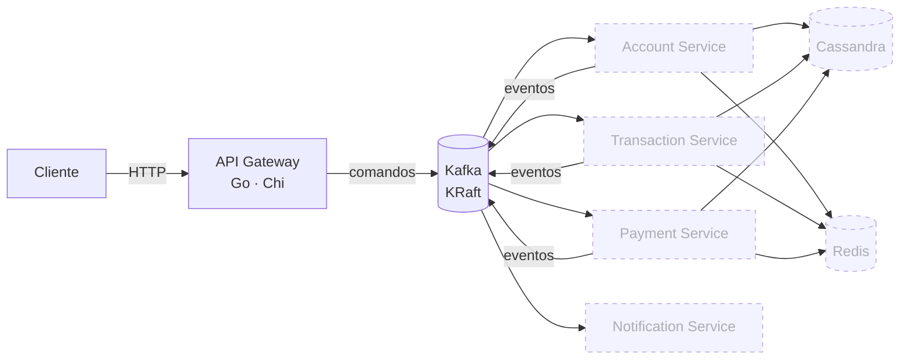

<div align="center">

# Fintech Bank Platform

**Backend bancário event-driven em Go** — um API gateway HTTP publicando comandos no Kafka, microserviços de domínio consumindo, Cassandra para persistência e Redis para cache.

[](#roadmap)
[](https://github.com/GabeSilvaDev/fintech-bank-platform/actions/workflows/ci.yml)
[](https://go.dev)
[](https://kafka.apache.org)
[](https://cassandra.apache.org)
[](https://redis.io)
[](#desenvolvimento)
[](LICENSE)

[English](README.md) · **Português (Brasil)**

</div>

> **Em desenvolvimento.** A infraestrutura, os pacotes compartilhados e o esqueleto do API gateway estão prontos; os serviços de domínio vêm a seguir. Veja o [roadmap](#roadmap) para o que está feito e o que está planejado.

## Arquitetura



Caixas sólidas existem hoje; tracejadas são planejadas. O gateway recebe requisições HTTP e vai publicá-las como comandos no Kafka; cada serviço de domínio consome seu tópico de comandos, persiste no Cassandra e emite eventos de resultado. O Redis guarda leituras quentes e sustenta o rate limiting.

**Tópicos** (`pkg/events`): `account.commands`, `transaction.commands`, `payment.commands` para comandos; `account.events`, `transaction.events`, `payment.events`, `notification.events` para resultados; um tópico de dead-letter por domínio.

## O que existe hoje

| Componente | Caminho | Estado |
|---|---|---|
| Infraestrutura | `docker-compose.yml` | Kafka 3.7.1 (KRaft), Cassandra 4.1, Redis 7.2, Kafka UI e Cassandra Web opcionais |
| Pacotes compartilhados | `pkg/` | `logger`, `errors`, `response`, `validation`, `events` — 100 % de cobertura, exigida no CI |
| API Gateway | `services/api-gateway/` | Router Chi com middlewares de request-id, recovery, real-IP, CORS e rate limit; `GET /health`; config tipada a partir do ambiente; testes unitários + de feature com 100 % de cobertura |

### Pacotes compartilhados

| Pacote | O que dá a cada serviço |
|---|---|
| `logger` | Wrapper do zerolog com `Config{Level, Pretty, TimeFormat, Output}` e presets de desenvolvimento/produção |
| `errors` | `AppError` com código, mensagem, status HTTP e detalhes; construtores por status (`BadRequest`, `NotFound`, …) |
| `response` | Helpers JSON (`OK`, `Created`, `NoContent`, `BadRequest`, …), `SuccessWithMeta` para paginação, `FromError` para renderizar um `AppError` |
| `validation` | Validadores brasileiros e bancários — CPF, CNPJ, telefone, chave PIX, agência e conta, moeda, força de senha — como funções e como tags `validate:"…"` |
| `events` | Envelope `Event` do Kafka (id, tipo, versão, origem, timestamp, trace id, metadata, payload), catálogos de tópicos e tipos de evento, payloads tipados e construtores como `NewAccountCommand` |

Exemplos de uso em [`pkg/README.md`](pkg/README.md).

## Como rodar

Requer Docker, Docker Compose e ~4 GB de RAM para os containers. Go 1.25 só se quiser rodar os serviços fora do Docker.

```bash
git clone https://github.com/GabeSilvaDev/fintech-bank-platform.git
cd fintech-bank-platform
cp .env.example .env

docker compose up -d                  # Kafka + Cassandra + Redis
docker compose --profile ui up -d     # + Kafka UI (:8080) e Cassandra Web (:3000)
docker compose ps                     # espere tudo ficar healthy (~1–2 min)
```

| Serviço | Container | Porta |
|---|---|---|
| Kafka (KRaft) | `fintech-kafka` | 9092 |
| Cassandra | `fintech-cassandra` | 9042 |
| Redis | `fintech-redis` | 6379 |
| Kafka UI *(profile `ui`)* | `fintech-kafka-ui` | 8080 |
| Cassandra Web *(profile `ui`)* | `fintech-cassandra-web` | 3000 |

### API Gateway

```bash
cd services/api-gateway
cp .env.example .env
docker compose up -d                  # hot reload com Air, publicado em :8081
curl http://localhost:8081/health
```

Ou nativo: `make run` (escuta em `SERVER_PORT`, padrão 8080). A configuração vem do ambiente: `SERVER_*` (host, porta, timeouts), `CORS_*` e `RATE_LIMIT_REQUESTS` / `RATE_LIMIT_WINDOW`.

## Desenvolvimento

```bash
# pacotes compartilhados
cd pkg && make test && make lint            # go test ./... · checagem de gofmt

# api gateway
cd services/api-gateway
make test                                   # unit + feature, cobertura de ./internal/...
make test-coverage                          # gera coverage.html
```

O CI (`.github/workflows/ci.yml`) roda a cada push e pull request: checagem de `gofmt` e as suítes de `pkg` e `api-gateway`, falhando o build se a cobertura cair abaixo de 100 %.

## Estrutura do projeto

```
fintech-bank-platform/
├── docker-compose.yml         Kafka · Cassandra · Redis (+ profile ui)
├── .env.example               todas as variáveis que a plataforma lê
├── .github/workflows/ci.yml   gofmt + testes + gate de cobertura
├── pkg/                       módulo Go compartilhado
│   ├── logger/  errors/  response/  validation/  events/
│   ├── Makefile · Dockerfile · docker-compose.yml
│   └── README.md
└── services/
    └── api-gateway/
        ├── cmd/main.go                    ponto de entrada
        ├── internal/
        │   ├── config/                    env → Config tipada
        │   ├── contracts/                 interfaces de config, contexto e http
        │   └── infrastructure/http/       server, router, handlers, middleware/
        ├── tests/  (unit/ · feature/)     helpers TestCase no estilo testify
        ├── Makefile · Dockerfile · docker-compose.yml · .air.toml
        └── .env.example
```

Cada serviço futuro segue o mesmo layout: `cmd/`, `internal/{config,contracts,infrastructure,app}`, `migrations/` (CQL) e `tests/`.

## Roadmap

- [x] **Sprint 0** — infraestrutura em Docker Compose (Kafka KRaft, Cassandra, Redis, UIs de debug)
- [x] **Pacotes compartilhados** — logger, errors, response, validation, events, com CI e 100 % de cobertura
- [~] **Sprint 1 — API Gateway** — esqueleto HTTP, middlewares e config prontos; producer Kafka e endpoints de comando pendentes
- [ ] **Sprint 2 — Account Service** — CRUD de contas e clientes, keyspace e migrations no Cassandra
- [ ] **Sprint 3 — Transaction Service** — transferências com idempotência e checagem de saldo
- [ ] **Sprint 4 — Payment Service** — fluxos de PIX, TED e boleto
- [ ] **Sprint 5 — Notification Service** — consumidores de e-mail, SMS e push
- [ ] **Sprint 6** — testes end-to-end e de carga
- [ ] **Sprint 7** — observabilidade (Prometheus, Jaeger) e docs

## Licença

[MIT](LICENSE) © [Gabriel Silva](https://github.com/GabeSilvaDev)
