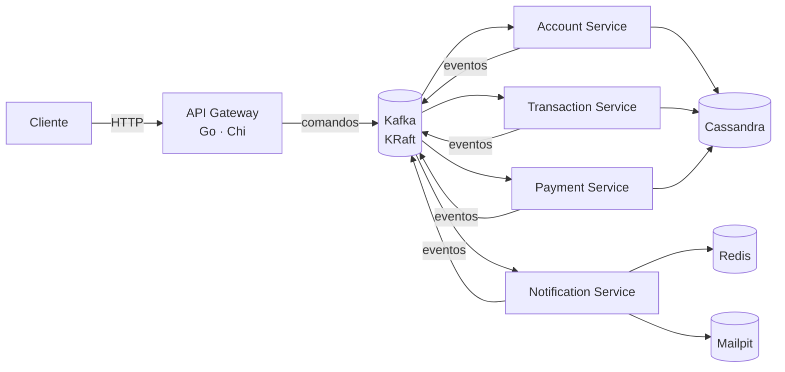

<div align="center">

# Fintech Bank Platform

**Backend bancário event-driven em Go** — um API gateway HTTP publicando comandos no Kafka, microserviços de domínio consumindo, Cassandra para persistência e Redis para cache.

[](#roadmap)
[](https://github.com/GabeSilvaDev/fintech-bank-platform/actions/workflows/ci.yml)
[](https://go.dev)
[](https://kafka.apache.org)
[](https://cassandra.apache.org)
[](https://redis.io)
[](#desenvolvimento)
[](LICENSE)

[English](README.md) · **Português (Brasil)**

</div>

> **Em desenvolvimento.** Infraestrutura, pacotes compartilhados e os cinco serviços — o API Gateway, o Account Service, o Transaction Service, o Payment Service e o Notification Service — estão prontos: os comandos fluem do HTTP para o Kafka e para o Cassandra, depósitos, saques e transferências se resolvem como sagas sobre o account service, pagamentos por PIX, TED e boleto se resolvem da mesma forma através de um provedor sandbox com webhooks assinados, e os eventos de resultado viram e-mail, SMS e push através do notification service, com as leituras voltando pelo gateway. Cada serviço tenta reconectar ao Cassandra ou ao Redis no boot, os créditos e débitos de conta são idempotentes por chave, um sweeper de reconciliação recupera transações e pagamentos presos, e a plataforma é testada de ponta a ponta e sob carga com k6, além dos testes unitários, de feature e de integração. Observabilidade vem a seguir. Veja o [roadmap](#roadmap) para o que está feito e o que está planejado.

## Arquitetura



O gateway recebe requisições HTTP e publica-as como comandos no Kafka; cada serviço de domínio consome seu tópico de comandos, persiste no Cassandra e emite eventos de resultado. O Notification Service transforma esses eventos de resultado em e-mail, SMS e push, usando o Redis para idempotência e histórico e o Mailpit para capturar os e-mails enviados em desenvolvimento.

**Tópicos** (`pkg/events`): `account.commands`, `transaction.commands`, `payment.commands` para comandos; `account.events`, `transaction.events`, `payment.events`, `notification.events` para resultados; um tópico de dead-letter por domínio. O compose raiz pré-cria todos os tópicos com um one-shot `kafka-init`.

## O que existe hoje

| Componente | Caminho | Estado |
|---|---|---|
| Infraestrutura | `docker-compose.yml` | Kafka 3.7.1 (KRaft), Cassandra 4.1, Redis 7.2, Mailpit, Kafka UI e Cassandra Web opcionais |
| Pacotes compartilhados | `pkg/` | `logger`, `errors`, `response`, `validation`, `events`, `env`, `middleware`, `messaging`, `domain`, `cassandra`, `processor`, `retry` — 100 % de cobertura, exigida no CI |
| API Gateway | `services/api-gateway/` | Router Chi com middlewares de request-id, real-IP, logging, recovery, CORS e rate limit; `GET /health`; endpoints de comando publicando no Kafka através de um producer protegido por circuit breaker; config tipada a partir do ambiente; testes unitários + de feature com 100 % de cobertura, teste de integração com Kafka no CI; rotas de leitura repassadas por proxy ao account service |
| Account Service | `services/account-service/` | Consome `account.commands`, tenta reconectar ao Cassandra, aplicar as migrations e abrir a sessão do keyspace no boot (`STARTUP_RETRY_*`), persiste clientes e contas no Cassandra (`fintech_accounts`), controla os saldos com créditos/débitos em compare-and-set que exigem `idempotency_key` e são aplicados no máximo uma vez (`balance_operations`, TTL de 30 dias), publica resultados — incluindo `account.credit_rejected` — em `account.events` e falhas em `account.dlq`; API de leitura na `:8082`; testes unitários + de feature com 100 % de `internal/app`, testes de integração com Cassandra e Kafka no CI |
| Transaction Service | `services/transaction-service/` | Consome `transaction.commands` e as respostas do account service em `account.events`, tenta reconectar ao Cassandra no boot (`STARTUP_RETRY_*`), registra depósitos, saques e transferências no Cassandra (`fintech_transactions`), orquestra cada um como uma saga sobre `account.commands` (débito → crédito → crédito compensatório em caso de falha) com chaves de idempotência por etapa, roda um sweeper de reconciliação que reenvia a próxima etapa de transações não terminais e paradas (`SWEEPER_*`), publica `transaction.created/completed/failed` e `transaction.transfer_completed/transfer_failed` em `transaction.events`, envia para dead-letter em `transaction.dlq`; API de leitura na `:8083`; testes unitários + de feature com 100 % de `internal/app`, testes de integração com Cassandra e Kafka no CI |
| Payment Service | `services/payment-service/` | Consome `payment.commands` e as respostas do account service em `account.events`, tenta reconectar ao Cassandra no boot (`STARTUP_RETRY_*`), guarda pagamentos por PIX, TED e boleto no Cassandra (`fintech_payments`), reserva os fundos com `account.debit`, submete a um provedor sandbox — PIX se resolve na hora, TED e boleto se resolvem por um webhook assinado — estorna rejeições com `account.credit`, roda um sweeper de reconciliação que reenvia a próxima etapa de pagamentos não terminais e parados (`SWEEPER_*`), publica `payment.created/processed/completed/failed` em `payment.events`, envia para dead-letter em `payment.dlq`; API de leitura e webhook na `:8084`; testes unitários + de feature com 100 % de `internal/app`, testes de integração com Cassandra e Kafka no CI |
| Notification Service | `services/notification-service/` | Consome `account.events`, `transaction.events` e `payment.events` e transforma os resultados em e-mail, SMS e push em português, tentando reconectar ao Redis no boot (`STARTUP_RETRY_*`), buscando os contatos no endpoint interno de titular do account service; os comandos de entrega em `notification.events` são enviados por SMTP (Mailpit em desenvolvimento) ou por provedores sandbox de SMS/push, registrados num histórico apoiado em Redis, e enviados para dead-letter em `notification.dlq`; API de leitura na `:8085`; testes unitários + de feature com 100 % de `internal/app`, testes de integração com Kafka, Redis e Mailpit no CI |

### Pacotes compartilhados

| Pacote | O que dá a cada serviço |
|---|---|
| `logger` | Wrapper do zerolog com `Config{Level, Pretty, TimeFormat, Output}` e presets de desenvolvimento/produção |
| `errors` | `AppError` com código, mensagem, status HTTP e detalhes; construtores por status (`BadRequest`, `NotFound`, …) |
| `response` | Helpers JSON (`OK`, `Created`, `NoContent`, `BadRequest`, …), `SuccessWithMeta` para paginação, `FromError` para renderizar um `AppError` |
| `validation` | Validadores brasileiros e bancários — CPF, CNPJ, telefone, chave PIX, agência e conta, moeda, força de senha — como funções e como tags `validate:"…"` |
| `events` | Envelope `Event` do Kafka (id, tipo, versão, origem, timestamp, trace id, metadata, payload), catálogos de tópicos e tipos de evento, payloads tipados e construtores como `NewAccountCommand` |
| `env` | Getters tipados para variáveis de ambiente |
| `middleware` | Request-id, logging de requisições e recovery de panics para o chi |
| `messaging` | Producer kafka-go com timeout de publicação e um loop de consumer com commit por mensagem que termina a mensagem em andamento no shutdown (`DrainTimeout`) e reinicia com backoff (`RunWithRestart`) |
| `domain` | Erros de domínio compartilhados (`ErrNotFound`, `ErrConflict`, `ErrAmbiguousWrite`, `Invalid`/`IsInvalid`/`InvalidCode`) e helpers de dinheiro (`ToCents`, `FromCents`, `Cents`) |
| `cassandra` | `Migrator` que roda primeiro o arquivo do keyspace e depois cada `.cql` em ordem sobre uma interface `Executor`, registrando as versões em `schema_migrations`; `MapWriteError` mapeia falhas ambíguas do Cassandra para `domain.ErrAmbiguousWrite` |
| `processor` | Processador idempotente de comandos Kafka: deduplica pelo id do evento, retenta erros transitórios com backoff, envia o resto para dead-letter e publica os eventos de resposta de um dispatcher |
| `retry` | `Do(ctx, attempts, delay, fn)` retenta `fn` com um delay fixo entre as tentativas até ter sucesso, esgotar as tentativas ou o contexto ser cancelado; usado pelos quatro serviços de domínio (account, transaction, payment e notification) para esperar o Cassandra ou o Redis no boot; o API gateway não tem nada a esperar |

Exemplos de uso em [`pkg/README.md`](pkg/README.md).

## Como rodar

Requer Docker, Docker Compose e ~4 GB de RAM para os containers. Go 1.25 só se quiser rodar os serviços fora do Docker.

```bash
git clone https://github.com/GabeSilvaDev/fintech-bank-platform.git
cd fintech-bank-platform
cp .env.example .env

docker compose up -d                  # Kafka + Cassandra + Redis
docker compose --profile ui up -d     # + Kafka UI (:8080) e Cassandra Web (:3000)
docker compose ps                     # espere tudo ficar healthy (~1–2 min)
```

| Serviço | Container | Porta |
|---|---|---|
| Kafka (KRaft) | `fintech-kafka` | 9092 |
| Cassandra | `fintech-cassandra` | 9042 |
| Redis | `fintech-redis` | 6379 (`REDIS_PORT`) |
| Mailpit | `fintech-mailpit` | 1025 SMTP (`MAILPIT_SMTP_PORT`) · 8025 UI (`MAILPIT_UI_PORT`) |
| Kafka UI *(profile `ui`)* | `fintech-kafka-ui` | 8080 |
| Cassandra Web *(profile `ui`)* | `fintech-cassandra-web` | 3000 |

O Redis sustenta a idempotência e o histórico do notification service; o Mailpit captura os e-mails enviados por ele, com interface web em http://localhost:8025.

### API Gateway

```bash
cd services/api-gateway
cp .env.example .env
docker compose up -d                  # hot reload com Air, publicado em :8081
curl http://localhost:8081/health
```

Ou nativo: `make run` (escuta em `SERVER_PORT`, padrão 8080). A configuração vem do ambiente: `SERVER_*` (host, porta, timeouts), `CORS_*`, `RATE_LIMIT_REQUESTS` / `RATE_LIMIT_WINDOW`, `KAFKA_BROKERS` / `KAFKA_WRITE_TIMEOUT` / `KAFKA_BATCH_TIMEOUT` / `KAFKA_PUBLISH_TIMEOUT` / `KAFKA_MAX_ATTEMPTS` / `KAFKA_BREAKER_*` e `LOG_LEVEL` / `LOG_PRETTY`.

### Account Service

```bash
cd services/account-service
cp .env.example .env
docker compose up -d                  # hot reload com Air, publicado em :8082
curl http://localhost:8082/health     # {"success":true,"data":{"status":"healthy","cassandra":"up"}}
```

Conectar ao Cassandra, aplicar as migrations em `migrations/*.cql` (contra o `CASSANDRA_KEYSPACE`, padrão `fintech_accounts`) e abrir a sessão do keyspace são retentados no boot até `STARTUP_RETRY_ATTEMPTS` vezes (padrão 30), esperando `STARTUP_RETRY_DELAY` entre as tentativas (padrão `2s`; um valor não positivo cai para o padrão). Configuração: `SERVER_*`, `KAFKA_BROKERS` / `KAFKA_GROUP_ID` / `KAFKA_*_TIMEOUT` / `KAFKA_MAX_ATTEMPTS`, `CONSUMER_RETRY_BACKOFF` / `CONSUMER_DRAIN_TIMEOUT`, `CASSANDRA_HOSTS` / `CASSANDRA_KEYSPACE` / `CASSANDRA_CONSISTENCY` / `CASSANDRA_*_TIMEOUT` / `CASSANDRA_MIGRATIONS_PATH`, `STARTUP_RETRY_ATTEMPTS` / `STARTUP_RETRY_DELAY`, `LOG_LEVEL` / `LOG_PRETTY`.

Comandos que ele trata (tópico `account.commands`) e os eventos com que ele responde (tópico `account.events`):

| Comando | Resultado | Dead-letter (`account.dlq`) quando |
|---|---|---|
| `account.create` | `account.created` | dados inválidos, colisão de número após 5 tentativas |
| `account.update` | `account.updated` | conta desconhecida, conta fechada, update vazio |
| `account.delete` | `account.deleted` | conta desconhecida, saldo diferente de zero |
| `account.credit` | `account.credited` ou `account.credit_rejected` (`account_not_active`, `account_not_found`) — reproduzido tal como está para uma `idempotency_key` repetida | valor, moeda ou chave de idempotência inválidos (`invalid_idempotency_key`, `idempotency_key_reused`), ou `ambiguous_write` enquanto o resultado dessa chave ainda está pendente |
| `account.debit` | `account.debited` ou `account.debit_rejected` (`insufficient_funds`, `account_not_active`, `account_not_found`) — reproduzido tal como está para uma `idempotency_key` repetida | valor, moeda ou chave de idempotência inválidos (`invalid_idempotency_key`, `idempotency_key_reused`), ou `ambiguous_write` enquanto o resultado dessa chave ainda está pendente |

Todo `account.credit` e `account.debit` precisa vir com uma `idempotency_key` e é aplicado no máximo uma vez por `(account_id, idempotency_key)`, rastreado em `balance_operations` (TTL de 30 dias, `services/account-service/migrations/007_balance_operations.cql`). Uma chave repetida pula a mudança de saldo e reproduz o resultado gravado como resposta — inclusive uma rejeição `insufficient_funds` já gravada; uma chave ainda reservada por uma tentativa que quebrou antes de registrar um resultado vai para a dead-letter como `ambiguous_write` em toda nova tentativa até a linha expirar com o TTL de 30 dias, já que não dá para saber se a mudança de saldo aconteceu; ela precisa de resolução manual antes disso, porque depois que a linha expira a mesma chave é aceita como nova e a mudança de saldo seria aplicada de novo (é por isso que os sweepers do transaction e do payment service param de reenviar depois de `SWEEPER_MAX_AGE`); uma chave já usada para o outro tipo de operação (um crédito retentado como débito, ou vice-versa) é rejeitada como `idempotency_key_reused`.

Cada comando é aplicado no máximo uma vez (`processed_events`, TTL de 7 dias); falhas transitórias são retentadas com `CONSUMER_RETRY_BACKOFF` e depois enviadas para a dead-letter como `account.command_failed`, com `retries` contando as tentativas de despacho. Um write timeout ou unavailable do Cassandra, uma lightweight transaction de resultado desconhecido, um timeout do lado do cliente, ou uma escrita cujo contexto foi cancelado ou expirou vai direto para a dead-letter como `ambiguous_write`, porque a escrita pode ou não ter sido aplicada e retentar poderia aplicá-la duas vezes. Como o id do evento é marcado antes do despacho, um comando da dead-letter reenviado tal como está é ignorado como duplicado: replays precisam de um novo id de evento. No shutdown o consumer termina a mensagem em andamento (até `CONSUMER_DRAIN_TIMEOUT`) antes de fazer o commit, e um consumer que para por erro é reiniciado com `CONSUMER_RETRY_BACKOFF` enquanto a API de leitura continua atendendo.

### Transaction Service

```bash
cd services/transaction-service
cp .env.example .env
docker compose up -d                  # hot reload com Air, publicado em :8083
curl http://localhost:8083/health     # {"success":true,"data":{"status":"healthy","cassandra":"up"}}
```

As migrations em `migrations/*.cql` rodam no boot contra o `CASSANDRA_KEYSPACE` (padrão `fintech_transactions`); conectar ao Cassandra, aplicar as migrations e abrir a sessão do keyspace são retentados do mesmo jeito que no account service (`STARTUP_RETRY_ATTEMPTS` / `STARTUP_RETRY_DELAY`). A configuração reaproveita os nomes de variável do account service, com `SERVER_PORT` padrão `8083`, `KAFKA_GROUP_ID` padrão `transaction-service` e `CASSANDRA_KEYSPACE` padrão `fintech_transactions`, mais as variáveis do sweeper de reconciliação: `SWEEPER_ENABLED` (padrão `true`), `SWEEPER_INTERVAL` (padrão `1m`), `SWEEPER_STALE_AFTER` (padrão `5m`), `SWEEPER_MAX_AGE` (padrão `24h`; precisa ser menor que `720h`, o TTL de `balance_operations`, senão o serviço não sobe) e `SWEEPER_BATCH` (padrão `100`).

Consome `transaction.commands` e as respostas do account service em `account.events`:

| Tópico | Grupo | Trata |
|---|---|---|
| `transaction.commands` | `KAFKA_GROUP_ID` | `transaction.create` (depósito/saque), `transaction.transfer` |
| `account.events` | `KAFKA_GROUP_ID-replies` | `account.credited`, `account.debited`, `account.debit_rejected`, `account.credit_rejected` |

Uma transação é registrada como `pending` com sua chave de idempotência reservada primeiro — uma chave repetida é um no-op — e então conduzida como uma saga sobre `account.commands`: um depósito ou saque pede um único crédito ou débito e se resolve como `completed` ou `failed` (`insufficient_funds`, `account_not_active`, `account_not_found`); uma transferência debita a origem (`pending` → `debited`), credita a contraparte (`debited` → `completed`), e compensa com um crédito de volta para a origem se esse crédito for rejeitado (`reversing` → `reversed`, ou `reversal_failed` mais uma entrada em `transaction.dlq` se a própria compensação for rejeitada). Cada etapa carrega sua própria chave de idempotência (`<id da transação>:debit`, `:credit` ou `:reversal`) e cada mudança de status é uma lightweight transaction do Cassandra condicionada ao status esperado, então uma resposta duplicada ou atrasada é ignorada. Os resultados são publicados em `transaction.events` (`transaction.created`, `transaction.completed`/`transaction.failed`, `transaction.transfer_completed`/`transaction.transfer_failed`); falhas transitórias são retentadas com `CONSUMER_RETRY_BACKOFF` e depois enviadas para a dead-letter em `transaction.dlq` como `transaction.command_failed`.

Se a resposta do account service para uma etapa nunca chegar, a transação fica presa; um sweeper de reconciliação (`SWEEPER_ENABLED`, ligado por padrão) a recupera. A cada `SWEEPER_INTERVAL` ele varre a tabela inteira, página por página, procurando transações não terminais com `updated_at` mais velho que `SWEEPER_STALE_AFTER`, até `SWEEPER_BATCH` por varredura; cada uma é "tocada" com uma lightweight transaction condicionada ao status e ao `updated_at` que ele leu, então só uma instância do serviço age sobre ela, e uma transação já tocada por outra instância simplesmente espera mais uma janela de staleness. Depois de tocada, sua próxima etapa é reenviada: um depósito `pending` pede outro crédito, um saque ou transferência `pending` pede outro débito, uma transferência `debited` credita a contraparte, e uma transferência `reversing` reenvia o crédito de reversão — reaproveitando as chaves de idempotência originais de cada etapa, que o account service agora deduplica.

O reenvio para quando a transação fica mais velha que `SWEEPER_MAX_AGE` (medido a partir de `created_at`). A primeira varredura que a encontra além dessa idade a toca uma última vez e, em vez de reenviar, dispara um único alerta: um evento `transaction.command_failed` em `transaction.dlq` com código de erro `reconciliation_exhausted` citando a transação e seu status, mais um log de nível error `reconciliation exhausted` com o id, o status e a idade. As varreduras seguintes a ignoram sem tocá-la, então o alerta sai uma vez por transação. Cada varredura percorre a tabela `transactions` inteira, em toda instância, a cada `SWEEPER_INTERVAL`; nesta escala isso não é problema, e uma tabela separada só com as transações em aberto é o caminho para manter a varredura proporcional aos registros presos quando o histórico crescer.

**Limitações conhecidas.** Transações não terminais (`pending`, `debited` ou `reversing`) podem ser encontradas por `GET /accounts/{account_id}/transactions`; o sweeper descrito acima resolve a maioria sozinho assim que elas ficam obsoletas. A exceção é uma etapa que o account service enviou para a dead-letter como `ambiguous_write`: sua chave de idempotência fica `pending` em `balance_operations` até o TTL de 30 dias expirar, então todo reenvio bate no mesmo resultado `ambiguous_write` até o sweeper chegar a `SWEEPER_MAX_AGE` e disparar o alerta `reconciliation_exhausted`. Uma transação assim precisa de resolução manual: antes de reenviar qualquer coisa, confira o saldo da conta e a linha de `balance_operations` da chave da etapa (`<id da transação>:debit`, `:credit` ou `:reversal`) para saber se a mudança de saldo foi aplicada, e resolva bem antes dos 30 dias, já que um replay depois de a chave expirar é aplicado de novo. Como no account service, um evento da dead-letter reenviado tal como está é ignorado como duplicado, então um replay precisa de um novo id de evento. No primeiro deploy o grupo `-replies` lê `account.events` desde o início; isso é inofensivo e acontece uma única vez, já que uma resposta que não corresponde a uma etapa conhecida é ignorada.

**Atualizando para esta versão.** Transações que já estavam presas antes de `balance_operations` existir podem ter tido a mudança de saldo aplicada sem nenhuma chave registrada, então o account service aplicaria um reenvio de novo. Resolva-as manualmente antes de ligar o sweeper (faça o deploy com `SWEEPER_ENABLED=false` até lá).

### Payment Service

```bash
cd services/payment-service
cp .env.example .env
docker compose up -d                  # hot reload com Air, publicado em :8084
curl http://localhost:8084/health     # {"success":true,"data":{"status":"healthy","cassandra":"up"}}
```

As migrations em `migrations/*.cql` rodam no boot contra o `CASSANDRA_KEYSPACE` (padrão `fintech_payments`); conectar ao Cassandra, aplicar as migrations e abrir a sessão do keyspace são retentados do mesmo jeito que no account service (`STARTUP_RETRY_ATTEMPTS` / `STARTUP_RETRY_DELAY`). A configuração reaproveita os nomes de variável do transaction service, com `SERVER_PORT` padrão `8084`, `KAFKA_GROUP_ID` padrão `payment-service`, `CASSANDRA_KEYSPACE` padrão `fintech_payments` e as mesmas variáveis `SWEEPER_*` de reconciliação (inclusive `SWEEPER_MAX_AGE`, padrão `24h`, que precisa ser menor que `720h`), mais `PAYMENT_WEBHOOK_SECRET` (obrigatória, com pelo menos 16 caracteres), `PAYMENT_WEBHOOK_URL` (padrão `http://localhost:8084/webhooks/gateway`), `PAYMENT_WEBHOOK_TOLERANCE` (padrão `5m`) e `PAYMENT_SETTLEMENT_DELAY` (padrão `2s`). O valor `dev-webhook-secret` em `docker-compose.yml` e `.env.example` serve apenas para desenvolvimento local; em qualquer outro ambiente, substitua-o por um segredo aleatório com pelo menos 16 caracteres.

Consome `payment.commands` e as respostas do account service em `account.events`:

| Tópico | Grupo | Trata |
|---|---|---|
| `payment.commands` | `KAFKA_GROUP_ID` | `payment.process`, `payment.submit`, `payment.settle` |
| `account.events` | `KAFKA_GROUP_ID-replies` | `account.credited`, `account.debited`, `account.debit_rejected`, `account.credit_rejected` |

Um pagamento é registrado como `pending` com sua chave de idempotência reservada primeiro, depois debita a conta (`pending` → `debited`) e é submetido ao provedor sandbox: PIX se resolve na hora (`completed`), TED e boleto são vinculados a um id externo e aguardam um webhook (`debited` → `submitted` → `completed`). Uma rejeição na etapa de débito falha o pagamento diretamente (`failed`, `insufficient_funds`, `account_not_active` ou `account_not_found`); uma rejeição na submissão ou na liquidação em vez disso estorna o débito (`refunding`) e chega a `refunded`, ou a `refund_failed` mais uma entrada em `payment.dlq` se o próprio estorno for rejeitado. Cada mudança de status é uma lightweight transaction do Cassandra condicionada ao status esperado, e os resultados são publicados em `payment.events` (`payment.created`, `payment.processed`, `payment.completed`, `payment.failed`).

O provedor sandbox informa a liquidação através de um webhook assinado: `POST /webhooks/gateway` com corpo `{external_id, status: settled|rejected, reason}`, headers `X-Timestamp` (unix seconds) e `X-Signature` (HMAC-SHA256 em hex de `timestamp + "." + body`), aceito dentro de `PAYMENT_WEBHOOK_TOLERANCE` do horário atual. Respostas: `202` com o id do comando, `401 INVALID_SIGNATURE`, `413 PAYLOAD_TOO_LARGE` (corpo acima de 64 KiB), `400 INVALID_JSON`, `422 VALIDATION_ERROR`, `503 PUBLISH_FAILED`.

**Valores do sandbox.**

| Entrada | Resultado |
|---|---|
| Chave PIX terminada em `@reject.test` | rejeitado, `pix_key_not_found` |
| `bank_code` `999` no TED | rejeitado, `invalid_destination` |
| Código de boleto começando com `999` | rejeitado, `boleto_not_found` |
| Qualquer outro valor | se resolve; TED e boleto se resolvem depois de `PAYMENT_SETTLEMENT_DELAY` |

Se o resultado de uma etapa nunca chegar, um pagamento fica preso em `pending`, `debited`, `submitted` ou `refunding` — por exemplo quando o sandbox perde um callback agendado porque o serviço reiniciou antes de `PAYMENT_SETTLEMENT_DELAY` passar. Um sweeper de reconciliação (`SWEEPER_ENABLED`, ligado por padrão) o recupera da mesma forma que no transaction service: a cada `SWEEPER_INTERVAL` ele varre a tabela inteira procurando pagamentos não terminais parados há mais de `SWEEPER_STALE_AFTER`, até `SWEEPER_BATCH` por varredura, "tocando" cada um com uma lightweight transaction condicionada ao status e ao `updated_at` que ele leu, então só uma instância age sobre ele. Um `pending` tocado é redebitado; um `debited` recebe outro `payment.submit`; um `submitted` é checado de novo contra o provedor sandbox — liquidado o completa, rejeitado inicia um estorno, e um que ainda está pendente simplesmente tem seu callback reentregue pelo sandbox; um `refunding` tem seu crédito de estorno reenviado. Os comandos reenviados reaproveitam as chaves de idempotência originais do pagamento, que o account service agora deduplica.

Como no transaction service, o reenvio para quando o pagamento fica mais velho que `SWEEPER_MAX_AGE`: a primeira varredura além dessa idade o toca uma última vez e dispara um único alerta `payment.command_failed` em `payment.dlq` com código de erro `reconciliation_exhausted` citando o pagamento e seu status, mais um log de nível error `reconciliation exhausted` com o id, o status e a idade, e as varreduras seguintes o ignoram sem tocá-lo. A varredura percorre a tabela `payments` inteira em toda instância a cada `SWEEPER_INTERVAL` — sem problema nesta escala; uma tabela de pagamentos em aberto é o caminho para escalar.

**Limitações conhecidas.** Pagamentos não terminais podem ser encontrados por `GET /accounts/{account_id}/payments`; o sweeper acima resolve a maioria sozinho assim que eles ficam obsoletos. A exceção é uma etapa que o account service enviou para a dead-letter como `ambiguous_write`: sua chave de idempotência fica `pending` em `balance_operations` até o TTL de 30 dias expirar, então todo reenvio bate no mesmo resultado `ambiguous_write` até o sweeper chegar a `SWEEPER_MAX_AGE` e disparar o alerta `reconciliation_exhausted`. Um pagamento assim precisa de resolução manual: antes de reenviar qualquer coisa, confira o saldo da conta e a linha de `balance_operations` da chave da etapa (`payment:<id do pagamento>:debit` ou `:refund`) para saber se a mudança de saldo foi aplicada, e resolva bem antes dos 30 dias, já que um replay depois de a chave expirar é aplicado de novo. Ressubmeter um pagamento `debited` ou `submitted` depende de o provedor deduplicar submissões pelo id do pagamento: o sandbox faz isso, mas um provedor real precisa receber o id do pagamento como chave de idempotência, senão uma submissão reenviada poderia pagar duas vezes. Uma liquidação que chega antes de o id externo ser vinculado, ou enquanto a submissão ainda está sendo registrada, é retentada e enviada para a dead-letter como `conflict` se nunca for aplicada. Como nos outros serviços, um evento da dead-letter reenviado tal como está é ignorado como duplicado, então um replay precisa de um novo id de evento. No primeiro deploy o serviço lê `payment.commands` e `account.events` desde o início.

**Atualizando para esta versão.** Pagamentos que já estavam presos antes de `balance_operations` existir podem ter tido o débito ou o estorno aplicado sem nenhuma chave registrada, então o account service aplicaria um reenvio de novo. Resolva-os manualmente antes de ligar o sweeper (faça o deploy com `SWEEPER_ENABLED=false` até lá).

### Notification Service

```bash
cd services/notification-service
cp .env.example .env
docker compose up -d                  # hot reload com Air, publicado em :8085
curl http://localhost:8085/health     # {"success":true,"data":{"status":"healthy","redis":"up"}}
```

O ping do Redis é retentado no boot até `STARTUP_RETRY_ATTEMPTS` vezes (padrão 30), esperando `STARTUP_RETRY_DELAY` entre as tentativas (padrão `2s`), antes de o serviço desistir e encerrar. Configuração: `SERVER_*`, `KAFKA_BROKERS` / `KAFKA_GROUP_ID` (padrão `notification-service`) / `KAFKA_*_TIMEOUT` / `KAFKA_MAX_ATTEMPTS`, `CONSUMER_RETRY_BACKOFF` / `CONSUMER_DRAIN_TIMEOUT`, `REDIS_ADDR` / `REDIS_PASSWORD` / `REDIS_DB`, `ACCOUNT_SERVICE_URL` / `ACCOUNT_DIRECTORY_TTL` (padrão `5m`) / `ACCOUNT_DIRECTORY_TIMEOUT` (padrão `3s`), `SMTP_ADDR` / `SMTP_FROM` (padrão `no-reply@fintech.local`) / `SMTP_TIMEOUT` (padrão `10s`), `NOTIFICATION_HISTORY_SIZE` (padrão `100`), `NOTIFICATION_MAX_EVENT_AGE` (padrão `1h`, `0` desativa), `STARTUP_RETRY_ATTEMPTS` / `STARTUP_RETRY_DELAY`, `LOG_LEVEL` / `LOG_PRETTY`.

O serviço roda dois tipos de consumer: o roteamento transforma eventos de resultado dos domínios em comandos de entrega, e a entrega os envia e registra o histórico.

| Tópico | Grupo | Trata |
|---|---|---|
| `account.events` | `KAFKA_GROUP_ID-accounts` | roteia `account.created` |
| `transaction.events` | `KAFKA_GROUP_ID-transactions` | roteia `transaction.completed`, `transaction.failed`, `transaction.transfer_completed`, `transaction.transfer_failed` |
| `payment.events` | `KAFKA_GROUP_ID-payments` | roteia `payment.completed`, `payment.failed` |
| `notification.events` | `KAFKA_GROUP_ID` | entrega `notification.email`, `notification.sms`, `notification.push`, com chave por id do usuário |

O roteamento renderiza um entre oito templates em português e transforma cada evento de resultado nos canais abaixo, buscando o titular da conta no account service e ignorando contas que ele não conhece:

| Evento | Destinatário | Canais |
|---|---|---|
| `account.created` | titular da conta | e-mail (boas-vindas) |
| `transaction.completed` | titular da conta | push |
| `transaction.failed` | titular da conta | push + e-mail |
| `transaction.transfer_completed` | remetente e contraparte | push para os dois |
| `transaction.transfer_failed` | remetente | push + e-mail |
| `payment.completed` | titular da conta | push + e-mail |
| `payment.failed` | titular da conta | push + e-mail, mais SMS quando `status` é `refund_failed` e o titular tem telefone |

Falhas transitórias de roteamento e de entrega são retentadas com `CONSUMER_RETRY_BACKOFF` e depois enviadas para a dead-letter como `notification.command_failed` em `notification.dlq`. Os contatos vêm do endpoint interno `GET /accounts/{id}/owner` do account service (`{account_id, user_id, name, email, phone?}`, `404 ACCOUNT_NOT_FOUND`) — não exposto pelo gateway — cacheados em memória por `ACCOUNT_DIRECTORY_TTL`.

A entrega envia e-mail por SMTP — Mailpit em desenvolvimento, com interface web em http://localhost:8025 — e SMS e push por provedores sandbox que apenas registram a mensagem em log; os valores nos templates aparecem como `R$ 1.234,56`. Um destinatário de e-mail malformado vai para a dead-letter em vez de ser retentado, e cada entrega SMTP — conexão e conversa inteira — é limitada por `SMTP_TIMEOUT`. Cada evento é processado no máximo uma vez mesmo com quedas, porque a marca de processado é gravada antes da entrega: uma queda no meio da entrega pode perder uma notificação, enquanto uma nova tentativa no mesmo processo após um erro ambíguo do provedor, ou uma marca de deduplicação perdida (expulsa pelo Redis), pode repeti-la.

O Redis mantém uma marca `notification:processed:<id do evento>` por 7 dias para deduplicar entregas e uma lista `notification:history:<id do usuário>`, mais recentes primeiro, limitada a `NOTIFICATION_HISTORY_SIZE` e expirando 90 dias depois da notificação mais recente; o compose raiz roda o Redis com `allkeys-lru` e 128 MB, então a deduplicação é best-effort quando a pressão de memória expulsa chaves antigas. API de histórico: `GET /users/{user_id}/notifications?limit=` (padrão 20, 1–100, `422` caso contrário) → `[{id, channel, recipient, subject?, body, source_event_id?, sent_at}]`, com o destinatário mascarado (`a***@example.com`, `+55*******7766`; push mantém o id do usuário).

Os consumers de roteamento leem a partir do offset retido mais antigo e ignoram eventos de origem mais velhos que `NOTIFICATION_MAX_EVENT_AGE` (padrão `1h`), para que um grupo de consumer novo ou uma indisponibilidade longa não inunde os clientes com notificações velhas; o grupo de entrega em `notification.events` também começa do offset mais antigo, então nenhum comando de entrega já publicado é perdido num redeploy; comandos já roteados antes de uma indisponibilidade não têm verificação de idade e ainda são entregues com atraso. O TTL de 7 dias da marca de processado precisa continuar maior que a retenção de 24 h do log do Kafka, para que um evento reprocessado ainda seja reconhecido como já processado.

**Limitações conhecidas.** Ainda não há autenticação: o endpoint de histórico devolve o corpo das mensagens para qualquer id de usuário (com os destinatários mascarados) e precisa ser restrito ao titular da conta quando houver autenticação. O endpoint interno `GET /accounts/{id}/owner` do account service não tem autenticação e não é repassado pelo gateway; sua porta é publicada apenas para desenvolvimento.

#### Endpoints de comando

Toda escrita é aceita de forma assíncrona: o gateway valida o corpo, publica um comando no Kafka e responde `202` com o id do comando e o trace id (`X-Request-ID`).

| Método | Caminho | Tópico | Tipo de evento |
|---|---|---|---|
| `POST` | `/api/v1/accounts` | `account.commands` | `account.create` |
| `PATCH` | `/api/v1/accounts/{id}` | `account.commands` | `account.update` |
| `DELETE` | `/api/v1/accounts/{id}` | `account.commands` | `account.delete` |
| `POST` | `/api/v1/transactions` | `transaction.commands` | `transaction.create` |
| `POST` | `/api/v1/transfers` | `transaction.commands` | `transaction.transfer` |
| `POST` | `/api/v1/payments` | `payment.commands` | `payment.process` |

```bash
curl -s -X POST localhost:8081/api/v1/accounts \
  -H 'Content-Type: application/json' \
  -d '{"user_id":"5d1e7c2a-0a6b-4c1e-9f4e-2b6f7a8c9d01","account_type":"checking","name":"Ana Souza","email":"ana@example.com","document":"52998224725"}'
# {"success":true,"data":{"command_id":"…","trace_id":"…"}}
```

Erros: `400 INVALID_JSON`, `413 PAYLOAD_TOO_LARGE` (corpo acima de 1 MiB), `422 VALIDATION_ERROR` (com `details` por campo), `422 EMPTY_UPDATE` (PATCH sem campos), `429 RATE_LIMIT_EXCEEDED`, `503 PUBLISH_FAILED` quando o broker está inacessível ou o circuito está aberto.

**Fluxo da transação**: `POST /transactions` (depósito/saque) e `POST /transfers` são aceitos com `202`; o transaction service registra a transação como `pending`, pede ao account service para debitar/creditar, e a resolve como `completed` ou `failed` (`insufficient_funds`, `account_not_active`, `account_not_found`); uma transferência cujo crédito é rejeitado depois do débito é compensada (`reversed`, ou `reversal_failed` + `transaction.dlq` quando a própria compensação é rejeitada). O mesmo `idempotency_key` nunca cria uma segunda transação.

**Fluxo do pagamento**: `POST /payments` exige um objeto `ted` (`bank_code`, `branch`, `account`, `document`) para pagamentos por TED — rejeitado em qualquer outro método (`422 ted: excluded`) — e valida os dígitos verificadores do `boleto_code` (`422 boleto_code: boleto`); o payment service debita a conta, submete a um provedor sandbox, e se resolve como `completed` (PIX na hora, TED e boleto depois de um webhook assinado) ou estorna o débito e se resolve como `failed`. O mesmo `idempotency_key` nunca cria um segundo pagamento.

#### Endpoints de leitura

As leituras são repassadas por proxy ao account service via `ACCOUNT_SERVICE_URL`, ao transaction service via `TRANSACTION_SERVICE_URL`, ao payment service via `PAYMENT_SERVICE_URL` e ao notification service via `NOTIFICATION_SERVICE_URL` (padrão `http://localhost:8085`); `502 UPSTREAM_UNAVAILABLE` quando o upstream está fora do ar.

| Método | Caminho | Upstream |
|---|---|---|
| `GET` | `/api/v1/accounts/{id}` | `GET /accounts/{id}` → `200` conta (`balance` em BRL), `404 ACCOUNT_NOT_FOUND`, `422` |
| `GET` | `/api/v1/users/{user_id}/accounts` | `GET /users/{user_id}/accounts` → `200` lista |
| `GET` | `/api/v1/transactions/{id}` | `GET /transactions/{id}` → `200` transação (`status` pending/debited/completed/failed/reversing/reversed/reversal_failed, saldos após cada etapa), `404 TRANSACTION_NOT_FOUND`, `422` |
| `GET` | `/api/v1/accounts/{account_id}/transactions` | `GET /accounts/{account_id}/transactions?limit=50` → `200` mais recentes primeiro (`limit` 1–200) |
| `GET` | `/api/v1/payments/{id}` | `GET /payments/{id}` → `200` pagamento (`status` pending/debited/submitted/completed/failed/refunding/refunded/refund_failed), `404 PAYMENT_NOT_FOUND`, `422` |
| `GET` | `/api/v1/accounts/{account_id}/payments` | `GET /accounts/{account_id}/payments?limit=50` → `200` mais recentes primeiro (`limit` 1–200) |
| `GET` | `/api/v1/users/{user_id}/notifications` | `GET /users/{user_id}/notifications?limit=20` → `200` mais recentes primeiro (`limit` 1–100), `422` |

## Desenvolvimento

```bash
# pacotes compartilhados
cd pkg && make test && make lint            # go test ./... · checagem de gofmt

# api gateway
cd services/api-gateway
make test                                   # unit + feature, cobertura de ./internal/...
make test-coverage                          # gera coverage.html
make test-integration                       # precisa de KAFKA_BROKERS apontando para um broker

# account service
cd services/account-service
make test                                   # unit + feature, cobertura de ./internal/app/...
make test-coverage                          # gera coverage.html
make test-integration                       # precisa de KAFKA_BROKERS e CASSANDRA_HOSTS

# transaction service
cd services/transaction-service
make test                                   # unit + feature, cobertura de ./internal/app/...
make test-coverage                          # gera coverage.html
make test-integration                       # precisa de KAFKA_BROKERS e CASSANDRA_HOSTS

# payment service
cd services/payment-service
make test                                   # unit + feature, cobertura de ./internal/app/...
make test-coverage                          # gera coverage.html
make test-integration                       # precisa de KAFKA_BROKERS e CASSANDRA_HOSTS

# notification service
cd services/notification-service
make test                                   # unit + feature, cobertura de ./internal/app/...
make test-coverage                          # gera coverage.html
make test-integration                       # precisa de KAFKA_BROKERS, REDIS_ADDR e SMTP_ADDR / MAILPIT_URL apontando para o Mailpit
```

### Testes end-to-end e de carga

O `scripts/stack.sh` sobe a plataforma inteira fora de processo, para testes que passam pelo gateway em vez de um único serviço: `up` sobe a infraestrutura raiz (Kafka, Cassandra, Redis, Mailpit, mais o one-shot `kafka-init`) sob o nome de projeto `fintech-bank-platform` e depois o compose de cada serviço; `wait` faz polling nos endpoints de saúde do gateway, de cada serviço de domínio e do Mailpit até responderem ou `STACK_TIMEOUT` (padrão 600s) esgotar; `logs` despeja as últimas 200 linhas de cada container de serviço; `down` derruba tudo. Ele respeita `GATEWAY_URL`, `MAILPIT_URL` (montada a partir de `MAILPIT_UI_PORT` se não definida) e as próprias `REDIS_PORT` / `MAILPIT_SMTP_PORT` / `MAILPIT_UI_PORT` do compose raiz.

```bash
scripts/stack.sh up
STACK_TIMEOUT=900 scripts/stack.sh wait
```

O `tests/e2e` é um módulo Go separado (build tag `e2e`) que exercita a stack em execução através do gateway: criação de conta, depósitos/saques/transferências (incluindo uma transferência que é revertida), pagamentos (incluindo rejeições do sandbox e liquidação por webhook) e as notificações que eles disparam. O `TestMain` pula a suíte se o gateway não estiver saudável, a menos que `E2E_REQUIRED=1` transforme isso numa falha; `GATEWAY_URL` e `MAILPIT_URL` apontam a suíte para a stack. Como a suíte dispara requisições suficientes para bater no rate limit padrão do gateway, o `services/api-gateway/docker-compose.yml` agora repassa `RATE_LIMIT_REQUESTS` a partir do ambiente — aumente-o ao subir a stack (a suíte usa por padrão `GATEWAY_URL=http://localhost:8081` e `MAILPIT_URL=http://localhost:8025`):

```bash
RATE_LIMIT_REQUESTS=100000 scripts/stack.sh up
scripts/stack.sh wait
(cd tests/e2e && E2E_REQUIRED=1 go test -count=1 -tags e2e ./... -v)
scripts/stack.sh down
```

O `tests/load` tem cenários k6 que exercitam o gateway de ponta a ponta — comandos, leituras e um benchmark bruto de throughput de depósitos; veja [`tests/load/README.md`](tests/load/README.md) para os scripts, os cenários e como rodá-los.

O CI (`.github/workflows/ci.yml`) roda a cada push e pull request em sete jobs — `pkg`, `api-gateway` (com um container de serviço Kafka), `account-service`, `transaction-service` e `payment-service` (com containers de serviço Kafka e Cassandra), `notification-service` (com containers de serviço Kafka, Redis e Mailpit) e `e2e` (com `RATE_LIMIT_REQUESTS` elevado, rodando `scripts/stack.sh up`/`wait`, a suíte `tests/e2e` e `scripts/stack.sh down`) — checagem de `gofmt` e as suítes de `pkg`, `api-gateway`, `account-service`, `transaction-service`, `payment-service` e `notification-service`, falhando o build se a cobertura cair abaixo de 100 % (de `internal/app` para o account service, o transaction service, o payment service e o notification service).

## Estrutura do projeto

```
fintech-bank-platform/
├── docker-compose.yml         Kafka · Cassandra · Redis (+ profile ui)
├── .env.example               todas as variáveis que a plataforma lê
├── .github/workflows/ci.yml   gofmt + testes + gate de cobertura
├── scripts/stack.sh           up/down/wait/logs para a stack inteira (usado pelo job e2e)
├── pkg/                       módulo Go compartilhado
│   ├── logger/  errors/  response/  validation/  events/
│   ├── env/  middleware/  messaging/
│   ├── domain/  cassandra/  processor/  retry/
│   ├── Makefile · Dockerfile · docker-compose.yml
│   └── README.md
├── services/
│   ├── api-gateway/
│   │   ├── cmd/main.go                    ponto de entrada
│   │   ├── internal/
│   │   │   ├── config/                    env → Config tipada
│   │   │   ├── contracts/                 interfaces de config, contexto e http
│   │   │   ├── app/handlers/              endpoints de comando
│   │   │   └── infrastructure/
│   │   │       ├── http/                  server, router, handlers, middleware/
│   │   │       └── messaging/             producer kafka, circuit breaker
│   │   ├── tests/  (unit/ · feature/ · integration/)     helpers TestCase no estilo testify
│   │   ├── Makefile · Dockerfile · docker-compose.yml · .air.toml
│   │   └── .env.example
│   ├── account-service/
│   │   ├── cmd/main.go                    ponto de entrada
│   │   ├── migrations/                    arquivos .cql numerados, aplicados no boot
│   │   ├── internal/
│   │   │   ├── config/                    env → Config tipada
│   │   │   ├── contracts/                 interfaces de config, messaging e repositórios
│   │   │   ├── app/
│   │   │   │   ├── models/                tipos de domínio
│   │   │   │   ├── services/              casos de uso de contas e clientes
│   │   │   │   └── handlers/              dispatcher de comandos, DLQ, endpoints de leitura
│   │   │   └── infrastructure/
│   │   │       ├── database/              repositórios Cassandra e migrations
│   │   │       └── http/                  server, router, health, handlers de leitura
│   │   ├── tests/  (unit/ · feature/ · integration/)
│   │   ├── Makefile · Dockerfile · docker-compose.yml · .air.toml
│   │   └── .env.example
│   ├── transaction-service/
│   │   ├── cmd/main.go                    ponto de entrada
│   │   ├── migrations/                    arquivos .cql numerados, aplicados no boot
│   │   ├── internal/
│   │   │   ├── config/                    env → Config tipada
│   │   │   ├── contracts/                 interfaces de config, messaging e repositórios
│   │   │   ├── app/
│   │   │   │   ├── models/                tipos de domínio
│   │   │   │   ├── services/              casos de uso de transações e transições da saga
│   │   │   │   └── handlers/              dispatchers de comando e resposta, endpoints de leitura
│   │   │   └── infrastructure/
│   │   │       ├── database/              repositórios Cassandra e migrations
│   │   │       └── http/                  server, router, health, handlers de leitura
│   │   ├── tests/  (unit/ · feature/ · integration/)
│   │   ├── Makefile · Dockerfile · docker-compose.yml · .air.toml
│   │   └── .env.example
│   ├── payment-service/
│   │   ├── cmd/main.go                    ponto de entrada
│   │   ├── migrations/                    arquivos .cql numerados, aplicados no boot
│   │   ├── internal/
│   │   │   ├── config/                    env → Config tipada
│   │   │   ├── contracts/                 interfaces de config, messaging e repositórios
│   │   │   ├── app/
│   │   │   │   ├── models/                tipos de domínio
│   │   │   │   ├── services/              casos de uso de pagamentos e transições da saga
│   │   │   │   └── handlers/              dispatchers de comando, resposta e webhook, endpoints de leitura
│   │   │   └── infrastructure/
│   │   │       ├── database/              repositórios Cassandra e migrations
│   │   │       ├── gateway/               simulador do provedor sandbox
│   │   │       └── http/                  server, router, health, handlers de leitura
│   │   ├── tests/  (unit/ · feature/ · integration/)
│   │   ├── Makefile · Dockerfile · docker-compose.yml · .air.toml
│   │   └── .env.example
│   └── notification-service/
│       ├── cmd/main.go                    ponto de entrada
│       ├── internal/
│       │   ├── config/                    env → Config tipada
│       │   ├── contracts/                 interfaces de config, messaging, senders e storage
│       │   ├── app/
│       │   │   ├── models/                tipos de domínio
│       │   │   ├── services/              roteamento, renderização e entrega, templates/
│       │   │   └── handlers/              endpoint de leitura do histórico
│       │   └── infrastructure/
│       │       ├── directory/             cliente do endpoint de titular do account service, cache em memória
│       │       ├── senders/               senders de SMTP e sandbox de SMS/push
│       │       ├── storage/               cliente Redis, store de idempotência e histórico
│       │       └── http/                  server, router, health, handler do histórico
│       ├── tests/  (unit/ · feature/ · integration/)
│       ├── Makefile · Dockerfile · docker-compose.yml · .air.toml
│       └── .env.example
└── tests/
    ├── e2e/                    módulo Go (build tag e2e): contas, transações, pagamentos, notificações
    └── load/                   cenários k6 (comandos, leituras, throughput) · README.md
```

Cada serviço futuro segue o mesmo layout: `cmd/`, `internal/{config,contracts,infrastructure,app}` e `tests/`, com `migrations/` (CQL) para os que persistem no Cassandra.

## Roadmap

- [x] **Sprint 0** — infraestrutura em Docker Compose (Kafka KRaft, Cassandra, Redis, UIs de debug)
- [x] **Pacotes compartilhados** — logger, errors, response, validation, events, com CI e 100 % de cobertura
- [x] **Sprint 1 — API Gateway** — esqueleto HTTP, middlewares, config, producer Kafka com circuit breaker e endpoints de comando
- [x] **Sprint 2 — Account Service** — clientes e contas no Cassandra, saldo com compare-and-set, eventos de resultado, API de leitura repassada por proxy pelo gateway
- [x] **Sprint 3 — Transaction Service** — depósitos, saques e transferências como sagas sobre o account service, chaves de idempotência, compensação, API de leitura repassada por proxy pelo gateway
- [x] **Sprint 4 — Payment Service** — PIX, TED e boleto como sagas sobre o account service, provedor sandbox com webhooks assinados, estornos, API de leitura repassada por proxy pelo gateway
- [x] **Sprint 5 — Notification Service** — e-mail, SMS e push a partir dos eventos de resultado, templates, idempotência e histórico apoiados em Redis, repassado por proxy pelo gateway
- [x] **Sprint 6** — testes end-to-end, testes de carga com k6, operações de saldo idempotentes e um sweeper de reconciliação para transações e pagamentos presos
- [ ] **Sprint 7** — observabilidade (Prometheus, Jaeger) e docs

## Licença

[MIT](LICENSE) © [Gabriel Silva](https://github.com/GabeSilvaDev)
