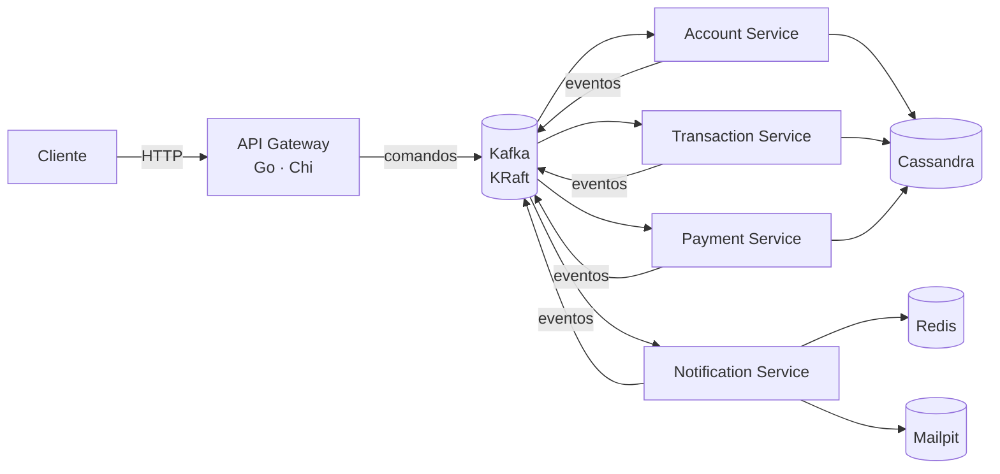

<div align="center">

# Fintech Bank Platform

**Backend bancário event-driven em Go** — um API gateway HTTP publicando comandos no Kafka, microserviços de domínio consumindo, Cassandra para persistência e Redis para cache.

[](#roadmap)
[](https://github.com/GabeSilvaDev/fintech-bank-platform/actions/workflows/ci.yml)
[](https://go.dev)
[](https://kafka.apache.org)
[](https://cassandra.apache.org)
[](https://redis.io)
[](#desenvolvimento)
[](LICENSE)

[English](README.md) · **Português (Brasil)**

</div>

> **Em desenvolvimento.** Infraestrutura, pacotes compartilhados e os cinco serviços — o API Gateway, o Account Service, o Transaction Service, o Payment Service e o Notification Service — estão prontos: os comandos fluem do HTTP para o Kafka e para o Cassandra, depósitos, saques e transferências se resolvem como sagas sobre o account service, pagamentos por PIX, TED e boleto se resolvem da mesma forma através de um provedor sandbox com webhooks assinados, e os eventos de resultado viram e-mail, SMS e push através do notification service, com as leituras voltando pelo gateway. Os clientes se cadastram e entram com e-mail e senha, e o gateway emite tokens de acesso JWT e deixa cada usuário chegar só às próprias contas, extratos, transações, pagamentos e notificações. O dinheiro é exato: os valores trafegam como strings decimais pela API e pelos eventos e são tratados como centavos inteiros dentro de cada serviço. Cada serviço tenta reconectar ao Cassandra ou ao Redis no boot, os créditos e débitos de conta são idempotentes por chave, um sweeper de reconciliação recupera transações e pagamentos presos a partir de um índice dos que estão em aberto, os extratos das contas são paginados com um cursor `before`, e a plataforma é testada de ponta a ponta e sob carga com k6, além dos testes unitários, de feature e de integração. Todo serviço expõe métricas Prometheus e traces OpenTelemetry, com um dashboard do Grafana, regras de alerta e o Jaeger num profile opcional do compose, e a API pública está descrita em OpenAPI. Veja o [roadmap](#roadmap) para o que está feito.

## Arquitetura



O gateway recebe requisições HTTP e publica-as como comandos no Kafka; cada serviço de domínio consome seu tópico de comandos, persiste no Cassandra e emite eventos de resultado. O Notification Service transforma esses eventos de resultado em e-mail, SMS e push, usando o Redis para idempotência e histórico e o Mailpit para capturar os e-mails enviados em desenvolvimento.

**Tópicos** (`pkg/events`): `account.commands`, `transaction.commands`, `payment.commands` para comandos; `account.events`, `transaction.events`, `payment.events`, `notification.events` para resultados; um tópico de dead-letter por domínio. O compose raiz pré-cria todos os tópicos com um one-shot `kafka-init`.

O desenho entre serviços — componentes, a tabela de tópicos, diagramas de sequência da autenticação, de cada saga, das notificações e da reconciliação, camadas de idempotência, semântica de falhas, segurança e observabilidade — está em [`docs/architecture.md`](docs/architecture.md) (em inglês). Como rodar as checagens, escrever commits e adicionar um serviço está em [`CONTRIBUTING.md`](CONTRIBUTING.md) (em inglês).

## O que existe hoje

| Componente | Caminho | Estado |
|---|---|---|
| Infraestrutura | `docker-compose.yml` | Kafka 3.7.1 (KRaft), Cassandra 4.1, Redis 7.2, Mailpit, Kafka UI e Cassandra Web opcionais (profile `ui`), Prometheus, Grafana e Jaeger opcionais (profile `observability`, configurados em `observability/`) |
| Pacotes compartilhados | `pkg/` | `logger`, `errors`, `response`, `validation`, `events`, `env`, `middleware`, `messaging`, `domain`, `cassandra`, `processor`, `retry`, `metrics`, `tracing` — 100 % de cobertura, exigida no CI |
| API Gateway | `services/api-gateway/` | Router Chi com middlewares de request-id, tracing, métricas, IP do cliente (o endereço da conexão, ou um salto confiável do `X-Forwarded-For` com `TRUST_PROXY_HEADERS=true`), logging, recovery, CORS e rate limit; `GET /health`; cadastro e login (`POST /api/v1/auth/register`, `/auth/login`, com rate limit próprio) emitindo tokens de acesso JWT HS256, autenticação bearer em todas as outras rotas de `/api/v1` e acesso restrito ao titular, conferido no endpoint de titular do account service (veja [Autenticação e autorização](#autenticação-e-autorização)); endpoints de comando publicando no Kafka através de um producer protegido por circuit breaker; config tipada a partir do ambiente; documento OpenAPI 3.1 servido em `GET /api/v1/openapi.yaml` e validado com Redocly no CI; testes unitários + de feature com 100 % de cobertura, teste de integração com Kafka no CI; rotas de leitura repassadas por proxy aos serviços de domínio |
| Account Service | `services/account-service/` | Consome `account.commands`, tenta reconectar ao Cassandra, aplicar as migrations e abrir a sessão do keyspace no boot (`STARTUP_RETRY_*`), persiste clientes e contas no Cassandra (`fintech_accounts`), controla os saldos com créditos/débitos em compare-and-set que exigem `idempotency_key` e são aplicados no máximo uma vez (`balance_operations`, TTL de 30 dias), publica resultados — incluindo `account.credit_rejected` — em `account.events` e falhas em `account.dlq`; guarda as identidades de e-mail e senha (`identities_by_email`, bcrypt) atrás de endpoints internos que o gateway chama no cadastro e no login; API de leitura na `:8082`; testes unitários + de feature com 100 % de `internal/app`, testes de integração com Cassandra e Kafka no CI |
| Transaction Service | `services/transaction-service/` | Consome `transaction.commands` e as respostas do account service em `account.events`, tenta reconectar ao Cassandra no boot (`STARTUP_RETRY_*`), registra depósitos, saques e transferências no Cassandra (`fintech_transactions`), orquestra cada um como uma saga sobre `account.commands` (débito → crédito → crédito compensatório em caso de falha) com chaves de idempotência por etapa, roda um sweeper de reconciliação que lê um índice das transações em aberto (`open_transactions`) e reenvia a próxima etapa das que estão paradas (`SWEEPER_*`), publica `transaction.created/completed/failed` e `transaction.transfer_completed/transfer_failed` em `transaction.events`, envia para dead-letter em `transaction.dlq`; API de leitura, com extratos paginados por `before`, na `:8083`; testes unitários + de feature com 100 % de `internal/app`, testes de integração com Cassandra e Kafka no CI |
| Payment Service | `services/payment-service/` | Consome `payment.commands` e as respostas do account service em `account.events`, tenta reconectar ao Cassandra no boot (`STARTUP_RETRY_*`), guarda pagamentos por PIX, TED e boleto no Cassandra (`fintech_payments`), reserva os fundos com `account.debit`, submete a um provedor sandbox — PIX se resolve na hora, TED e boleto se resolvem por um webhook assinado — estorna rejeições com `account.credit`, roda um sweeper de reconciliação que lê um índice dos pagamentos em aberto (`open_payments`) e reenvia a próxima etapa dos que estão parados (`SWEEPER_*`), publica `payment.created/processed/completed/failed` em `payment.events`, envia para dead-letter em `payment.dlq`; API de leitura, com extratos paginados por `before`, e webhook na `:8084`; testes unitários + de feature com 100 % de `internal/app`, testes de integração com Cassandra e Kafka no CI |
| Notification Service | `services/notification-service/` | Consome `account.events`, `transaction.events` e `payment.events` e transforma os resultados em e-mail, SMS e push em português, tentando reconectar ao Redis no boot (`STARTUP_RETRY_*`), buscando os contatos no endpoint interno de titular do account service; os comandos de entrega em `notification.events` são enviados por SMTP (Mailpit em desenvolvimento) ou por provedores sandbox de SMS/push, registrados num histórico apoiado em Redis, e enviados para dead-letter em `notification.dlq`; API de leitura na `:8085`; testes unitários + de feature com 100 % de `internal/app`, testes de integração com Kafka, Redis e Mailpit no CI |

Todo serviço também serve métricas Prometheus em `GET /metrics` na sua porta HTTP e propaga traces OpenTelemetry por HTTP e Kafka — veja [Observabilidade](#observabilidade).

### Pacotes compartilhados

| Pacote | O que dá a cada serviço |
|---|---|
| `logger` | Wrapper do zerolog com `Config{Level, Pretty, TimeFormat, Output}` e presets de desenvolvimento/produção |
| `errors` | `AppError` com código, mensagem, status HTTP e detalhes; construtores por status (`BadRequest`, `NotFound`, …) |
| `response` | Helpers JSON (`OK`, `Created`, `NoContent`, `BadRequest`, …), `SuccessWithMeta` para paginação, `FromError` para renderizar um `AppError` |
| `validation` | Validadores brasileiros e bancários — CPF, CNPJ, telefone, chave PIX, agência e conta, moeda, força de senha, linha digitável de boleto (e o valor que ela codifica), chave de idempotência — como funções e como tags `validate:"…"` |
| `events` | Envelope `Event` do Kafka (id, tipo, versão, origem, timestamp, trace id, metadata, payload), catálogos de tópicos e tipos de evento, payloads tipados e construtores como `NewAccountCommand` |
| `env` | Getters tipados para variáveis de ambiente |
| `middleware` | Request-id, logging de requisições e recovery de panics para o chi; `Recovery(log)` registra o panic no log e responde o envelope de erro JSON com `500 INTERNAL_ERROR` |
| `messaging` | Producer kafka-go com timeout de publicação e um loop de consumer com commit por mensagem que termina a mensagem em andamento no shutdown (`DrainTimeout`) e reinicia com backoff (`RunWithRestart`) |
| `domain` | Erros de domínio compartilhados (`ErrNotFound`, `ErrConflict`, `ErrAmbiguousWrite`, `Invalid`/`IsInvalid`/`InvalidCode`) e o tipo de dinheiro exato `Amount` (centavos em int64, em JSON como string com duas casas decimais, `ParseAmount`, `AmountFromCents`) |
| `cassandra` | `Migrator` que roda primeiro o arquivo do keyspace e depois cada `.cql` em ordem sobre uma interface `Executor`, registrando as versões em `schema_migrations`; `MapWriteError` mapeia falhas ambíguas do Cassandra para `domain.ErrAmbiguousWrite` |
| `processor` | Processador idempotente de comandos Kafka: deduplica pelo id do evento, retenta erros transitórios com backoff, envia o resto para dead-letter e publica os eventos de resposta de um dispatcher |
| `retry` | `Do(ctx, attempts, delay, fn)` retenta `fn` com um delay fixo entre as tentativas até ter sucesso, esgotar as tentativas ou o contexto ser cancelado; usado pelos quatro serviços de domínio (account, transaction, payment e notification) para esperar o Cassandra ou o Redis no boot; o API gateway não tem nada a esperar |
| `metrics` | Registry Prometheus por serviço com o label `service`, collectors de Go e de processo, middleware HTTP (`http_requests_total`, `http_request_duration_seconds`), handler de `/metrics` e fábricas de counter, gauge e histogram seguras com nil |
| `tracing` | Setup do OpenTelemetry com exporter OTLP/HTTP opcional e amostragem por proporção, middleware de servidor HTTP e transport de cliente, injeção e extração de `traceparent` nos headers do Kafka |

Exemplos de uso em [`pkg/README.md`](pkg/README.md).

## Como rodar

Requer Docker, Docker Compose e ~4 GB de RAM para os containers. Go 1.25 só se quiser rodar os serviços fora do Docker.

```bash
git clone https://github.com/GabeSilvaDev/fintech-bank-platform.git
cd fintech-bank-platform
cp .env.example .env

docker compose up -d                  # Kafka + Cassandra + Redis
docker compose --profile ui up -d     # + Kafka UI (:8080) e Cassandra Web (:3000)
docker compose --profile observability up -d   # + Prometheus (:9090), Grafana (:3000), Jaeger (:16686)
docker compose ps                     # espere tudo ficar healthy (~1–2 min)
```

| Serviço | Container | Porta |
|---|---|---|
| Kafka (KRaft) | `fintech-kafka` | 9092 |
| Cassandra | `fintech-cassandra` | 9042 |
| Redis | `fintech-redis` | 6379 (`REDIS_PORT`) |
| Mailpit | `fintech-mailpit` | 1025 SMTP (`MAILPIT_SMTP_PORT`) · 8025 UI (`MAILPIT_UI_PORT`) |
| Kafka UI *(profile `ui`)* | `fintech-kafka-ui` | 8080 |
| Cassandra Web *(profile `ui`)* | `fintech-cassandra-web` | 3000 |
| Prometheus *(profile `observability`)* | `fintech-prometheus` | 9090 (`PROMETHEUS_PORT`) |
| Grafana *(profile `observability`)* | `fintech-grafana` | 3000 (`GRAFANA_PORT`) |
| Jaeger *(profile `observability`)* | `fintech-jaeger` | 16686 UI (`JAEGER_UI_PORT`) |

O Grafana e o Cassandra Web usam a porta 3000 por padrão: defina `GRAFANA_PORT` (por exemplo `3001`) no `.env` antes de ligar os dois profiles.

O Redis sustenta a idempotência e o histórico do notification service; o Mailpit captura os e-mails enviados por ele, com interface web em http://localhost:8025.

### API Gateway

```bash
cd services/api-gateway
cp .env.example .env
docker compose up -d                  # hot reload com Air, publicado em :8081
curl http://localhost:8081/health
```

Ou nativo: `make run` (escuta em `SERVER_PORT`, padrão 8080). A configuração vem do ambiente: `SERVER_*` (host, porta, timeouts), `CORS_*` (`CORS_ALLOWED_METHODS` tem padrão `GET,POST,PUT,PATCH,DELETE,OPTIONS`, `CORS_ALLOW_CREDENTIALS`, `false`, e `CORS_EXPOSED_HEADERS`, `Link,X-Next-Before`), `RATE_LIMIT_REQUESTS` / `RATE_LIMIT_WINDOW`, `KAFKA_BROKERS` / `KAFKA_WRITE_TIMEOUT` / `KAFKA_BATCH_TIMEOUT` / `KAFKA_PUBLISH_TIMEOUT` / `KAFKA_MAX_ATTEMPTS` / `KAFKA_BREAKER_*`, `TRUST_PROXY_HEADERS` / `TRUSTED_PROXY_HOPS`, `JWT_SECRET` / `JWT_TTL`, `AUTH_RATE_LIMIT_REQUESTS` / `AUTH_RATE_LIMIT_WINDOW`, `OWNER_CACHE_TTL`, `METRICS_ENABLED` / `OTEL_EXPORTER_OTLP_ENDPOINT` / `OTEL_SAMPLER_RATIO` e `LOG_LEVEL` / `LOG_PRETTY`.

| Variável | Padrão | Efeito |
|---|---|---|
| `JWT_SECRET` | nenhum (variável obrigatória) | Chave HMAC que assina e verifica os tokens de acesso; os espaços das pontas são removidos, e o gateway se recusa a subir quando o que sobra tem menos de 32 bytes. O valor `dev-only-jwt-secret-change-me-0123456789` do `docker-compose.yml` e do `.env.example` é público e serve só para desenvolvimento local: o gateway registra um aviso na subida sempre que roda com ele (`JWT_SECRET is the published development value; set a private secret before exposing the gateway`); em qualquer outro lugar, defina um segredo aleatório de pelo menos 32 bytes |
| `JWT_TTL` | `1h` | Validade de um token de acesso (`expires_in` em segundos), no máximo `24h`: um valor maior impede o gateway de subir; um valor não positivo cai para o padrão |
| `CORS_ALLOW_CREDENTIALS` | `false` | Se o navegador pode mandar cookies ou autenticação HTTP em requisições de outra origem. A API autentica com token bearer, então não precisa disso; ligue só junto com uma lista explícita em `CORS_ALLOWED_ORIGINS` |
| `AUTH_RATE_LIMIT_REQUESTS` / `AUTH_RATE_LIMIT_WINDOW` | `10` / `1m` | Limite separado em `/api/v1/auth/*`, contado por cliente como o geral; valores abaixo de `1` (ou uma janela não positiva) caem para os padrões |
| `OWNER_CACHE_TTL` | `1m` | Por quanto tempo o gateway guarda em memória o titular de uma conta; um valor não positivo cai para o padrão |

O rate limit (`RATE_LIMIT_REQUESTS` por `RATE_LIMIT_WINDOW`) é contado por endereço do cliente, e um cliente IPv6 pela sua rede /64, então trocar de endereço dentro do próprio prefixo não lhe rende mais requisições (endereços IPv4, inclusive os IPv6 mapeados de IPv4, são contados um a um). Por padrão (`TRUST_PROXY_HEADERS=false`) esse é o endereço da conexão TCP, e `X-Forwarded-For`, `X-Real-IP` e `True-Client-IP` são ignorados, então um cliente não consegue escolher o próprio balde do rate limit enviando esses headers. Use `TRUST_PROXY_HEADERS=true` só quando o gateway for acessível exclusivamente através dos seus proxies reversos, e defina `TRUSTED_PROXY_HOPS` (padrão `1`; valores abaixo de `1` voltam para `1`) com o número de proxies entre a internet e o gateway. O endereço do cliente passa a ser a entrada do `X-Forwarded-For` adicionada pelo proxy mais externo: o gateway conta `TRUSTED_PROXY_HOPS` entradas a partir da direita do header (todos os headers `X-Forwarded-For` juntados na ordem em que chegaram) e fica com essa, então com um proxy é a entrada mais à direita — o endereço que esse proxy viu — e nada que o cliente tenha colocado mais à esquerda chega a ser lido. `X-Real-IP` e `True-Client-IP` também são ignorados nesse modo. Quando o `X-Forwarded-For` não vem, tem menos entradas que `TRUSTED_PROXY_HOPS` ou a entrada escolhida não é um IP, a requisição é contada pelo endereço da conexão (o do proxy mais próximo, então essas requisições dividem um único balde). Use a contagem exata: uma a menos conta todos os clientes pelo endereço de um proxy, e uma a mais lê uma entrada escrita pelo próprio cliente (ou, quando ela não existe, cai naquele balde compartilhado). O gateway nunca reescreve o endereço remoto da requisição, então os logs de requisição mantêm o par TCP — o proxy, quando há um — em `remote_addr` e acrescentam o endereço do cliente resolvido como `client_ip` sempre que houver um.

A API pública está descrita em OpenAPI 3.1 em `services/api-gateway/api/openapi.yaml`, embutida no binário e servida pelo próprio gateway (`curl http://localhost:8081/api/v1/openapi.yaml`); o CI a valida com o Redocly usando o `redocly.yaml` da raiz.

### Account Service

```bash
cd services/account-service
cp .env.example .env
docker compose up -d                  # hot reload com Air, publicado em :8082
curl http://localhost:8082/health     # {"success":true,"data":{"status":"healthy","cassandra":"up"}}
```

Conectar ao Cassandra, aplicar as migrations em `migrations/*.cql` (contra o `CASSANDRA_KEYSPACE`, padrão `fintech_accounts`) e abrir a sessão do keyspace são retentados no boot até `STARTUP_RETRY_ATTEMPTS` vezes (padrão 30), esperando `STARTUP_RETRY_DELAY` entre as tentativas (padrão `2s`; um valor não positivo cai para o padrão). Configuração: `SERVER_*`, `KAFKA_BROKERS` / `KAFKA_GROUP_ID` / `KAFKA_*_TIMEOUT` / `KAFKA_MAX_ATTEMPTS`, `CONSUMER_RETRY_BACKOFF` / `CONSUMER_DRAIN_TIMEOUT`, `CASSANDRA_HOSTS` / `CASSANDRA_KEYSPACE` / `CASSANDRA_CONSISTENCY` / `CASSANDRA_*_TIMEOUT` / `CASSANDRA_MIGRATIONS_PATH`, `STARTUP_RETRY_ATTEMPTS` / `STARTUP_RETRY_DELAY`, `IDENTITY_HASH_CONCURRENCY`, `METRICS_ENABLED` / `OTEL_EXPORTER_OTLP_ENDPOINT` / `OTEL_SAMPLER_RATIO`, `LOG_LEVEL` / `LOG_PRETTY`.

O account service também guarda as identidades da plataforma, em `identities_by_email` (`migrations/008_identities_by_email.cql`: e-mail, id do usuário, hash bcrypt da senha com custo 12, data de criação). O gateway chama dois endpoints internos no cadastro e no login; eles não são repassados pelo gateway:

| Método | Caminho | Corpo | Resposta |
|---|---|---|---|
| `POST` | `/identities` | `{email, password}` | `201` `{user_id}` (um UUID aleatório novo), `409 EMAIL_TAKEN`, `422 VALIDATION_ERROR` (`email` ou `password`), `503 SERVICE_BUSY` |
| `POST` | `/identities/verify` | `{email, password}` | `200` `{user_id}`, `401 INVALID_CREDENTIALS`, `503 SERVICE_BUSY` |

O e-mail tem os espaços das pontas removidos e é passado para minúsculas antes de ser gravado ou buscado, e o cadastro é gravado com `IF NOT EXISTS`, então dois cadastros simultâneos do mesmo e-mail não conseguem ambos ter sucesso. A senha precisa ter de 8 a 72 bytes, o limite do próprio bcrypt. A verificação responde o mesmo `401` para um e-mail desconhecido, uma senha errada, um e-mail que não é um endereço válido e uma senha com mais de 72 bytes; quando não há identidade com que comparar, ela ainda roda uma comparação bcrypt contra um hash fictício fixo, para que o tempo de resposta não revele quais e-mails estão cadastrados. Corpos acima de 16 KiB respondem `413 PAYLOAD_TOO_LARGE`.

O bcrypt é lento de propósito, então o serviço roda no máximo `IDENTITY_HASH_CONCURRENCY` hashes e comparações ao mesmo tempo (padrão: o dobro de `GOMAXPROCS`; valores abaixo de `1` voltam ao padrão), inclusive a comparação fictícia. Uma requisição que não consegue começar o hash em 2 s, ou cujo cliente desiste antes, responde `503 SERVICE_BUSY` sem mexer nas identidades gravadas, então uma rajada de logins espera um pouco na fila e depois é descartada em vez de sufocar o resto do serviço.

Comandos que ele trata (tópico `account.commands`) e os eventos com que ele responde (tópico `account.events`):

| Comando | Resultado | Dead-letter (`account.dlq`) quando |
|---|---|---|
| `account.create` | `account.created` | dados inválidos, colisão de número após 5 tentativas |
| `account.update` | `account.updated` | conta desconhecida, conta fechada, update vazio |
| `account.delete` | `account.deleted` | conta desconhecida, saldo diferente de zero |
| `account.credit` | `account.credited` ou `account.credit_rejected` (`account_not_active`, `account_not_found`, `balance_limit_exceeded` quando o crédito levaria o saldo além do maior número de centavos em int64) — reproduzido tal como está para uma `idempotency_key` repetida | valor, moeda ou chave de idempotência inválidos (`invalid_idempotency_key`, `idempotency_key_reused`), ou `ambiguous_write` enquanto o resultado dessa chave ainda está pendente |
| `account.debit` | `account.debited` ou `account.debit_rejected` (`insufficient_funds`, `account_not_active`, `account_not_found`) — reproduzido tal como está para uma `idempotency_key` repetida | valor, moeda ou chave de idempotência inválidos (`invalid_idempotency_key`, `idempotency_key_reused`), ou `ambiguous_write` enquanto o resultado dessa chave ainda está pendente |

Todo `account.credit` e `account.debit` precisa vir com uma `idempotency_key` e é aplicado no máximo uma vez por `(account_id, idempotency_key)`, rastreado em `balance_operations` (TTL de 30 dias, `services/account-service/migrations/007_balance_operations.cql`). Uma chave repetida pula a mudança de saldo e reproduz o resultado gravado como resposta — inclusive uma rejeição `insufficient_funds` já gravada; uma chave ainda reservada por uma tentativa que quebrou antes de registrar um resultado vai para a dead-letter como `ambiguous_write` em toda nova tentativa até a linha expirar com o TTL de 30 dias, já que não dá para saber se a mudança de saldo aconteceu; ela precisa de resolução manual antes disso, porque depois que a linha expira a mesma chave é aceita como nova e a mudança de saldo seria aplicada de novo (é por isso que os sweepers do transaction e do payment service param de reenviar depois de `SWEEPER_MAX_AGE`); uma chave já usada para o outro tipo de operação (um crédito retentado como débito, ou vice-versa) é rejeitada como `idempotency_key_reused`.

Cada comando é aplicado no máximo uma vez (`processed_events`, TTL de 7 dias); falhas transitórias são retentadas com `CONSUMER_RETRY_BACKOFF` e depois enviadas para a dead-letter como `account.command_failed`, com `retries` contando as tentativas de despacho. Um write timeout ou unavailable do Cassandra, uma lightweight transaction de resultado desconhecido, um timeout do lado do cliente, ou uma escrita cujo contexto foi cancelado ou expirou vai direto para a dead-letter como `ambiguous_write`, porque a escrita pode ou não ter sido aplicada e retentar poderia aplicá-la duas vezes. Como o id do evento é marcado antes do despacho, um comando da dead-letter reenviado tal como está é ignorado como duplicado: replays precisam de um novo id de evento. No shutdown o consumer termina a mensagem em andamento (até `CONSUMER_DRAIN_TIMEOUT`) antes de fazer o commit, e um consumer que para por erro é reiniciado com `CONSUMER_RETRY_BACKOFF` enquanto a API de leitura continua atendendo.

### Transaction Service

```bash
cd services/transaction-service
cp .env.example .env
docker compose up -d                  # hot reload com Air, publicado em :8083
curl http://localhost:8083/health     # {"success":true,"data":{"status":"healthy","cassandra":"up"}}
```

As migrations em `migrations/*.cql` rodam no boot contra o `CASSANDRA_KEYSPACE` (padrão `fintech_transactions`); conectar ao Cassandra, aplicar as migrations e abrir a sessão do keyspace são retentados do mesmo jeito que no account service (`STARTUP_RETRY_ATTEMPTS` / `STARTUP_RETRY_DELAY`). A configuração reaproveita os nomes de variável do account service, com `SERVER_PORT` padrão `8083`, `KAFKA_GROUP_ID` padrão `transaction-service` e `CASSANDRA_KEYSPACE` padrão `fintech_transactions`, mais as variáveis do sweeper de reconciliação: `SWEEPER_ENABLED` (padrão `true`), `SWEEPER_INTERVAL` (padrão `1m`), `SWEEPER_STALE_AFTER` (padrão `5m`), `SWEEPER_MAX_AGE` (padrão `24h`; precisa ser menor que `720h`, o TTL de `balance_operations`, senão o serviço não sobe), `SWEEPER_BATCH` (padrão `100`) e `SWEEPER_FULL_SCAN_INTERVAL` (padrão `24h`; `0` desliga as reconstruções periódicas do índice, mas mantém a da subida, e um valor negativo volta ao padrão).

Consome `transaction.commands` e as respostas do account service em `account.events`:

| Tópico | Grupo | Trata |
|---|---|---|
| `transaction.commands` | `KAFKA_GROUP_ID` | `transaction.create` (depósito/saque), `transaction.transfer` |
| `account.events` | `KAFKA_GROUP_ID-replies` | `account.credited`, `account.debited`, `account.debit_rejected`, `account.credit_rejected` |

Uma transação é registrada como `pending` com sua chave de idempotência reservada primeiro em `transactions_by_account_key`, no escopo da conta da transação (a de origem, numa transferência) — uma chave repetida na mesma conta é um no-op, enquanto outra conta pode usar a mesma chave — e então conduzida como uma saga sobre `account.commands`: um depósito ou saque pede um único crédito ou débito e se resolve como `completed` ou `failed` (`insufficient_funds`, `account_not_active`, `account_not_found`, `balance_limit_exceeded`); uma transferência debita a origem (`pending` → `debited`), credita a contraparte (`debited` → `completed`), e compensa com um crédito de volta para a origem se esse crédito for rejeitado (`reversing` → `reversed`, ou `reversal_failed` mais uma entrada em `transaction.dlq` se a própria compensação for rejeitada). Cada etapa carrega sua própria chave de idempotência (`<id da transação>:debit`, `:credit` ou `:reversal`) e cada mudança de status é uma lightweight transaction do Cassandra condicionada ao status esperado, então uma resposta duplicada ou atrasada é ignorada. Os resultados são publicados em `transaction.events` (`transaction.created`, `transaction.completed`/`transaction.failed`, `transaction.transfer_completed`/`transaction.transfer_failed`); falhas transitórias são retentadas com `CONSUMER_RETRY_BACKOFF` e depois enviadas para a dead-letter em `transaction.dlq` como `transaction.command_failed`.

Se a resposta do account service para uma etapa nunca chegar, a transação fica presa; um sweeper de reconciliação (`SWEEPER_ENABLED`, ligado por padrão) a recupera. A cada `SWEEPER_INTERVAL` ele lê os ids do índice de transações em aberto, carrega essas transações em lotes de até 100 ids e escolhe as não terminais com `updated_at` mais velho que `SWEEPER_STALE_AFTER`, até `SWEEPER_BATCH` por varredura; cada uma é "tocada" com uma lightweight transaction condicionada ao status e ao `updated_at` que ele leu, então só uma instância do serviço age sobre ela, e uma transação já tocada por outra instância simplesmente espera mais uma janela de staleness. Depois de tocada, sua próxima etapa é reenviada: um depósito `pending` pede outro crédito, um saque ou transferência `pending` pede outro débito, uma transferência `debited` credita a contraparte, e uma transferência `reversing` reenvia o crédito de reversão — reaproveitando as chaves de idempotência originais de cada etapa, que o account service agora deduplica.

O reenvio para quando a transação fica mais velha que `SWEEPER_MAX_AGE` (medido a partir de `created_at`). A primeira varredura que a encontra além dessa idade a toca uma última vez e, em vez de reenviar, dispara um único alerta: um evento `transaction.command_failed` em `transaction.dlq` com código de erro `reconciliation_exhausted` citando a transação e seu status, mais um log de nível error `reconciliation exhausted` com o id, o status e a idade. As varreduras seguintes a ignoram sem tocá-la, então o alerta sai uma vez por transação.

A varredura nunca percorre a tabela `transactions`. Ela lê `open_transactions` (`migrations/007_open_transactions.cql`), um índice das transações que ainda não chegaram a um status terminal, distribuído em 16 partições pelo primeiro caractere hexadecimal do id da transação. A linha de índice de uma transação é gravada no mesmo batch que a própria transação e apagada quando uma transição a leva para `completed`, `failed`, `reversed` ou `reversal_failed`. Essa remoção é best-effort: uma varredura que carrega uma transação já terminal apaga a linha que sobrou, enquanto uma linha cuja transação ainda não pode ser lida fica para a próxima varredura. O `gc_grace_seconds` da tabela é de uma hora (`migrations/008_open_transactions_gc_grace.cql`), então as tombstones deixadas por essas remoções passam a poder ser removidas por compactação depois de uma hora, e não dos dez dias padrão. Assim, uma varredura custa 16 leituras de partição mais, no máximo, uma consulta `IN` a cada 100 ids em aberto, por maior que o histórico fique; uma transação que chegou a `SWEEPER_MAX_AGE` continua no índice, ainda não terminal, até ser resolvida. Como uma gravação perdida no índice esconderia uma transação presa do sweeper, cada instância também reconstrói o índice com uma varredura completa de `transactions`, recolocando uma linha para cada transação não terminal: uma vez na subida, antes da primeira varredura, e de novo a cada `SWEEPER_FULL_SCAN_INTERVAL`. A reconstrução roda dentro do sweeper, então só acontece com `SWEEPER_ENABLED=true`, as varreduras esperam enquanto ela roda, e ela registra `open index rebuilt` com a contagem, ou `open index rebuild failed`.

**Limitações conhecidas.** Transações não terminais (`pending`, `debited` ou `reversing`) podem ser encontradas por `GET /accounts/{account_id}/transactions`; o sweeper descrito acima resolve a maioria sozinho assim que elas ficam obsoletas. A exceção é uma etapa que o account service enviou para a dead-letter como `ambiguous_write`: sua chave de idempotência fica `pending` em `balance_operations` até o TTL de 30 dias expirar, então todo reenvio bate no mesmo resultado `ambiguous_write` até o sweeper chegar a `SWEEPER_MAX_AGE` e disparar o alerta `reconciliation_exhausted`. Uma transação assim precisa de resolução manual: antes de reenviar qualquer coisa, confira o saldo da conta e a linha de `balance_operations` da chave da etapa (`<id da transação>:debit`, `:credit` ou `:reversal`) para saber se a mudança de saldo foi aplicada, e resolva bem antes dos 30 dias, já que um replay depois de a chave expirar é aplicado de novo. Como no account service, um evento da dead-letter reenviado tal como está é ignorado como duplicado, então um replay precisa de um novo id de evento. No primeiro deploy o grupo `-replies` lê `account.events` desde o início; isso é inofensivo e acontece uma única vez, já que uma resposta que não corresponde a uma etapa conhecida é ignorada.

Chaves de idempotência precisam ter de 1 a 64 caracteres ASCII imprimíveis (`0x21`–`0x7E`), sem espaços nem caracteres de controle; o gateway já rejeita qualquer outra coisa, e um comando que ainda chegue com uma chave assim vai para a dead-letter como `invalid_idempotency_key`.

**Atualizando de uma versão anterior à Sprint 10.** `migrations/007_open_transactions.cql` e `008_open_transactions_gc_grace.cql` são aplicadas automaticamente na subida. As transações que já estavam em aberto antes da atualização ainda não têm linha no índice; a primeira subida da nova versão reconstrói o índice com uma varredura completa antes da primeira varredura do sweeper, então ele as encontra sem nenhum passo manual (com `SWEEPER_ENABLED=false`, a reconstrução espera até o sweeper ser ligado).

**Atualizando de uma versão anterior à Sprint 8.** As chaves de idempotência dos clientes saíram de `transactions_by_key`, um único espaço de nomes compartilhado por todas as contas, para `transactions_by_account_key` (`migrations/006_transactions_by_account_key.cql`), indexada por conta e chave. Chaves reservadas na tabela antiga antes da atualização não são vistas pela nova, então um cliente que envia uma requisição antes do deploy e a retenta depois pode criar uma segunda transação. Suspenda as retentativas dos clientes durante o deploy, ou espere que elas se esgotem: deixe as requisições enviadas antes dele se resolverem e não as retente depois. A tabela antiga não é mais lida nem escrita.

**Atualizando de uma versão anterior à Sprint 6.** Transações que já estavam presas antes de `balance_operations` existir podem ter tido a mudança de saldo aplicada sem nenhuma chave registrada, então o account service aplicaria um reenvio de novo. Resolva-as manualmente antes de ligar o sweeper (faça o deploy com `SWEEPER_ENABLED=false` até lá).

### Payment Service

```bash
cd services/payment-service
cp .env.example .env
docker compose up -d                  # hot reload com Air, publicado em :8084
curl http://localhost:8084/health     # {"success":true,"data":{"status":"healthy","cassandra":"up"}}
```

As migrations em `migrations/*.cql` rodam no boot contra o `CASSANDRA_KEYSPACE` (padrão `fintech_payments`); conectar ao Cassandra, aplicar as migrations e abrir a sessão do keyspace são retentados do mesmo jeito que no account service (`STARTUP_RETRY_ATTEMPTS` / `STARTUP_RETRY_DELAY`). A configuração reaproveita os nomes de variável do transaction service, com `SERVER_PORT` padrão `8084`, `KAFKA_GROUP_ID` padrão `payment-service`, `CASSANDRA_KEYSPACE` padrão `fintech_payments` e as mesmas variáveis `SWEEPER_*` de reconciliação (inclusive `SWEEPER_MAX_AGE`, padrão `24h`, que precisa ser menor que `720h`, e `SWEEPER_FULL_SCAN_INTERVAL`, padrão `24h`), mais `PAYMENT_WEBHOOK_SECRET` (obrigatória, com pelo menos 16 caracteres), `PAYMENT_WEBHOOK_URL` (padrão `http://localhost:8084/webhooks/gateway`), `PAYMENT_WEBHOOK_TOLERANCE` (padrão `5m`) e `PAYMENT_SETTLEMENT_DELAY` (padrão `2s`). O valor `dev-webhook-secret` em `docker-compose.yml` e `.env.example` serve apenas para desenvolvimento local; em qualquer outro ambiente, substitua-o por um segredo aleatório com pelo menos 16 caracteres.

Consome `payment.commands` e as respostas do account service em `account.events`:

| Tópico | Grupo | Trata |
|---|---|---|
| `payment.commands` | `KAFKA_GROUP_ID` | `payment.process`, `payment.submit`, `payment.settle` |
| `account.events` | `KAFKA_GROUP_ID-replies` | `account.credited`, `account.debited`, `account.debit_rejected`, `account.credit_rejected` |

Um pagamento é registrado como `pending` com sua chave de idempotência reservada primeiro, depois debita a conta (`pending` → `debited`) e é submetido ao provedor sandbox: PIX se resolve na hora (`completed`), TED e boleto são vinculados a um id externo e aguardam um webhook (`debited` → `submitted` → `completed`). Uma rejeição na etapa de débito falha o pagamento diretamente (`failed`, `insufficient_funds`, `account_not_active` ou `account_not_found`); uma rejeição na submissão ou na liquidação em vez disso estorna o débito (`refunding`) e chega a `refunded`, ou a `refund_failed` mais uma entrada em `payment.dlq` se o próprio estorno for rejeitado. Cada mudança de status é uma lightweight transaction do Cassandra condicionada ao status esperado, e os resultados são publicados em `payment.events` (`payment.created`, `payment.processed`, `payment.completed`, `payment.failed`).

O provedor sandbox informa a liquidação através de um webhook assinado: `POST /webhooks/gateway` com corpo `{external_id, status: settled|rejected, reason}`, headers `X-Timestamp` (unix seconds) e `X-Signature` (HMAC-SHA256 em hex de `timestamp + "." + body`), aceito dentro de `PAYMENT_WEBHOOK_TOLERANCE` do horário atual. Respostas: `202` com o id do comando, `401 INVALID_SIGNATURE`, `413 PAYLOAD_TOO_LARGE` (corpo acima de 64 KiB), `400 INVALID_JSON`, `422 VALIDATION_ERROR`, `503 PUBLISH_FAILED`.

**Valores do sandbox.**

| Entrada | Resultado |
|---|---|
| Chave PIX terminada em `@reject.test` | rejeitado, `pix_key_not_found` |
| `bank_code` `999` no TED | rejeitado, `invalid_destination` |
| Código de boleto começando com `999` | rejeitado, `boleto_not_found` |
| Qualquer outro valor | se resolve; TED e boleto se resolvem depois de `PAYMENT_SETTLEMENT_DELAY` |

Se o resultado de uma etapa nunca chegar, um pagamento fica preso em `pending`, `debited`, `submitted` ou `refunding` — por exemplo quando o sandbox perde um callback agendado porque o serviço reiniciou antes de `PAYMENT_SETTLEMENT_DELAY` passar. Um sweeper de reconciliação (`SWEEPER_ENABLED`, ligado por padrão) o recupera da mesma forma que no transaction service: a cada `SWEEPER_INTERVAL` ele lê o índice de pagamentos em aberto e escolhe os pagamentos não terminais parados há mais de `SWEEPER_STALE_AFTER`, até `SWEEPER_BATCH` por varredura, "tocando" cada um com uma lightweight transaction condicionada ao status e ao `updated_at` que ele leu, então só uma instância age sobre ele. Um `pending` tocado é redebitado; um `debited` recebe outro `payment.submit`; um `submitted` é checado de novo contra o provedor sandbox — liquidado o completa, rejeitado inicia um estorno, e um que ainda está pendente simplesmente tem seu callback reentregue pelo sandbox; um `refunding` tem seu crédito de estorno reenviado. Os comandos reenviados reaproveitam as chaves de idempotência originais do pagamento, que o account service agora deduplica.

Como no transaction service, o reenvio para quando o pagamento fica mais velho que `SWEEPER_MAX_AGE`: a primeira varredura além dessa idade o toca uma última vez e dispara um único alerta `payment.command_failed` em `payment.dlq` com código de erro `reconciliation_exhausted` citando o pagamento e seu status, mais um log de nível error `reconciliation exhausted` com o id, o status e a idade, e as varreduras seguintes o ignoram sem tocá-lo. O índice funciona como no transaction service: `open_payments` (`migrations/007_open_payments.cql`, com `gc_grace_seconds` de uma hora em `008_open_payments_gc_grace.cql`) guarda os pagamentos que ainda não chegaram a um status terminal em 16 partições pelo primeiro caractere hexadecimal do id do pagamento, a linha é gravada junto com o pagamento e apagada, em best-effort, quando ele chega a `completed`, `failed`, `refunded` ou `refund_failed`, as varreduras limpam as linhas de pagamentos já terminais e mantêm as de pagamentos que ainda não podem ser lidos, e cada instância reconstrói o índice com uma varredura completa de `payments` na subida e a cada `SWEEPER_FULL_SCAN_INTERVAL` (`0` mantém só a reconstrução da subida).

**Limitações conhecidas.** Pagamentos não terminais podem ser encontrados por `GET /accounts/{account_id}/payments`; o sweeper acima resolve a maioria sozinho assim que eles ficam obsoletos. A exceção é uma etapa que o account service enviou para a dead-letter como `ambiguous_write`: sua chave de idempotência fica `pending` em `balance_operations` até o TTL de 30 dias expirar, então todo reenvio bate no mesmo resultado `ambiguous_write` até o sweeper chegar a `SWEEPER_MAX_AGE` e disparar o alerta `reconciliation_exhausted`. Um pagamento assim precisa de resolução manual: antes de reenviar qualquer coisa, confira o saldo da conta e a linha de `balance_operations` da chave da etapa (`payment:<id do pagamento>:debit` ou `:refund`) para saber se a mudança de saldo foi aplicada, e resolva bem antes dos 30 dias, já que um replay depois de a chave expirar é aplicado de novo. Ressubmeter um pagamento `debited` ou `submitted` depende de o provedor deduplicar submissões pelo id do pagamento: o sandbox faz isso, mas um provedor real precisa receber o id do pagamento como chave de idempotência, senão uma submissão reenviada poderia pagar duas vezes. Uma liquidação que chega antes de o id externo ser vinculado, ou enquanto a submissão ainda está sendo registrada, é retentada e enviada para a dead-letter como `conflict` se nunca for aplicada. Como nos outros serviços, um evento da dead-letter reenviado tal como está é ignorado como duplicado, então um replay precisa de um novo id de evento. No primeiro deploy o serviço lê `payment.commands` e `account.events` desde o início.

**Atualizando de uma versão anterior à Sprint 10.** `migrations/007_open_payments.cql` e `008_open_payments_gc_grace.cql` são aplicadas automaticamente na subida, e a primeira subida da nova versão reconstrói o índice com uma varredura completa antes da primeira varredura do sweeper, então os pagamentos que já estavam em aberto antes da atualização são encontrados sem nenhum passo manual (com `SWEEPER_ENABLED=false`, a reconstrução espera até o sweeper ser ligado).

**Atualizando de uma versão anterior à Sprint 6.** Pagamentos que já estavam presos antes de `balance_operations` existir podem ter tido o débito ou o estorno aplicado sem nenhuma chave registrada, então o account service aplicaria um reenvio de novo. Resolva-os manualmente antes de ligar o sweeper (faça o deploy com `SWEEPER_ENABLED=false` até lá).

### Notification Service

```bash
cd services/notification-service
cp .env.example .env
docker compose up -d                  # hot reload com Air, publicado em :8085
curl http://localhost:8085/health     # {"success":true,"data":{"status":"healthy","redis":"up"}}
```

O ping do Redis é retentado no boot até `STARTUP_RETRY_ATTEMPTS` vezes (padrão 30), esperando `STARTUP_RETRY_DELAY` entre as tentativas (padrão `2s`), antes de o serviço desistir e encerrar. Configuração: `SERVER_*`, `KAFKA_BROKERS` / `KAFKA_GROUP_ID` (padrão `notification-service`) / `KAFKA_*_TIMEOUT` / `KAFKA_MAX_ATTEMPTS`, `CONSUMER_RETRY_BACKOFF` / `CONSUMER_DRAIN_TIMEOUT`, `REDIS_ADDR` / `REDIS_PASSWORD` / `REDIS_DB`, `ACCOUNT_SERVICE_URL` / `ACCOUNT_DIRECTORY_TTL` (padrão `5m`) / `ACCOUNT_DIRECTORY_TIMEOUT` (padrão `3s`) / `ACCOUNT_DIRECTORY_MAX_ENTRIES` (padrão `10000`; valores abaixo de `1` voltam ao padrão), `SMTP_ADDR` / `SMTP_FROM` (padrão `no-reply@fintech.local`) / `SMTP_TIMEOUT` (padrão `10s`), `NOTIFICATION_HISTORY_SIZE` (padrão `100`), `NOTIFICATION_MAX_EVENT_AGE` (padrão `1h`, `0` desativa), `STARTUP_RETRY_ATTEMPTS` / `STARTUP_RETRY_DELAY`, `METRICS_ENABLED` / `OTEL_EXPORTER_OTLP_ENDPOINT` / `OTEL_SAMPLER_RATIO`, `LOG_LEVEL` / `LOG_PRETTY`.

O serviço roda dois tipos de consumer: o roteamento transforma eventos de resultado dos domínios em comandos de entrega, e a entrega os envia e registra o histórico.

| Tópico | Grupo | Trata |
|---|---|---|
| `account.events` | `KAFKA_GROUP_ID-accounts` | roteia `account.created` |
| `transaction.events` | `KAFKA_GROUP_ID-transactions` | roteia `transaction.completed`, `transaction.failed`, `transaction.transfer_completed`, `transaction.transfer_failed` |
| `payment.events` | `KAFKA_GROUP_ID-payments` | roteia `payment.completed`, `payment.failed` |
| `notification.events` | `KAFKA_GROUP_ID` | entrega `notification.email`, `notification.sms`, `notification.push`, com chave por id do usuário |

O roteamento renderiza um entre oito templates em português e transforma cada evento de resultado nos canais abaixo, buscando o titular da conta no account service e ignorando contas que ele não conhece:

| Evento | Destinatário | Canais |
|---|---|---|
| `account.created` | titular da conta | e-mail (boas-vindas) |
| `transaction.completed` | titular da conta | push |
| `transaction.failed` | titular da conta | push + e-mail |
| `transaction.transfer_completed` | remetente e contraparte | push para os dois |
| `transaction.transfer_failed` | remetente | push + e-mail |
| `payment.completed` | titular da conta | push + e-mail |
| `payment.failed` | titular da conta | push + e-mail, mais SMS quando `status` é `refund_failed` e o titular tem telefone |

Falhas transitórias de roteamento e de entrega são retentadas com `CONSUMER_RETRY_BACKOFF` e depois enviadas para a dead-letter como `notification.command_failed` em `notification.dlq`. Os contatos vêm do endpoint interno `GET /accounts/{id}/owner` do account service (`{account_id, user_id, name, email, phone?}`, `404 ACCOUNT_NOT_FOUND`) — não exposto pelo gateway — cacheados em memória por `ACCOUNT_DIRECTORY_TTL`. O cache guarda no máximo `ACCOUNT_DIRECTORY_MAX_ENTRIES` contas: quando está cheio, as entradas expiradas saem primeiro e depois a que está mais perto de expirar. Consultas simultâneas da mesma conta compartilham uma única requisição, e uma consulta que falha, `404` incluído, não é cacheada, então a próxima pergunta de novo ao account service.

A entrega envia e-mail por SMTP — Mailpit em desenvolvimento, com interface web em http://localhost:8025 — e SMS e push por provedores sandbox que apenas registram a mensagem em log; os valores nos templates aparecem como `R$ 1.234,56`, formatados a partir do valor exato do evento. Um destinatário de e-mail malformado vai para a dead-letter em vez de ser retentado, e cada entrega SMTP — conexão e conversa inteira — é limitada por `SMTP_TIMEOUT`. Cada evento é processado no máximo uma vez mesmo com quedas, porque a marca de processado é gravada antes da entrega: uma queda no meio da entrega pode perder uma notificação, enquanto uma nova tentativa no mesmo processo após um erro ambíguo do provedor pode repeti-la.

O Redis mantém uma marca `notification:processed:<id do evento>` por 7 dias para deduplicar entregas e uma lista `notification:history:<id do usuário>`, mais recentes primeiro, limitada a `NOTIFICATION_HISTORY_SIZE` e expirando 90 dias depois da notificação mais recente; o compose raiz roda o Redis com `--maxmemory 256mb --maxmemory-policy noeviction`. API de histórico: `GET /users/{user_id}/notifications?limit=` (padrão 20, 1–100, `422` caso contrário) → `[{id, channel, recipient, subject?, body, source_event_id?, sent_at}]`, com o destinatário mascarado (`a***@example.com`, `+55*******7766`; push mantém o id do usuário).

Os consumers de roteamento leem a partir do offset retido mais antigo e ignoram eventos de origem mais velhos que `NOTIFICATION_MAX_EVENT_AGE` (padrão `1h`), para que um grupo de consumer novo ou uma indisponibilidade longa não inunde os clientes com notificações velhas; o grupo de entrega em `notification.events` também começa do offset mais antigo, então nenhum comando de entrega já publicado é perdido num redeploy; comandos já roteados antes de uma indisponibilidade não têm verificação de idade e ainda são entregues com atraso. O TTL de 7 dias da marca de processado precisa continuar maior que a retenção de 24 h do log do Kafka, para que um evento reprocessado ainda seja reconhecido como já processado.

**Dimensionando o Redis.** O Redis nunca expulsa chaves para abrir espaço: quando chega a `maxmemory`, as gravações passam a falhar. Expulsar era pior para este serviço, porque uma marca de processado expulsa transforma, em silêncio, um evento reentregue ou reprocessado em um evento novo, e a notificação sai de novo. Com `noeviction`, uma marca que não pode ser gravada é retentada com `CONSUMER_RETRY_BACKOFF` e depois devolvida ao consumidor sem commit, então o consumidor reinicia e o evento é processado de novo quando o Redis tiver espaço: as notificações atrasam em vez de se repetirem, e nada é enviado sem a sua marca. Uma entrada de histórico que não pode ser gravada é registrada no log como `notification history not recorded` e se perde, já que a notificação em si já saiu. As chaves continuam expirando pelo próprio TTL (7 dias para as marcas, 90 dias para o histórico). Dimensione o `maxmemory` para o seu volume de notificações — cada evento que os consumidores de roteamento leem em `account.events`, `transaction.events` e `payment.events`, roteado ou não, e cada comando de entrega guardam uma marca por 7 dias, e cada usuário guarda até `NOTIFICATION_HISTORY_SIZE` entradas de histórico — e acompanhe o `used_memory` em relação ao `maxmemory` no `redis-cli INFO memory` para aumentar o limite antes que ele seja atingido. Ao atualizar de uma versão anterior à Sprint 10, recrie o container do Redis (`docker compose up -d redis` na raiz) para aplicar o novo limite e a nova política.

**Limitações conhecidas.** O endpoint de histórico em si não tem autenticação: pelo gateway ele só responde para o usuário do token de acesso (veja [Autenticação e autorização](#autenticação-e-autorização)), mas o serviço confia em quem chegar à sua própria porta. O endpoint interno `GET /accounts/{id}/owner` do account service também não tem autenticação e não é repassado pelo gateway. As duas portas são publicadas apenas para desenvolvimento.

#### Autenticação e autorização

Toda rota de `/api/v1`, exceto `POST /api/v1/auth/register`, `POST /api/v1/auth/login` e `GET /api/v1/openapi.yaml`, exige um token de acesso em `Authorization: Bearer <token>`. Os usuários se cadastram e entram com e-mail e senha: o gateway os confere pelos endpoints internos de identidade do account service (veja [Account Service](#account-service)) e assina o token ele mesmo.

| Método | Caminho | Corpo | Resposta |
|---|---|---|---|
| `POST` | `/api/v1/auth/register` | `{email, password}` | `201` `{user_id, access_token, token_type: "Bearer", expires_in}`, `409 EMAIL_TAKEN`, `422 VALIDATION_ERROR`, `503 SERVICE_BUSY` |
| `POST` | `/api/v1/auth/login` | `{email, password}` | `200` `{access_token, token_type: "Bearer", expires_in}`, `401 INVALID_CREDENTIALS` (com `WWW-Authenticate: Bearer`), `422 VALIDATION_ERROR`, `503 SERVICE_BUSY` |

O e-mail tem os espaços das pontas removidos e é passado para minúsculas, então `Ana@Example.com` e `ana@example.com` são o mesmo usuário. O cadastro aceita um e-mail válido de até 254 caracteres (`details` `email`: `required`, `email` ou `max`) e uma senha de 8 a 72 bytes (`password`: `required` ou `length`), e responde com um id de usuário aleatório novo. O login só exige os dois campos (`required`) e dá o mesmo `401 INVALID_CREDENTIALS` para um e-mail desconhecido, uma senha errada, um e-mail que nunca poderia ter sido cadastrado e uma senha com mais de 72 bytes, então a resposta não diz qual foi o caso. O cadastro, por outro lado, revela se um e-mail já está cadastrado: um segundo cadastro responde `409 EMAIL_TAKEN`, e é por isso que as duas rotas ficam atrás do limite mais rígido descrito abaixo. Os dois respondem `413 PAYLOAD_TOO_LARGE` para um corpo acima de 16 KiB, `503 SERVICE_BUSY` quando o account service já está calculando tantos hashes de senha quanto permite (tente de novo depois de uma pausa curta) e `502 UPSTREAM_UNAVAILABLE` quando o account service não responde ou responde algo inesperado, inclusive um redirect (o gateway nunca segue um).

**Tokens.** O token de acesso é um JWT assinado com HMAC-SHA256 (HS256) e o `JWT_SECRET`, com `sub` (o id do usuário), `iss` (`fintech-gateway`), `iat`, `exp` e `jti` (um id aleatório). Ele vale por `JWT_TTL` (padrão `1h`, no máximo `24h`); `expires_in` é essa validade em segundos. O gateway só aceita tokens HS256 emitidos por ele mesmo: qualquer outro `alg` (inclusive `none`), outro emissor, uma assinatura inválida, um `exp` ausente ou vencido (com 30 s de tolerância para diferença de relógio) ou um `sub` que não é um id de usuário é recusado. Não há refresh token nem revogação: quando o token vence, o cliente faz login de novo, e um token vazado continua valendo até vencer. Um token ausente, malformado ou recusado responde `401 UNAUTHORIZED` com `WWW-Authenticate: Bearer`. O gateway remove o header `Authorization` antes de repassar uma leitura, então os serviços de domínio nunca veem o token.

**Rate limit.** Além do limite geral, `/auth/register` e `/auth/login` dividem um limite mais rígido: `AUTH_RATE_LIMIT_REQUESTS` (padrão `10`) por `AUTH_RATE_LIMIT_WINDOW` (padrão `1m`), contado por endereço do cliente exatamente como o geral (um cliente IPv6 pela sua rede /64) e respondendo `429 RATE_LIMIT_EXCEEDED`. Ele atrasa quem tenta adivinhar senhas; aumente-o só para rodar testes (veja [Testes end-to-end e de carga](#testes-end-to-end-e-de-carga)). O limite é só por endereço do cliente: não há bloqueio por conta, então quem tenta adivinhar a partir de muitos endereços só é freado pelo bcrypt e pelo limite de hashes descrito acima.

**Titularidade.** Um usuário só chega aos próprios dados. O gateway garante isso em todas as rotas; os serviços de domínio não conferem quem está chamando.

| Rota | Permitida quando |
|---|---|
| `POST /accounts` | `user_id` é omitido — a conta é criada para o usuário do token — ou é igual ao usuário do token |
| `GET`, `PATCH`, `DELETE /accounts/{id}` | a conta pertence ao usuário do token |
| `GET /accounts/{account_id}/transactions`, `GET /accounts/{account_id}/payments` | a conta pertence ao usuário do token |
| `POST /transactions`, `POST /payments` | o `account_id` do corpo pertence ao usuário do token |
| `POST /transfers` | o `from_account_id` do corpo pertence ao usuário do token; o `to_account_id` pode ser de qualquer um |
| `GET /transactions/{id}` | a conta da transação pertence ao usuário do token, ou, numa transferência, a contraparte pertence — a contraparte a recebe sem a `description` e a `idempotency_key` de quem enviou |
| `GET /payments/{id}` | a conta do pagamento pertence ao usuário do token |
| `GET /users/{user_id}/accounts`, `GET /users/{user_id}/notifications` | `user_id` é o usuário do token |

Qualquer outro caso responde `403 FORBIDDEN`. O titular de uma conta vem do endpoint interno `GET /accounts/{id}/owner` do account service e fica na memória do gateway por `OWNER_CACHE_TTL` (padrão `1m`, no máximo 10.000 contas); o titular de uma conta nunca muda, então o cache não entrega uma conta a outra pessoa. Uma conta que o account service não conhece responde `404 ACCOUNT_NOT_FOUND` pelo próprio gateway, seja ela citada no caminho ou no corpo de um comando, e essa resposta não vai para o cache, então uma conta criada há pouco é encontrada assim que passa a existir; uma consulta que falha responde `502 UPSTREAM_UNAVAILABLE`. O corpo de um comando é validado primeiro, então um comando inválido ainda responde `422` antes de a conta ser consultada. Um id de conta no caminho de `GET /accounts/{id}`, `GET /accounts/{account_id}/transactions` ou `GET /accounts/{account_id}/payments` que não é um UUID responde `422 VALIDATION_ERROR` (`details` `{"id":"uuid"}` ou `{"account_id":"uuid"}`) pelo próprio gateway, antes de qualquer consulta; um id com percent-encoding é decodificado para a checagem de titularidade e depois recusado do mesmo jeito, então nunca chega a um serviço. `GET /transactions/{id}` e `GET /payments/{id}` buscam o registro e só o entregam ao titular, então um id desconhecido continua respondendo `404 TRANSACTION_NOT_FOUND` ou `404 PAYMENT_NOT_FOUND`, enquanto o registro de outro usuário responde `403`. Quem recebe uma transferência consegue lê-la pelo id, mas o gateway remove antes a `description` e a `idempotency_key`, que foram escolhidas por quem enviou.

Os serviços atrás do gateway confiam nele: não há autenticação entre serviços, então as portas deles (`8082`–`8085`), com os endpoints internos de identidade e de titular do account service, não podem ficar acessíveis de fora. Os arquivos de compose só as publicam para desenvolvimento; o webhook do payment service, que confere a própria assinatura, é a única rota que um provedor precisa alcançar.

```bash
curl -s -X POST localhost:8081/api/v1/auth/register \
  -H 'Content-Type: application/json' \
  -d '{"email":"ana@example.com","password":"correct-horse-battery"}'
# {"success":true,"data":{"user_id":"5d1e7c2a-0a6b-4c1e-9f4e-2b6f7a8c9d01","access_token":"eyJhbGciOiJIUzI1NiIs…","token_type":"Bearer","expires_in":3600}}

TOKEN=$(curl -s -X POST localhost:8081/api/v1/auth/login \
  -H 'Content-Type: application/json' \
  -d '{"email":"ana@example.com","password":"correct-horse-battery"}' | jq -r .data.access_token)

curl -s localhost:8081/api/v1/users/5d1e7c2a-0a6b-4c1e-9f4e-2b6f7a8c9d01/accounts -H "Authorization: Bearer $TOKEN"
# {"success":true,"data":[]}

curl -s localhost:8081/api/v1/users/5d1e7c2a-0a6b-4c1e-9f4e-2b6f7a8c9d01/accounts
# {"success":false,"error":{"code":"UNAUTHORIZED","message":"authentication required"}}
```

**Atualizando de uma versão anterior à Sprint 11.** Todo cliente agora precisa se cadastrar ou fazer login e mandar o token em toda chamada, e `POST /accounts` não precisa mais de `user_id`. Os clientes existentes não têm senha, então se cadastram como qualquer outro — com o mesmo e-mail, se quiserem, já que as identidades ficam numa tabela própria — e recebem um id de usuário novo: as contas criadas antes com um id de usuário escolhido pelo cliente não ficam ligadas a ele, então não podem mais ser acessadas pela API, embora continuem intactas no banco. Comandos e leituras de extrato que citam uma conta inexistente agora são recusados pelo gateway com `404 ACCOUNT_NOT_FOUND`. Defina `JWT_SECRET` com um valor aleatório de pelo menos 32 bytes antes do deploy (o gateway se recusa a subir sem ele); o valor de desenvolvimento do compose e do `.env.example` é público. O account service aplica a `008_identities_by_email.cql` no boot; faça o deploy dele antes do gateway ou junto, porque o cadastro e o login chamam os novos endpoints de identidade e respondem `502 UPSTREAM_UNAVAILABLE` enquanto eles não existem.

#### Endpoints de comando

Toda escrita é aceita de forma assíncrona: o gateway valida o corpo, confere se quem chama pode agir sobre a conta (veja [Autenticação e autorização](#autenticação-e-autorização)), publica um comando no Kafka e responde `202` com o id do comando e o trace id (`X-Request-ID`).

| Método | Caminho | Tópico | Tipo de evento |
|---|---|---|---|
| `POST` | `/api/v1/accounts` | `account.commands` | `account.create` |
| `PATCH` | `/api/v1/accounts/{id}` | `account.commands` | `account.update` |
| `DELETE` | `/api/v1/accounts/{id}` | `account.commands` | `account.delete` |
| `POST` | `/api/v1/transactions` | `transaction.commands` | `transaction.create` |
| `POST` | `/api/v1/transfers` | `transaction.commands` | `transaction.transfer` |
| `POST` | `/api/v1/payments` | `payment.commands` | `payment.process` |

```bash
curl -s -X POST localhost:8081/api/v1/accounts \
  -H "Authorization: Bearer $TOKEN" \
  -H 'Content-Type: application/json' \
  -d '{"account_type":"checking","name":"Ana Souza","email":"ana@example.com","document":"52998224725"}'
# {"success":true,"data":{"command_id":"…","trace_id":"…"}}
```

Erros: `400 INVALID_JSON`, `401 UNAUTHORIZED`, `403 FORBIDDEN`, `404 ACCOUNT_NOT_FOUND`, `413 PAYLOAD_TOO_LARGE` (corpo acima de 1 MiB), `422 VALIDATION_ERROR` (com `details` por campo), `422 EMPTY_UPDATE` (PATCH sem campos), `429 RATE_LIMIT_EXCEEDED`, `502 UPSTREAM_UNAVAILABLE` quando não dá para consultar o titular da conta, `503 PUBLISH_FAILED` quando o broker está inacessível ou o circuito está aberto. Um handler que entra em panic — no gateway ou em qualquer serviço — responde `500 INTERNAL_ERROR` no mesmo envelope JSON, a menos que já tenha começado a resposta, e é registrado no log em nível de erro como `handler panicked`, com o valor do panic, a stack, o request id, o método, o caminho e os ids de trace.

O `idempotency_key`, obrigatório em `POST /transactions`, `/transfers` e `/payments`, precisa ter de 1 a 64 caracteres ASCII imprimíveis, sem espaços nem caracteres de controle (caso contrário, `422 idempotency_key: idempotency_key`).

**Fluxo da transação**: `POST /transactions` (depósito/saque) e `POST /transfers` são aceitos com `202`; o transaction service registra a transação como `pending`, pede ao account service para debitar/creditar, e a resolve como `completed` ou `failed` (`insufficient_funds`, `account_not_active`, `account_not_found`, `balance_limit_exceeded`); uma transferência cujo crédito é rejeitado depois do débito é compensada (`reversed`, ou `reversal_failed` + `transaction.dlq` quando a própria compensação é rejeitada). O mesmo `idempotency_key` nunca cria uma segunda transação na mesma conta — a da transação, num depósito ou saque, e a de origem, numa transferência; contas diferentes podem usar a mesma chave de forma independente.

**Fluxo do pagamento**: `POST /payments` exige um objeto `ted` (`bank_code`, `branch`, `account`, `document`) para pagamentos por TED — rejeitado em qualquer outro método (`422 ted: excluded`) — e valida os dígitos verificadores do `boleto_code` (`422 boleto_code: boleto`) e, quando o código codifica um valor diferente de zero, que o `amount` bate com ele até o centavo (`422 amount: boleto_amount`); o payment service debita a conta, submete a um provedor sandbox, e se resolve como `completed` (PIX na hora, TED e boleto depois de um webhook assinado) ou estorna o débito e se resolve como `failed`. O mesmo `idempotency_key` nunca cria um segundo pagamento na mesma conta.

#### Valores

O dinheiro é exato de ponta a ponta. Todo `amount` de uma requisição, todo campo de dinheiro de uma resposta e todo campo de dinheiro de um evento no Kafka é uma string decimal em BRL com duas casas decimais (`"1234.50"`); dentro dos serviços ele é um `domain.Amount`, um número inteiro de centavos, e o Cassandra guarda esses mesmos centavos em colunas `bigint`. Nenhum valor passa por ponto flutuante binário, então três depósitos de `"0.10"` seguidos de um saque de `"0.30"` deixam o saldo em exatamente `"0.00"`.

As requisições devem mandar `amount` como string com até duas casas decimais (`"1234.5"` e `"1234.50"` são o mesmo valor). Um número JSON ainda é aceito por compatibilidade e é lido a partir do texto literal, então `1234.56` vira exatamente 123456 centavos; mesmo assim, mande strings, porque o encoder JSON do próprio cliente pode já ter arredondado o número. As regras, em `POST /transactions`, `/transfers` e `/payments`:

| Valor | Resposta |
|---|---|
| Não é um decimal com no máximo duas casas — `"1.234"`, `1.234`, `"1,00"`, `"abc"` | `422 VALIDATION_ERROR`, `details` `{"amount":"amount"}`, sozinho, antes de qualquer outro campo ser verificado |
| Ausente, zero ou negativo | `422`, `{"amount":"gt"}` |
| Acima de `9999999999999.99` | `422`, `{"amount":"lte"}` |
| Um boleto cujo código traz outro valor | `422`, `{"amount":"boleto_amount"}`, comparado em centavos |

As verificações `gt` e `lte` rodam depois da validação por tag de cada campo, então uma requisição que também tem outros campos inválidos informa esses campos e é rejeitada do mesmo jeito.

```bash
curl -s -X POST localhost:8081/api/v1/transactions \
  -H "Authorization: Bearer $TOKEN" \
  -H 'Content-Type: application/json' \
  -d '{"account_id":"7e47434d-40d8-4288-afc8-358b73999896","type":"deposit","amount":"1234.50","currency":"BRL","description":"Salário","idempotency_key":"salario-2026-09"}'
# {"success":true,"data":{"command_id":"…","trace_id":"…"}}

curl -s localhost:8081/api/v1/accounts/7e47434d-40d8-4288-afc8-358b73999896 -H "Authorization: Bearer $TOKEN"
# {"success":true,"data":{"account_id":"7e47434d-…","status":"active","currency":"BRL","balance":"1234.50",…}}

curl -s localhost:8081/api/v1/accounts/7e47434d-40d8-4288-afc8-358b73999896/transactions -H "Authorization: Bearer $TOKEN"
# {"success":true,"data":[{"transaction_id":"f7c4b83f-…","type":"deposit","status":"completed","amount":"1234.50","currency":"BRL","to_balance_after":"1234.50",…}]}

curl -s -X POST localhost:8081/api/v1/transactions \
  -H "Authorization: Bearer $TOKEN" \
  -H 'Content-Type: application/json' \
  -d '{"account_id":"7e47434d-40d8-4288-afc8-358b73999896","type":"deposit","amount":"1.234","currency":"BRL","idempotency_key":"preciso-demais"}'
# {"success":false,"error":{"code":"VALIDATION_ERROR","message":"request validation failed","details":{"amount":"amount"}}}
```

As respostas trazem `balance` (contas), `amount`, `from_balance_after` e `to_balance_after` (transações), e `amount` e `balance_after` (pagamentos) como strings. Os eventos no Kafka trazem todos os campos de dinheiro (`amount`, `balance`, `balance_after`) do mesmo jeito; os consumidores também aceitam um número JSON, que é como as versões anteriores publicavam: o envelope é decodificado mantendo o texto literal de cada número, então um literal decimal simples como `1234.56` ou `92233720368547758.07` vira centavos exatamente, em qualquer tamanho, sem nunca passar por um float binário, e um envelope seguido de qualquer outro dado vai para a dead-letter como `invalid_event`; um evento cujo valor tem mais de duas casas decimais ou não cabe em centavos de 64 bits vai para a dead-letter como `bad_payload`.

**Atualizando de uma versão anterior à Sprint 9.** As respostas de leitura devolviam dinheiro como números JSON e agora devolvem strings decimais, então os clientes precisam ler `balance`, `amount`, `balance_after`, `from_balance_after` e `to_balance_after` como strings; requisições com valores numéricos continuam funcionando. Os eventos gravados por versões anteriores trazem números e continuam legíveis, assim como as respostas guardadas em `balance_operations` antes da atualização, e nada muda no Cassandra. Já os serviços antigos não conseguem ler os valores em string que esta versão publica, então todo serviço precisa rodar uma versão que leia `Amount` antes que qualquer um deles publique um. A Sprint 9 é a primeira versão que lê as duas formas, então atualizar a partir de uma versão anterior é um único deploy coordenado: pare o gateway e os quatro serviços de domínio antigos, suba a versão nova em todos e só então libere o tráfego, para que nenhuma instância antiga fique consumindo um evento publicado por uma nova.

#### Endpoints de leitura

As leituras são repassadas por proxy ao account service via `ACCOUNT_SERVICE_URL`, ao transaction service via `TRANSACTION_SERVICE_URL`, ao payment service via `PAYMENT_SERVICE_URL` e ao notification service via `NOTIFICATION_SERVICE_URL` (padrão `http://localhost:8085`); `502 UPSTREAM_UNAVAILABLE` quando o upstream está fora do ar. As leituras exigem o mesmo token bearer e passam pelas regras de titularidade acima antes de serem repassadas, então, além das respostas abaixo, toda leitura pode responder `401 UNAUTHORIZED` e `403 FORBIDDEN`, e as que são por conta, `404 ACCOUNT_NOT_FOUND` pelo gateway.

| Método | Caminho | Upstream |
|---|---|---|
| `GET` | `/api/v1/accounts/{id}` | `GET /accounts/{id}` → `200` conta (`balance` como string decimal em BRL), `404 ACCOUNT_NOT_FOUND`, `422` |
| `GET` | `/api/v1/users/{user_id}/accounts` | `GET /users/{user_id}/accounts` → `200` lista |
| `GET` | `/api/v1/transactions/{id}` | `GET /transactions/{id}` → `200` transação (`status` pending/debited/completed/failed/reversing/reversed/reversal_failed, sem saldos), `404 TRANSACTION_NOT_FOUND`, `422` |
| `GET` | `/api/v1/accounts/{account_id}/transactions` | `GET /accounts/{account_id}/transactions?limit=50&before=` → `200` mais recentes primeiro (`limit` 1–200), com os saldos vistos a partir de `account_id`, `X-Next-Before` quando a página vem cheia, `422` |
| `GET` | `/api/v1/payments/{id}` | `GET /payments/{id}` → `200` pagamento (`status` pending/debited/submitted/completed/failed/refunding/refunded/refund_failed, `document` da TED mascarado), `404 PAYMENT_NOT_FOUND`, `422` |
| `GET` | `/api/v1/accounts/{account_id}/payments` | `GET /accounts/{account_id}/payments?limit=50&before=` → `200` mais recentes primeiro (`limit` 1–200), `document` da TED mascarado, `X-Next-Before` quando a página vem cheia, `422` |
| `GET` | `/api/v1/users/{user_id}/notifications` | `GET /users/{user_id}/notifications?limit=20` → `200` mais recentes primeiro (`limit` 1–100), `422` |

Os saldos após uma transação só aparecem para a conta a que pertencem. Na lista de transações de uma conta, um depósito traz `to_balance_after` e um saque `from_balance_after` depois que o saldo muda; uma transferência traz `from_balance_after` na lista de quem envia e `to_balance_after` na lista de quem recebe, nunca os dois, então nenhum dos lados vê o saldo do outro. `GET /transactions/{id}` não devolve saldo nenhum. O `document` (CPF ou CNPJ) de um pagamento por TED volta com todos os caracteres, menos os dois últimos, trocados por `*` (`*********25`), tanto na consulta por id quanto nas listas.

A lista de transações ou de pagamentos de uma conta lê os ids mais recentes na tabela de índice da conta (`transactions_by_account`, `payments_by_account`) e depois busca os registros em si com consultas `IN` em lotes de no máximo 100 ids, então uma página cheia de 200 itens custa três consultas ao Cassandra em vez de uma leitura por linha; a página mantém a ordem do índice, do mais recente para o mais antigo, e um id cujo registro não existe é ignorado.

**Paginando um extrato.** As duas listas aceitam `before`, um timestamp RFC 3339 com ou sem fração de segundo (`2026-09-20T10:00:00Z`, `2026-09-20T10:00:00.123Z`), e passam a devolver só as linhas criadas estritamente antes dele; um valor que não pode ser interpretado responde `422 VALIDATION_ERROR` com `details` `{"before":"datetime"}`. Quando a página vem cheia (tantas linhas quanto o `limit`), a resposta traz um header `X-Next-Before` com o `created_at` da última linha em RFC 3339 com nanossegundos: mande-o de volta, codificado para URL, como `before` para buscar a próxima página, mais antiga, e pare quando uma resposta vier sem ele (uma última página que por acaso vem cheia ainda traz o header, e a requisição seguinte devolve uma lista vazia). O gateway repassa `before` e `X-Next-Before` sem alterar e, por padrão, inclui `X-Next-Before` em `CORS_EXPOSED_HEADERS`, para que clientes no navegador consigam lê-lo; um valor definido por você substitui essa lista, então mantenha `X-Next-Before` nela (um `services/api-gateway/.env` com `CORS_EXPOSED_HEADERS=Link` esconde o header dos navegadores).

```bash
curl -s -D - -H "Authorization: Bearer $TOKEN" "localhost:8081/api/v1/accounts/7e47434d-40d8-4288-afc8-358b73999896/transactions?limit=2"
# X-Next-Before: 2026-09-20T10:00:00.123Z
curl -s -H "Authorization: Bearer $TOKEN" "localhost:8081/api/v1/accounts/7e47434d-40d8-4288-afc8-358b73999896/transactions?limit=2&before=2026-09-20T10%3A00%3A00.123Z"
```

O cursor é um timestamp, e o Cassandra guarda o `created_at` com precisão de milissegundo, então uma linha criada no mesmo milissegundo que a última linha de uma página, mas que ficou fora dela, é pulada pela página seguinte. Isso exige dois registros da mesma conta criados no mesmo milissegundo, bem na fronteira entre páginas.

## Observabilidade

Todo serviço expõe métricas Prometheus em `GET /metrics` na sua própria porta HTTP (`:8081` para o gateway a partir do host, `:8082`–`:8085` para os serviços de domínio) e propaga traces OpenTelemetry por HTTP e Kafka. Os cinco leem as mesmas três variáveis:

| Variável | Padrão | Efeito |
|---|---|---|
| `METRICS_ENABLED` | `true` | `false` deixa o `/metrics` sem rota |
| `OTEL_EXPORTER_OTLP_ENDPOINT` | vazio | Endpoint OTLP/HTTP para os spans, como `http://jaeger:4318`; vazio não exporta nada, mas continua propagando o contexto de trace e registrando os ids de trace nos logs |
| `OTEL_SAMPLER_RATIO` | `1.0` | Proporção de amostragem na raiz, baseada no pai; `<= 0` ou `> 1` vale `1` |

**Métricas**, todas com o label `service`: `http_requests_total{method,route,status}` e `http_request_duration_seconds{method,route}` em todo router; `messages_processed_total{type,outcome}` (`ok`, `duplicate`, `dead_lettered`), `message_processing_duration_seconds{type}` e `message_retries_total{type}` de todo processador de mensagens; `messages_published_total{topic,outcome}` (`ok`, `error`) de todo producer; `kafka_consumer_lag{topic,group}` (lag da última partição lida) de todo consumer; `circuit_breaker_state` no gateway (`0` fechado, `1` meio-aberto, `2` aberto); `reconciliation_resent_total{status}` e `reconciliation_exhausted_total` dos sweepers do transaction e do payment service; `notifications_sent_total{channel,outcome}` da entrega de notificações; mais os collectors de runtime do Go e de processo.

**Traces.** Cada requisição HTTP ganha um span de servidor com o nome da sua rota, o proxy de leitura do gateway propaga o `traceparent` para os serviços de domínio, toda publicação no Kafka injeta o `traceparent` nos headers da mensagem e todo consumer o continua num span `process <tipo do evento>`, então um comando é um único trace por todos os serviços que ele toca. O próprio gateway começa esse trace: o `traceparent` de um cliente só fica registrado como link e o `baggage` dele é descartado. `/health` e `/metrics` não geram traces. As linhas de log de requisição e do processador trazem `otel_trace_id` e `otel_span_id`. O `trace_id` do envelope (o `X-Request-ID` do gateway) é um id de correlação de negócio à parte.

**Como rodar.** O profile `observability` do compose raiz adiciona Prometheus, Grafana e Jaeger, configurados a partir de `observability/`. O jeito mais simples de ligar tudo é o script da stack, que sobe o profile e exporta `OTEL_EXPORTER_OTLP_ENDPOINT=http://jaeger:4318` para os serviços (a menos que já esteja definida):

```bash
STACK_OBSERVABILITY=1 scripts/stack.sh up
STACK_OBSERVABILITY=1 scripts/stack.sh wait   # também espera Prometheus, Grafana e Jaeger
```

Subir os serviços um a um também funciona: `docker compose --profile observability up -d` na raiz, depois `OTEL_EXPORTER_OTLP_ENDPOINT=http://jaeger:4318 docker compose up -d` no diretório de cada serviço. O Prometheus coleta os serviços pelos hostnames do compose, então eles precisam rodar nos seus stacks do compose.

| UI | URL | Observações |
|---|---|---|
| Prometheus | http://localhost:9090 (`PROMETHEUS_PORT`) | Cinco jobs de coleta a cada 15 s, regras de alerta na página Alerts |
| Grafana | http://localhost:3000 (`GRAFANA_PORT`) | Acesso anônimo somente leitura; `admin` / `GRAFANA_ADMIN_PASSWORD` (padrão `admin`) para editar. Dashboard inicial "Platform overview" (uid `fintech-overview`): saúde, taxa HTTP, proporção de 5xx e latência p95, mensagens por resultado, dead letters, lag dos consumers, reconciliação e notificações, com um link para os traces do serviço |
| Jaeger | http://localhost:16686 (`JAEGER_UI_PORT`) | `jaegertracing/jaeger:2.20.0` (a 2.21 removeu a API de consulta `/api/*` que a fonte de dados Jaeger do Grafana usa); OTLP em 4317/4318 só dentro da rede do compose |

**Alertas** (`observability/prometheus/alerts.yml`, avaliados pelo Prometheus, sem Alertmanager configurado):

| Alerta | Dispara quando | Severidade |
|---|---|---|
| `ServiceDown` | um alvo de coleta fica fora do ar por 1 minuto | critical |
| `HighErrorRate` | mais de 5 % das requisições de um serviço respondem 5xx em 5 minutos, por 5 minutos | warning |
| `DeadLettersGrowing` | um processador de mensagens enviou uma mensagem para a dead-letter nos últimos 10 minutos | warning |
| `ConsumerLagHigh` | um consumer fica mais de 1000 mensagens atrás por 5 minutos | warning |
| `ReconciliationExhausted` | um sweeper desistiu de uma transação ou pagamento nos últimos 15 minutos | critical |
| `CircuitBreakerOpen` | o circuit breaker do gateway fica aberto por 1 minuto | critical |

A tabela completa de métricas, a estrutura dos spans, os painéis do dashboard e os dois saltos que começam um trace novo (reenvios do sweeper e o webhook do sandbox) estão em [`docs/architecture.md`](docs/architecture.md#observability).

## Desenvolvimento

Os containers dos serviços se recompilam com o Air quando muda um arquivo do próprio módulo, mas o Air não observa o `pkg/`, que é montado ao lado do módulo: depois de alterar um pacote compartilhado, reinicie os containers dos serviços que o usam (`docker restart fintech-transaction-service`, ou `docker compose restart` no diretório do serviço) para que eles recompilem com o código novo.

O [`CONTRIBUTING.md`](CONTRIBUTING.md) mostra como rodar cada gate abaixo só com Docker (um container `golang:1.25-alpine` por módulo, `gofmt`, `go vet`, cobertura e testes de integração), o estilo de commit e o checklist para adicionar um serviço. Com Go instalado localmente, os Makefiles fazem o mesmo:

```bash
# pacotes compartilhados
cd pkg && make test && make lint            # go test ./... · checagem de gofmt

# api gateway
cd services/api-gateway
make test                                   # unit + feature, cobertura de ./internal/...
make test-coverage                          # gera coverage.html
make test-integration                       # precisa de KAFKA_BROKERS apontando para um broker

# account service
cd services/account-service
make test                                   # unit + feature, cobertura de ./internal/app/...
make test-coverage                          # gera coverage.html
make test-integration                       # precisa de KAFKA_BROKERS e CASSANDRA_HOSTS

# transaction service
cd services/transaction-service
make test                                   # unit + feature, cobertura de ./internal/app/...
make test-coverage                          # gera coverage.html
make test-integration                       # precisa de KAFKA_BROKERS e CASSANDRA_HOSTS

# payment service
cd services/payment-service
make test                                   # unit + feature, cobertura de ./internal/app/...
make test-coverage                          # gera coverage.html
make test-integration                       # precisa de KAFKA_BROKERS e CASSANDRA_HOSTS

# notification service
cd services/notification-service
make test                                   # unit + feature, cobertura de ./internal/app/...
make test-coverage                          # gera coverage.html
make test-integration                       # precisa de KAFKA_BROKERS, REDIS_ADDR e SMTP_ADDR / MAILPIT_URL apontando para o Mailpit
```

### Testes end-to-end e de carga

O `scripts/stack.sh` sobe a plataforma inteira fora de processo, para testes que passam pelo gateway em vez de um único serviço: `up` sobe a infraestrutura raiz (Kafka, Cassandra, Redis, Mailpit, mais o one-shot `kafka-init`) sob o nome de projeto `fintech-bank-platform` e depois o compose de cada serviço; `wait` faz polling nos endpoints de saúde do gateway, de cada serviço de domínio e do Mailpit até responderem ou `STACK_TIMEOUT` (padrão 600s) esgotar; `logs` despeja as últimas 200 linhas de cada container de serviço; `down` derruba tudo. Ele carrega o `.env` da raiz sem sobrescrever variáveis já definidas no ambiente, e respeita `GATEWAY_URL`, `MAILPIT_URL` (montada a partir de `MAILPIT_UI_PORT` se não definida) e as próprias `REDIS_PORT` / `MAILPIT_SMTP_PORT` / `MAILPIT_UI_PORT` do compose raiz. Com `STACK_OBSERVABILITY=1`, o `up` também sobe o profile `observability` e exporta `OTEL_EXPORTER_OTLP_ENDPOINT=http://jaeger:4318` para os serviços, e o `wait` também faz polling no Prometheus, no Grafana e no Jaeger (`PROMETHEUS_URL`, `GRAFANA_URL` e `JAEGER_URL`, montadas a partir das portas se não definidas).

```bash
scripts/stack.sh up
STACK_TIMEOUT=900 scripts/stack.sh wait
```

O `tests/e2e` é um módulo Go separado (build tag `e2e`) que exercita a stack em execução através do gateway, cadastrando um usuário para cada cliente que cria e mandando o token desse usuário em toda chamada: cadastro e login (`401 UNAUTHORIZED` sem token ou com um token inválido, `INVALID_CREDENTIALS` para uma senha errada ou um e-mail desconhecido, `EMAIL_TAKEN` para um segundo cadastro), titularidade (as contas, os extratos, as transações, os pagamentos e as notificações de outro usuário respondem `403`, assim como comandos sobre a conta de outro usuário, e contas desconhecidas respondem `404`), criação de conta, depósitos/saques/transferências (incluindo uma transferência que é revertida, quais saldos cada lado vê e chaves de idempotência no escopo de cada conta), pagamentos (incluindo rejeições do sandbox, liquidação por webhook, o mascaramento do documento da TED e um boleto cujo valor não bate com o código), valores decimais exatos (valores em string comparados exatamente, um valor numérico ainda aceito, três depósitos de `"0.10"` e um saque de `"0.30"` deixando `"0.00"`, e as rejeições `amount` e `lte`), a paginação do extrato (cinco depósitos lidos de dois em dois seguindo o `X-Next-Before`), a validação do formato da chave e as notificações que eles disparam. O `TestMain` pula a suíte se o gateway não estiver saudável, a menos que `E2E_REQUIRED=1` transforme isso numa falha; `GATEWAY_URL` e `MAILPIT_URL` apontam a suíte para a stack. Como a suíte dispara requisições suficientes para bater no rate limit padrão do gateway e cadastra muito mais usuários do que os 10 por minuto do limite de autenticação, o `services/api-gateway/docker-compose.yml` repassa `RATE_LIMIT_REQUESTS` e `AUTH_RATE_LIMIT_REQUESTS` a partir do ambiente — aumente os dois ao subir a stack, já que, sem isso, o `scripts/stack.sh up` deixa o limite de autenticação em 10 por minuto (a suíte usa por padrão `GATEWAY_URL=http://localhost:8081` e `MAILPIT_URL=http://localhost:8025`):

```bash
export RATE_LIMIT_REQUESTS=100000 AUTH_RATE_LIMIT_REQUESTS=100000
scripts/stack.sh up
scripts/stack.sh wait
(cd tests/e2e && E2E_REQUIRED=1 go test -count=1 -tags e2e ./... -v)
scripts/stack.sh down
```

O `tests/load` tem cenários k6 que exercitam o gateway de ponta a ponta — comandos, leituras e um benchmark bruto de throughput de depósitos — e que cadastram um usuário por cliente e mandam o token dele, então também precisam dos dois limites aumentados; veja [`tests/load/README.md`](tests/load/README.md) para os scripts, os cenários e como rodá-los.

O CI (`.github/workflows/ci.yml`) roda a cada push e pull request em sete jobs — `pkg`, `api-gateway` (com um container de serviço Kafka, também validando o `services/api-gateway/api/openapi.yaml` com o `redocly/cli`), `account-service`, `transaction-service` e `payment-service` (com containers de serviço Kafka e Cassandra), `notification-service` (com containers de serviço Kafka, Redis e Mailpit) e `e2e` (com `RATE_LIMIT_REQUESTS` e `AUTH_RATE_LIMIT_REQUESTS` elevados, rodando `scripts/stack.sh up`/`wait`, a suíte `tests/e2e` e `scripts/stack.sh down`) — checagem de `gofmt` e as suítes de `pkg`, `api-gateway`, `account-service`, `transaction-service`, `payment-service` e `notification-service`, falhando o build se a cobertura cair abaixo de 100 % (de `internal/app` para o account service, o transaction service, o payment service e o notification service).

## Estrutura do projeto

```
fintech-bank-platform/
├── docker-compose.yml         Kafka · Cassandra · Redis · Mailpit (+ profiles ui e observability)
├── .env.example               todas as variáveis que a plataforma lê
├── .github/workflows/ci.yml   gofmt + testes + gate de cobertura + lint do OpenAPI
├── CONTRIBUTING.md            pré-requisitos, checagens com Docker, estilo de commit, novo serviço
├── redocly.yaml               regras de lint do OpenAPI
├── docs/architecture.md       componentes, tópicos, diagramas de sequência, idempotência, falhas, observabilidade
├── observability/
│   ├── prometheus/            prometheus.yml (jobs de coleta) · alerts.yml (regras de alerta)
│   └── grafana/               provisioning/ (data sources, dashboards) · dashboards/platform-overview.json
├── scripts/stack.sh           up/down/wait/logs para a stack inteira (usado pelo job e2e)
├── pkg/                       módulo Go compartilhado
│   ├── logger/  errors/  response/  validation/  events/
│   ├── env/  middleware/  messaging/
│   ├── domain/  cassandra/  processor/  retry/
│   ├── metrics/  tracing/
│   ├── Makefile · Dockerfile · docker-compose.yml
│   └── README.md
├── services/
│   ├── api-gateway/
│   │   ├── cmd/main.go                    ponto de entrada
│   │   ├── api/openapi.yaml               documento OpenAPI 3.1, embutido e servido
│   │   ├── internal/
│   │   │   ├── config/                    env → Config tipada
│   │   │   ├── contracts/                 interfaces de config, contexto, http e autenticação
│   │   │   ├── app/handlers/              endpoints de comando, cadastro/login, guarda de titularidade, proxy de leitura, handler do OpenAPI
│   │   │   └── infrastructure/
│   │   │       ├── auth/                  emissor e verificador de JWT, middleware bearer
│   │   │       ├── identity/              cliente de identidades do account service
│   │   │       ├── owners/                consulta do titular da conta com cache em memória
│   │   │       ├── http/                  server, router, handlers, middleware/
│   │   │       └── messaging/             producer kafka, circuit breaker
│   │   ├── tests/  (unit/ · feature/ · integration/)     helpers TestCase no estilo testify
│   │   ├── Makefile · Dockerfile · docker-compose.yml · .air.toml
│   │   └── .env.example
│   ├── account-service/
│   │   ├── cmd/main.go                    ponto de entrada
│   │   ├── migrations/                    arquivos .cql numerados, aplicados no boot
│   │   ├── internal/
│   │   │   ├── config/                    env → Config tipada
│   │   │   ├── contracts/                 interfaces de config, messaging e repositórios
│   │   │   ├── app/
│   │   │   │   ├── models/                tipos de domínio
│   │   │   │   ├── services/              casos de uso de contas, clientes e identidades
│   │   │   │   └── handlers/              dispatcher de comandos, DLQ, endpoints de leitura e de identidade
│   │   │   └── infrastructure/
│   │   │       ├── database/              repositórios Cassandra e migrations
│   │   │       └── http/                  server, router, health, handlers de leitura
│   │   ├── tests/  (unit/ · feature/ · integration/)
│   │   ├── Makefile · Dockerfile · docker-compose.yml · .air.toml
│   │   └── .env.example
│   ├── transaction-service/
│   │   ├── cmd/main.go                    ponto de entrada
│   │   ├── migrations/                    arquivos .cql numerados, aplicados no boot
│   │   ├── internal/
│   │   │   ├── config/                    env → Config tipada
│   │   │   ├── contracts/                 interfaces de config, messaging e repositórios
│   │   │   ├── app/
│   │   │   │   ├── models/                tipos de domínio
│   │   │   │   ├── services/              casos de uso de transações e transições da saga
│   │   │   │   └── handlers/              dispatchers de comando e resposta, endpoints de leitura
│   │   │   └── infrastructure/
│   │   │       ├── database/              repositórios Cassandra e migrations
│   │   │       └── http/                  server, router, health, handlers de leitura
│   │   ├── tests/  (unit/ · feature/ · integration/)
│   │   ├── Makefile · Dockerfile · docker-compose.yml · .air.toml
│   │   └── .env.example
│   ├── payment-service/
│   │   ├── cmd/main.go                    ponto de entrada
│   │   ├── migrations/                    arquivos .cql numerados, aplicados no boot
│   │   ├── internal/
│   │   │   ├── config/                    env → Config tipada
│   │   │   ├── contracts/                 interfaces de config, messaging e repositórios
│   │   │   ├── app/
│   │   │   │   ├── models/                tipos de domínio
│   │   │   │   ├── services/              casos de uso de pagamentos e transições da saga
│   │   │   │   └── handlers/              dispatchers de comando, resposta e webhook, endpoints de leitura
│   │   │   └── infrastructure/
│   │   │       ├── database/              repositórios Cassandra e migrations
│   │   │       ├── gateway/               simulador do provedor sandbox
│   │   │       └── http/                  server, router, health, handlers de leitura
│   │   ├── tests/  (unit/ · feature/ · integration/)
│   │   ├── Makefile · Dockerfile · docker-compose.yml · .air.toml
│   │   └── .env.example
│   └── notification-service/
│       ├── cmd/main.go                    ponto de entrada
│       ├── internal/
│       │   ├── config/                    env → Config tipada
│       │   ├── contracts/                 interfaces de config, messaging, senders e storage
│       │   ├── app/
│       │   │   ├── models/                tipos de domínio
│       │   │   ├── services/              roteamento, renderização e entrega, templates/
│       │   │   └── handlers/              endpoint de leitura do histórico
│       │   └── infrastructure/
│       │       ├── directory/             cliente do endpoint de titular do account service, cache em memória
│       │       ├── senders/               senders de SMTP e sandbox de SMS/push
│       │       ├── storage/               cliente Redis, store de idempotência e histórico
│       │       └── http/                  server, router, health, handler do histórico
│       ├── tests/  (unit/ · feature/ · integration/)
│       ├── Makefile · Dockerfile · docker-compose.yml · .air.toml
│       └── .env.example
└── tests/
    ├── e2e/                    módulo Go (build tag e2e): autenticação, contas, transações, extratos, pagamentos, notificações
    └── load/                   cenários k6 (comandos, leituras, throughput) · README.md
```

Cada serviço futuro segue o mesmo layout: `cmd/`, `internal/{config,contracts,infrastructure,app}` e `tests/`, com `migrations/` (CQL) para os que persistem no Cassandra; o [`CONTRIBUTING.md`](CONTRIBUTING.md#adding-a-service) lista tudo que um serviço novo precisa.

## Roadmap

- [x] **Sprint 0** — infraestrutura em Docker Compose (Kafka KRaft, Cassandra, Redis, UIs de debug)
- [x] **Pacotes compartilhados** — logger, errors, response, validation, events, com CI e 100 % de cobertura
- [x] **Sprint 1 — API Gateway** — esqueleto HTTP, middlewares, config, producer Kafka com circuit breaker e endpoints de comando
- [x] **Sprint 2 — Account Service** — clientes e contas no Cassandra, saldo com compare-and-set, eventos de resultado, API de leitura repassada por proxy pelo gateway
- [x] **Sprint 3 — Transaction Service** — depósitos, saques e transferências como sagas sobre o account service, chaves de idempotência, compensação, API de leitura repassada por proxy pelo gateway
- [x] **Sprint 4 — Payment Service** — PIX, TED e boleto como sagas sobre o account service, provedor sandbox com webhooks assinados, estornos, API de leitura repassada por proxy pelo gateway
- [x] **Sprint 5 — Notification Service** — e-mail, SMS e push a partir dos eventos de resultado, templates, idempotência e histórico apoiados em Redis, repassado por proxy pelo gateway
- [x] **Sprint 6** — testes end-to-end, testes de carga com k6, operações de saldo idempotentes e um sweeper de reconciliação para transações e pagamentos presos
- [x] **Sprint 7** — observabilidade (métricas Prometheus, dashboard do Grafana e alertas, traces OpenTelemetry no Jaeger), OpenAPI e docs de arquitetura
- [x] **Sprint 8** — hardening: falsificação da chave do rate limit, tratamento de panics, idempotência por conta, alinhamento das validações e privacidade nas leituras
- [x] **Sprint 9** — dinheiro decimal exato na API e nos eventos, extratos em lote e saltos de proxy confiáveis
- [x] **Sprint 10** — robustez operacional: varreduras só dos registros em aberto, paginação de extratos, números legados exatos e Redis sem evicção
- [x] **Sprint 11** — autenticação: identidades com e-mail e senha, tokens de acesso JWT e acesso restrito ao titular em todas as rotas

## Licença

[MIT](LICENSE) © [Gabriel Silva](https://github.com/GabeSilvaDev)
