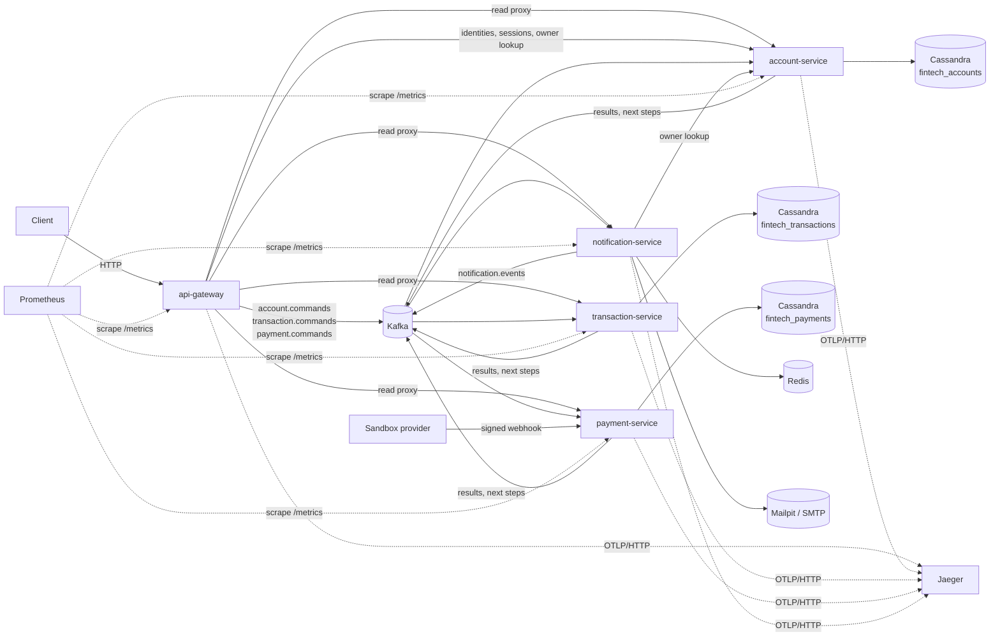
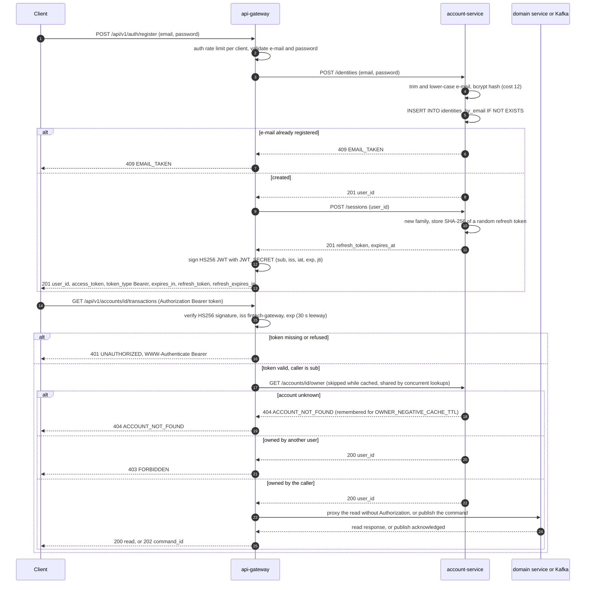
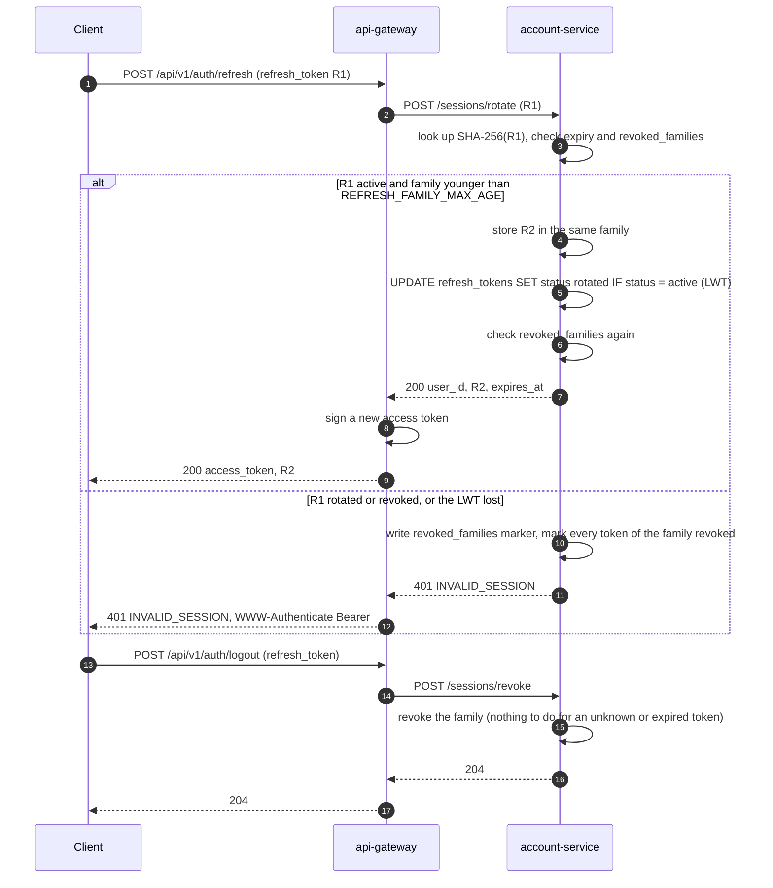
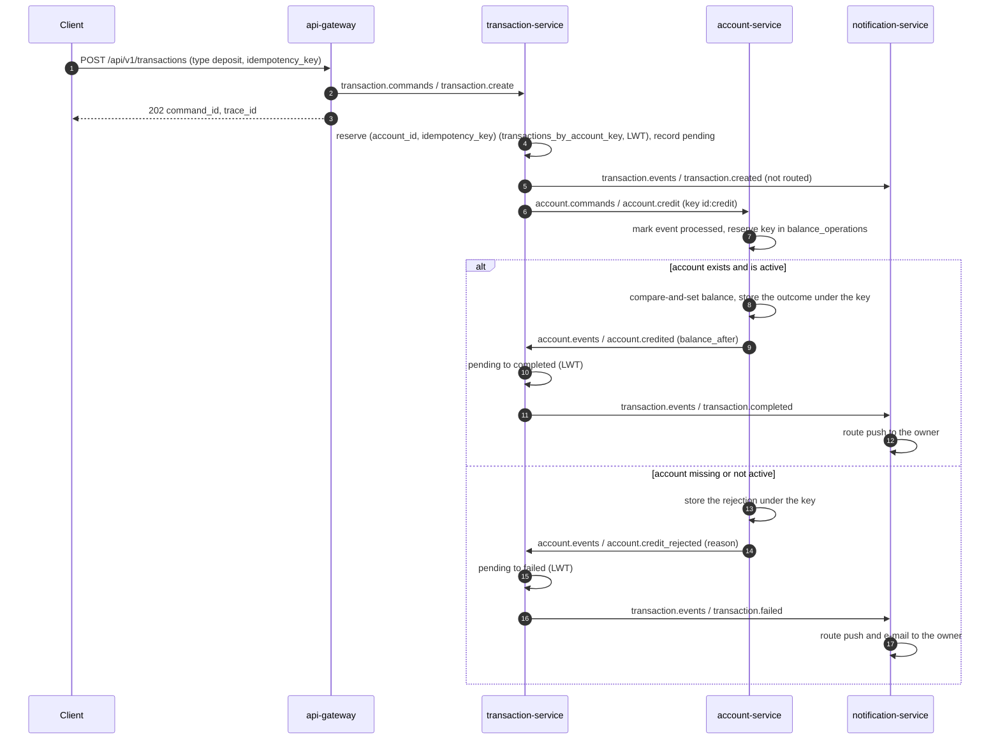
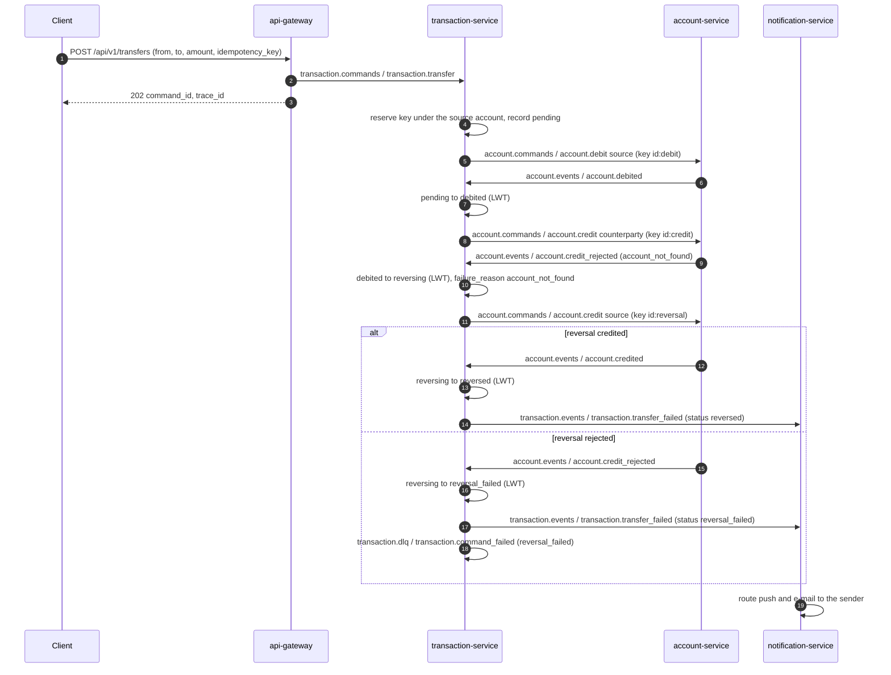
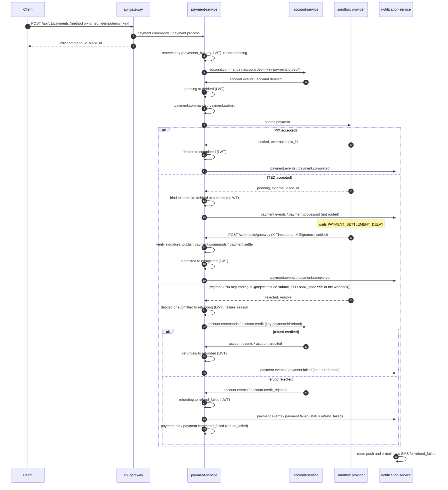
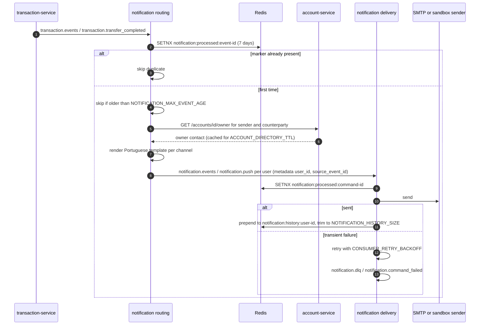
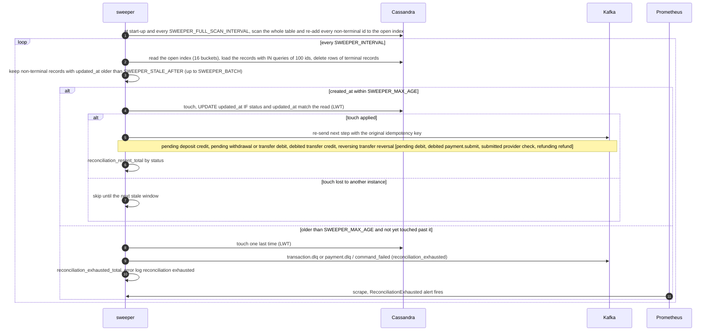

# Architecture

This document is the cross-service view of the platform: which component owns what, which topics connect them, how requests are authenticated, how the sagas and the notification pipeline run, where idempotency is enforced, what happens on failure, what the security model assumes and how the whole thing is observed. Each service's own configuration and endpoints are described in the [README](../README.md); the shared packages are documented in [`pkg/README.md`](../pkg/README.md).

## Components

| Component | Port (container / published) | Responsibility | State |
|---|---|---|---|
| `api-gateway` | 8080 / 8081 | Registers and logs users in through the account service and issues short-lived HS256 JWT access tokens next to the account service's rotating refresh tokens, which it exchanges (`/auth/refresh`) and revokes (`/auth/logout`); authenticates every other `/api/v1` request and lets it through only for the caller's own accounts and user id (see [Security](#security)); validates HTTP writes and publishes them as commands (`202` with `command_id` and `trace_id`); proxies reads to the domain services; serves the OpenAPI document at `GET /api/v1/openapi.yaml`; guards the Kafka producer with a circuit breaker; CORS and a per-client rate limit keyed on the connection address, or with `TRUST_PROXY_HEADERS=true` on the `TRUSTED_PROXY_HOPS`-th `X-Forwarded-For` entry counting from the right (`X-Real-IP` and `True-Client-IP` are never read), plus a separate limit on `/api/v1/auth/*` | In memory: account owners for `OWNER_CACHE_TTL` and unknown accounts for `OWNER_NEGATIVE_CACHE_TTL`, at most 10,000 entries |
| `account-service` | 8082 / 8082 | Customers and accounts; the only owner of balances — credits and debits are compare-and-set updates applied at most once per idempotency key; e-mail/password identities (bcrypt) with a per-e-mail login lockout behind internal `POST /identities` and `POST /identities/verify`, and refresh sessions behind internal `POST /sessions`, `/sessions/rotate` and `/sessions/revoke`, all for the gateway; internal owner endpoint for the gateway and the notification service | `fintech_accounts`: `accounts`, `customers`, lookup tables, `identities_by_email`, `login_failures`, `refresh_tokens`, `sessions_by_family`, `revoked_families`, `balance_operations`, `processed_events` |
| `transaction-service` | 8083 / 8083 | Deposits, withdrawals and transfers as sagas over `account.commands`, compensation of rejected transfer credits, reconciliation sweeper, per-account statements | `fintech_transactions`: `transactions`, `transactions_by_account`, `transactions_by_account_key`, `open_transactions`, `processed_events` (the older `transactions_by_key` is no longer used) |
| `payment-service` | 8084 / 8084 | PIX, TED and boleto as sagas: debit, submission to the sandbox provider, settlement (at once or by signed webhook), refund on rejection, reconciliation sweeper, per-account statements | `fintech_payments`: `payments`, `payments_by_account`, `payments_by_key`, `payments_by_external_id`, `open_payments`, `processed_events` |
| `notification-service` | 8085 / 8085 | Routes result events into e-mail, SMS and push commands and delivers them; per-user history | Redis (`maxmemory 256mb`, `noeviction`): processed markers and `notification:history:<user id>`; in memory: owner contacts, bounded by `ACCOUNT_DIRECTORY_MAX_ENTRIES` |
| Kafka 3.7.1 (KRaft) | 29092 internal / 9092 | Every topic pre-created by `kafka-init` with 3 partitions; 24 h log retention | — |
| Prometheus, Grafana, Jaeger | 9090, 3000, 16686 | Metrics scraping and alerting, dashboards, trace storage and UI — root compose `observability` profile | — |

Commands and results travel as the `pkg/events` envelope: `id`, `type`, `version`, `source`, `timestamp`, `trace_id`, `metadata`, `payload`. The envelope's `trace_id` is the gateway's `X-Request-ID`, copied from each command to the events it causes; it is a business correlation id, separate from the OpenTelemetry trace id carried in the Kafka `traceparent` header (see [Traces](#traces)).

Money in every payload is a `pkg/domain` `Amount`: an int64 number of cents that marshals as a decimal string with two decimal places (`"1234.50"`) and unmarshals from such a string or from a JSON number, which is how events written by earlier releases carry it. `events.FromJSON` decodes the envelope with `UseNumber`, so a numeric payload field reaches `Amount` as its original literal text, and a plain decimal literal is converted to cents exactly at any size instead of passing through a `float64`; it also rejects anything after the envelope's JSON value, and such a message is dead-lettered as `invalid_event`. That covers `amount`, `balance` and `balance_after` in the account, transaction and payment payloads. A payload whose amount has more than two decimal places or does not fit in int64 cents fails to decode and is dead-lettered at once as `bad_payload`. The same cents are stored in Cassandra `bigint` columns and come back as the same strings from the read APIs (`balance`, `amount`, `balance_after`, `from_balance_after`, `to_balance_after`). At the edge the gateway accepts `amount` as a string or a number, reads a number from its literal text, answers a malformed or over-precise one with `422 amount: amount`, and bounds it to more than zero (`gt`) and at most `9999999999999.99` (`lte`); a boleto's encoded amount is compared in cents. Since older consumers cannot decode string amounts, every service has to run a release that reads `Amount` before any of them publishes one; Sprint 9 was the first release that reads both forms and also publishes strings, so upgrading from an earlier release is a single coordinated deploy (stop every old instance, start the new release everywhere, then let traffic in).

An account statement (`GET /accounts/{account_id}/transactions` or `/payments`) reads the newest ids from `transactions_by_account` or `payments_by_account` and then fetches the records with `IN` queries of at most 100 ids each, so a page of up to 200 items costs at most three Cassandra queries; the page keeps the index's newest-first order and skips an id whose record is missing. `before` (RFC 3339, exclusive) adds `created_at < before` to the index query, and a full page answers an `X-Next-Before` header with the last row's `created_at` (RFC 3339 with nanoseconds) to pass as the next page's `before`; the gateway forwards both and exposes the header through CORS (`CORS_EXPOSED_HEADERS`, default `Link,X-Next-Before`). The cursor carries only a timestamp, which Cassandra keeps to the millisecond, so a row created in the same millisecond as a page's last row but left off that page is skipped by the next one.

## Topics

Group names are the defaults (`KAFKA_GROUP_ID` of each service plus the suffix set in its `cmd/main.go`).

| Topic | Producers (event types) | Consumers (group) |
|---|---|---|
| `account.commands` | `api-gateway` (`account.create`, `account.update`, `account.delete`); `transaction-service` (`account.credit`, `account.debit`); `payment-service` (`account.debit`, and `account.credit` for refunds) | `account-service` (`account-service`) |
| `transaction.commands` | `api-gateway` (`transaction.create`, `transaction.transfer`) | `transaction-service` (`transaction-service`) |
| `payment.commands` | `api-gateway` (`payment.process`); `payment-service` itself (`payment.submit` after the debit and from the sweeper, `payment.settle` from the webhook handler) | `payment-service` (`payment-service`) |
| `account.events` | `account-service` (`account.created`, `account.updated`, `account.deleted`, `account.credited`, `account.debited`, `account.credit_rejected`, `account.debit_rejected`) | `transaction-service` (`transaction-service-replies`), `payment-service` (`payment-service-replies`), `notification-service` (`notification-service-accounts`) |
| `transaction.events` | `transaction-service` (`transaction.created`, `transaction.completed`, `transaction.failed`, `transaction.transfer_completed`, `transaction.transfer_failed`) | `notification-service` (`notification-service-transactions`) |
| `payment.events` | `payment-service` (`payment.created`, `payment.processed`, `payment.completed`, `payment.failed`) | `notification-service` (`notification-service-payments`) |
| `notification.events` | `notification-service` routing (`notification.email`, `notification.sms`, `notification.push`, keyed by user id) | `notification-service` delivery (`notification-service`) |
| `account.dlq` | `account-service` (`account.command_failed`) | none — inspected by operators |
| `transaction.dlq` | `transaction-service` (`transaction.command_failed`: processor failures on commands and on replies, `reversal_failed`, `reconciliation_exhausted`) | none |
| `payment.dlq` | `payment-service` (`payment.command_failed`: processor failures, `refund_failed`, `reconciliation_exhausted`) | none |
| `notification.dlq` | `notification-service` (`notification.command_failed`) | none |

The transaction and payment services each run two processors over one `processed_events` table and one dead-letter topic: one for their command topic and one for the account service's replies on `account.events`; a reply that does not match a known saga step is ignored.

## Flows

In the diagrams, an arrow between two services is a message published on Kafka and consumed by the other side; its label names the topic and the event type. "LWT" is a Cassandra lightweight transaction.

### Authentication and ownership

Every flow below starts with a request that has already been through these checks. Registration is shown; login is the same exchange with `POST /identities/verify`, answered `200` with the user id, `401 INVALID_CREDENTIALS` or, for a locked e-mail, `429 TOO_MANY_ATTEMPTS` (see [Sessions and login lockout](#sessions-and-login-lockout)). Here the arrows between the gateway and the account service are synchronous HTTP calls.

`/users/{user_id}/…` routes compare the path with `sub` and need no lookup; `GET /transactions/{id}` and `GET /payments/{id}` proxy first and release the record only when its account (or, for a transfer, the counterparty) belongs to the caller. The full route table is in the README's [Authentication and authorization](../README.md#authentication-and-authorization).

### Sessions and login lockout

A session is a family of refresh tokens that starts at login or registration. Each refresh token works once: a refresh rotates it into the next token of the family, and presenting a token that was already used revokes the whole family. The account service stores only SHA-256 hashes of the tokens.

Refresh tokens live `REFRESH_TOKEN_TTL` (default `720h`) and never outlive their family's `REFRESH_FAMILY_MAX_AGE` (default `2160h`). The revoked-family marker is written before the tokens are marked, and a rotation checks it both before and after its LWT, so a revocation running at the same time as a rotation wins: the token the rotation just issued is refused. A rotation whose write outcome is unknown answers an error although the token may have been rotated; a client that retries with the same token then revokes its own family and logs in again. Access tokens are not tracked, so logout doesn't cut one short: it stays valid until its `exp` (`JWT_TTL`, default `15m`).

`POST /identities/verify` reserves every attempt in `login_failures`, keyed by the normalised e-mail whether or not it is registered, with an LWT compare-and-set before it checks the password. Once `LOGIN_MAX_FAILURES` (default `5`) attempts count within `LOGIN_LOCKOUT_WINDOW` (default `15m`, a fixed window from the first failure measured by the service's clock), it answers `429 TOO_MANY_ATTEMPTS` with `Retry-After` set to the seconds left, even for the right password, so at most `LOGIN_MAX_FAILURES` passwords are compared per e-mail per window however many requests race. A success deletes the row; an attempt that fails for a reason other than wrong credentials gives its reservation back. An attempt that keeps losing the compare-and-set, or whose write has an unknown outcome, answers `429` with `Retry-After: 1`; one that can't read or write the row answers `503 SERVICE_BUSY` with `Retry-After: 1` without comparing the password. The gateway forwards `Retry-After` on both.

### Deposit

A withdrawal is the same flow with `account.debit` (key `id:debit`), settling on `account.debited` or failing on `account.debit_rejected` (`insufficient_funds`, `account_not_active`, `account_not_found`).

### Transfer with reversal

The counterparty credit is rejected with `account_not_found`, so the debit is compensated with a credit back to the source.

A rejected source debit fails the transfer directly (`pending` to `failed`, `transaction.transfer_failed` with status `failed`). A completed credit moves `debited` to `completed` and publishes `transaction.transfer_completed`, which notifies both parties.

### PIX and TED payments with refund

The debit step mirrors the withdrawal above; a rejected debit fails the payment outright (`pending` to `failed`, `payment.failed`) without reaching the provider. Boleto follows the TED path.

A settlement that arrives before its external id is bound, or while the payment is still `debited`, is a `conflict`: retried with the consumer backoff and dead-lettered if it never lands.

### Notification routing and delivery

Routing skips accounts the account service does not know (`404`), and the routing rules per event are the table in the README. Because the processed marker is written before the send, delivery is at most once across crashes (see [Failure semantics](#failure-semantics)).

### Reconciliation sweep and exhaustion

The transaction and payment services run the same sweeper; the payment service's next steps are shown in brackets.

A row that was touched after `created_at + SWEEPER_MAX_AGE` is left out of later sweeps, so each record raises the exhaustion alert once. `SWEEPER_MAX_AGE` must stay below the 30-day `balance_operations` TTL (the services refuse to start otherwise), because a re-send after the key expired would be applied again.

The sweep reads only the open-record index, `open_transactions` or `open_payments` (migrations 007 and 008): `PRIMARY KEY ((bucket), transaction_id)` or `((bucket), payment_id)`, with 16 buckets named after the first hex character of the id and `gc_grace_seconds = 3600`, so the tombstones of deleted rows become purgeable by compaction after an hour. A record's row is written in the same batch as the record and deleted, best effort, by the transition that moves it to a terminal status (`completed`, `failed`, `reversed` or `reversal_failed` for a transaction; `completed`, `failed`, `refunded` or `refund_failed` for a payment). A sweep deletes the rows of records it finds already terminal and keeps the rows of records it can't read yet, so a sweep costs 16 partition reads and at most one `IN` query per 100 open ids, however long the history is. An exhausted record stays non-terminal, and so stays in the index, until it is resolved. A full scan of the record table (`Reindex`) re-adds every non-terminal id, covering index writes that were lost: it runs once when the sweeper starts, before its first sweep, and every `SWEEPER_FULL_SCAN_INTERVAL` (default `24h`, `0` disables only the periodic rescans), inside the sweeper's loop, so sweeps wait while it runs; the first start after an upgrade uses it to index the records that were already open.

## Idempotency layers

| Layer | Where | Key | Guarantee |
|---|---|---|---|
| Client idempotency key | Required by the gateway on `POST /transactions`, `/transfers` and `/payments` — 1 to 64 printable ASCII characters (`0x21`–`0x7E`), no spaces, the `pkg/validation` `idempotency_key` rule, checked again by the owning service — and reserved by that service with `INSERT ... IF NOT EXISTS` | `transactions_by_account_key` (`account_id`, key; the source account for a transfer); `payments_by_key` (`account_id`, key) | A key repeated on the same account never creates a second transaction or payment; the duplicate command is logged and ignored. Different accounts may use the same key |
| Processed events | Every processor, before dispatch (`pkg/processor`) | Event id in `processed_events` (Cassandra, `IF NOT EXISTS`, 7-day TTL) or `notification:processed:<event id>` (Redis `SETNX`, 7 days) | A redelivered message is skipped and counted as `messages_processed_total{outcome="duplicate"}`; a replay needs a new event id |
| Balance operations | `account-service` on every `account.credit` / `account.debit` | (`account_id`, `idempotency_key`) in `balance_operations`, 30-day TTL; saga keys `id:debit`, `id:credit`, `id:reversal` and `payment:id:debit`, `payment:id:refund` | Each balance change applies at most once; a repeated key replays the stored reply; a key reused for the other operation kind is `idempotency_key_reused`; a key still `pending` is `ambiguous_write` |
| LWT transitions | `transaction-service`, `payment-service` | `UPDATE ... IF status = <expected>`; sweeper touches add `AND updated_at = <read>` | A duplicate or stale reply cannot move a saga twice; only one instance acts on a stale record |

The sandbox provider deduplicates submissions by payment id; a real provider must be given the payment id as its idempotency key, since the sweeper may re-submit a `debited` or `submitted` payment.

## Failure semantics

- **Delivery.** Consumers commit each message after its handler returns, so delivery is at least once; the processed-events layer turns that into at-most-once processing per event id. On shutdown the in-flight message gets up to `CONSUMER_DRAIN_TIMEOUT` to finish; a consumer that stops on an error is rebuilt with `CONSUMER_RETRY_BACKOFF` while the HTTP API keeps serving. A fetch that fails with a cancelled or expired context is a clean stop only when the service itself is shutting down; otherwise it is an error like any other, and the consumer is rebuilt.
- **Retries.** A dispatcher error is retried in process with `CONSUMER_RETRY_BACKOFF` (default `200ms,1s,5s`, so up to four attempts) unless it is permanent: invalid data (the domain code, such as `invalid_amount`), `not_found`, `ambiguous_write`, `unknown_command`, `bad_payload` or `panic` are dead-lettered at once. Transient errors that outlive the backoff are dead-lettered as `conflict` or `internal_error`. The dead-letter event is `<domain>.command_failed` with `error_code`, `error_message`, `retries` (dispatch attempts) and the original event.
- **Other dead-letter codes.** `invalid_event` for a message that is not a decodable envelope with a uuid id; `publish_failed` when a result could not be published (the event itself is dead-lettered and logged); `reversal_failed` and `refund_failed` when a compensation is rejected; `reconciliation_exhausted` from the sweepers.
- **Redelivery instead of dead-letter.** A cancelled context or a failure of the processed-events store returns the error to the consumer, which does not commit, so the message is processed again after the restart.
- **`ambiguous_write`.** A Cassandra write timeout or unavailable error, an unknown LWT outcome, a client-side timeout or a cancelled write context may or may not have applied, so it is never retried automatically. In the account service the balance operation stays `pending` and every re-send of that key gets `ambiguous_write` again until the sweeper reaches `SWEEPER_MAX_AGE` and raises `reconciliation_exhausted`; the record then needs manual resolution well within the 30-day TTL (check the balance and the `balance_operations` row before replaying anything).
- **Notifications.** The processed marker is written before the send, so a crash mid-delivery drops that notification (at most once), while an in-process retry after an ambiguous provider error can repeat one. Redis runs with `maxmemory 256mb` and `noeviction`, so a marker is never evicted to make room (an evicted marker would let a redelivered event notify again); when Redis is full, writes fail instead: a marker write is retried with the backoff and then returned to the consumer uncommitted, so the event is processed again once there is room, and a failed history write is logged and dropped. Size `maxmemory` for the notification volume, since markers live 7 days. Routing skips source events older than `NOTIFICATION_MAX_EVENT_AGE`; delivery commands have no age check.
- **Gateway.** When the broker is unreachable or the circuit breaker is open, writes answer `503 PUBLISH_FAILED`; a down upstream answers `502 UPSTREAM_UNAVAILABLE` on reads, and so does a failed owner lookup on any account-scoped route and a failed identity call on registration or login (the identity and owner clients never follow redirects, so a redirect counts as a failure). An account service that is already hashing as many passwords as it allows, or can't reach its login-failure counters, answers `503 SERVICE_BUSY` with `Retry-After: 1`, and a locked e-mail `429 TOO_MANY_ATTEMPTS` with the seconds left in `Retry-After`; the gateway passes both through with their `Retry-After`. A refresh or logout the account service can't answer is `502 UPSTREAM_UNAVAILABLE`, and a logout that fails that way has not revoked anything. `401`, `403` and `404 ACCOUNT_NOT_FOUND` are answered before anything is published, so a refused command never reaches Kafka.
- **HTTP panics.** Every router mounts `pkg/middleware.Recovery(log)`: a panicking handler is logged at error level as `handler panicked` (panic value, stack, request id, method, path, `otel_trace_id` and `otel_span_id` when present) and answered with the JSON error envelope, `500 INTERNAL_ERROR`, unless it had already written a response. `http.ErrAbortHandler` is re-raised so the server aborts the connection as usual.

## Security

**Identities.** The account service owns them: `identities_by_email` (migration 008) keys a user by the trimmed, lower-cased e-mail and keeps a random user id and a bcrypt hash (cost 12) of a password of 8 to 72 bytes. Registration is an `IF NOT EXISTS` insert, so an e-mail is registered once. Verification gives the same `401 INVALID_CREDENTIALS` for an unknown e-mail, a wrong password, an invalid e-mail and a password over 72 bytes, and runs a bcrypt comparison against a fixed dummy hash when there is no identity, so neither the answer nor its timing tells whether login succeeded because the e-mail exists. Registration does tell: a taken e-mail answers `409 EMAIL_TAKEN`, a deliberate usability trade-off that the auth rate limit below only slows down. bcrypt runs behind a semaphore of `IDENTITY_HASH_CONCURRENCY` slots (default `2 × GOMAXPROCS`) shared by hashes, real comparisons and the dummy comparison; a request that can't get a slot within 2 s, or whose context ends first, answers `503 SERVICE_BUSY`, so a login flood degrades into fast refusals instead of an unbounded CPU queue. Both endpoints are internal: the gateway doesn't proxy them. Verification also enforces the per-e-mail lockout described in [Sessions and login lockout](#sessions-and-login-lockout): it counts unknown e-mails like registered ones, so a `429` reveals nothing either.

**Tokens.** The gateway signs HS256 JWTs with `JWT_SECRET` (`sub` user id, `iss` `fintech-gateway`, `iat`, `exp` after `JWT_TTL`, default `15m` and at most `24h` — a longer value stops the gateway at start-up — and a random `jti`) and verifies them with the algorithm pinned to HS256, the issuer checked, `exp` required and 30 s of leeway. The secret is trimmed of surrounding whitespace and must then be at least 32 bytes or the gateway refuses to start; the value shipped in `services/api-gateway/docker-compose.yml` and `.env.example` is public and only for development, so the gateway logs a warning at start-up whenever it runs with it, and any real deployment sets its own random secret. Clients renew access tokens with the account service's single-use refresh tokens (see [Sessions and login lockout](#sessions-and-login-lockout)); a leaked refresh token is usable at most once before reuse detection revokes its session, and logout revokes a session on purpose. There is no revocation list for access tokens: the `jti` is not tracked, so a leaked access token stays valid until its `exp`, which is why `JWT_TTL` is short. Password reset, MFA and listing a user's sessions are out of scope. Changing `JWT_SECRET` invalidates every token at once.

**Authentication and authorization.** Every `/api/v1` route except `/auth/register`, `/auth/login`, `/auth/refresh`, `/auth/logout` and `/openapi.yaml` requires `Authorization: Bearer`, answering `401 UNAUTHORIZED` with `WWW-Authenticate: Bearer` otherwise; `/health` and `/metrics` sit outside `/api/v1` and are not authenticated. Ownership is enforced in the gateway only: a path `user_id` must equal `sub`, and an account named in a path or a command body (`account_id`, or `from_account_id` for a transfer) must belong to `sub`, as told by the account service's `GET /accounts/{id}/owner` and cached for `OWNER_CACHE_TTL`; concurrent lookups of one account share a single call, and an unknown account is remembered for `OWNER_NEGATIVE_CACHE_TTL` (default `5s`, `0` turns it off), so a burst for an unknown id doesn't turn into a burst on the account service. `POST /accounts` takes the user id from the token. Violations answer `403 FORBIDDEN`, unknown accounts `404 ACCOUNT_NOT_FOUND`. The owner check fails closed: an account id in a read path that is not a UUID answers `422 VALIDATION_ERROR` (`details` `{"id":"uuid"}` or `{"account_id":"uuid"}`) from the gateway; a percent-encoded id is decoded for the owner check (so another user's account still answers `403`) and then refused with the same `422`, so only unencoded ids that parse as UUIDs reach a service. `GET /transactions/{id}` serves the owner of `account_id` the record as stored, and the owner of only `counterparty_id` the same record without `description` and `idempotency_key`, which the sender chose. The gateway drops `Authorization` from proxied reads.

**CORS.** By default any origin may call the API (`CORS_ALLOWED_ORIGINS=*`) with `GET`, `POST`, `PUT`, `PATCH`, `DELETE` and `OPTIONS`, and `CORS_ALLOW_CREDENTIALS` is `false`: the API authenticates with a bearer token, not cookies, so browsers have no ambient credential to send. Turn credentials on only together with an explicit origin list.

**Brute force.** `/auth/register`, `/auth/login`, `/auth/refresh` and `/auth/logout` share a limiter of `AUTH_RATE_LIMIT_REQUESTS` (default 10) per `AUTH_RATE_LIMIT_WINDOW` (default `1m`) per client address, IPv6 counted by /64, on top of the general limit. It slows one client down; guesses spread over many addresses are capped by the per-e-mail lockout instead, at `LOGIN_MAX_FAILURES` passwords per `LOGIN_LOCKOUT_WINDOW` for each e-mail. The flip side is that anyone who knows an e-mail can lock it for the rest of the window with five wrong passwords (by default), a trade-off accepted for a limit that can't be spread across addresses.

**Trust boundary.** The domain services trust the gateway: there is no service-to-service authentication, and their HTTP APIs — reads, `GET /accounts/{id}/owner`, `POST /identities`, `POST /identities/verify` and the `/sessions` endpoints — answer anyone who reaches them. `POST /sessions` trusts the `user_id` it is given, so whoever reaches the account service can start a session for any user; its compose file publishes it on `127.0.0.1:8082` only. The other ports are published by the compose files only for development; in any other deployment only the gateway (and the payment service's signed webhook) may be reachable from outside. Kafka is unauthenticated too, so whoever can publish a command bypasses the gateway's checks.

## Observability

Every service builds its registry and tracer in `cmd/main.go` from three variables:

| Variable | Default | Effect |
|---|---|---|
| `METRICS_ENABLED` | `true` | Registers the metrics and mounts `GET /metrics` on the service's HTTP port; `false` leaves the route unmounted |
| `OTEL_EXPORTER_OTLP_ENDPOINT` | empty | OTLP/HTTP base URL (spans go to `/v1/traces`). Empty keeps a provider without exporter: spans still get ids, which propagate over HTTP and Kafka and appear in logs, but nothing is exported. A value that is not an `http`/`https` URL with a host stops the service at start-up |
| `OTEL_SAMPLER_RATIO` | `1.0` | Root sampling ratio (parent-based, so a sampled parent is always followed); `<= 0` or `> 1` means `1` |

### Metrics

All series carry a `service` label (`api-gateway`, `account-service`, `transaction-service`, `payment-service`, `notification-service`), next to the Go runtime and process collectors.

| Metric | Type | Labels | Recorded by |
|---|---|---|---|
| `http_requests_total` | counter | `method`, `route`, `status` | `pkg/metrics` middleware on every service; `route` is the chi pattern or `unmatched`; `method` is one of the nine standard methods or `OTHER` |
| `http_request_duration_seconds` | histogram | `method`, `route` | same |
| `messages_processed_total` | counter | `type`, `outcome` (`ok`, `duplicate`, `dead_lettered`) | `pkg/processor`; undecodable messages, events without a valid uuid id and commands no handler knows use type `unknown` |
| `message_processing_duration_seconds` | histogram | `type` | `pkg/processor` |
| `message_retries_total` | counter | `type` | `pkg/processor`, dispatch attempts beyond the first |
| `messages_published_total` | counter | `topic`, `outcome` (`ok`, `error`) | `pkg/messaging` producer on every service |
| `kafka_consumer_lag` | gauge | `topic`, `group` | `pkg/messaging` consumer after every fetch: the lag of the partition the latest message came from, not a sum over partitions |
| `circuit_breaker_state` | gauge | — | `api-gateway` producer breaker, read at scrape time: `0` closed, `1` half-open, `2` open; an open breaker reports half-open once its timeout passes, even without traffic |
| `reconciliation_resent_total` | counter | `status` | `transaction-service` and `payment-service` sweepers |
| `reconciliation_exhausted_total` | counter | — | same sweepers |
| `notifications_sent_total` | counter | `channel`, `outcome` (`ok`, `error`) | `notification-service` delivery |

A result publish that fails still counts the processed message as `ok`; the failure shows up as `messages_published_total{outcome="error"}` and as a `publish_failed` dead letter. The gateway's `/metrics` sits behind the same middleware chain as the API, including the per-IP rate limit, but not behind authentication.

### Traces

`tracing.Init` installs the W3C `traceparent`/`tracestate` and `baggage` propagators. The spans a request produces:

- **HTTP server** — `tracing.Middleware` on every domain service router continues an incoming `traceparent` and names the span after the route (`POST /api/v1/transactions`). The gateway uses `tracing.EdgeMiddleware` instead: it starts a new root span, records a client's `traceparent` only as a span link, and strips `traceparent`, `tracestate` and `baggage` from the request so none of them reaches the services. Neither traces `/health` or `/metrics`. A method outside the nine standard ones is recorded as `_OTHER` (span name `HTTP`), with the raw value in `http.request.method_original`.
- **HTTP client** — the gateway's read proxy, identity client and owner lookup use `tracing.Transport`, so proxied reads, registrations, logins, refreshes, logouts and owner lookups continue into the domain service's server span.
- **Kafka publish** — `Producer.Publish` starts a `publish <topic>` producer span and injects `traceparent` into the message headers, next to the `event_type` and `trace_id` headers.
- **Kafka consume** — the consumer hands the handler a context extracted from those headers, and `Processor.Process` runs in a `process <event type>` consumer span; the store, the dispatcher and every publish use that span's context, so results and dead letters stay on the same trace. Events labelled `unknown` (see the metrics table) get `process unknown`, with their own type in `messaging.message.type_original`.

A deposit is therefore one trace from the gateway's HTTP span through the transaction service, the account service, back to the transaction service and on to the notification service's routing, owner lookup and delivery. Two hops start a new trace by design: sweeper re-sends (they are not triggered by a message) and the sandbox provider's webhook call (fired from a timer without request context, like a real provider's callback).

Request log lines (`pkg/middleware.Logger`) and the processor's own log lines carry `otel_trace_id` and `otel_span_id`, so a log entry leads to its trace in Jaeger.

### Stack

The root compose's `observability` profile adds:

| Service | Image | UI | Notes |
|---|---|---|---|
| Prometheus | `prom/prometheus:v3.14.0` | `127.0.0.1:${PROMETHEUS_PORT:-9090}` | `observability/prometheus/prometheus.yml`: 15 s scrape and evaluation, one job per service at its compose hostname (`api-gateway:8080`, `account-service:8082`, `transaction-service:8083`, `payment-service:8084`, `notification-service:8085`); rules in `alerts.yml` |
| Grafana | `grafana/grafana:13.2.2` | `127.0.0.1:${GRAFANA_PORT:-3000}` | Anonymous Viewer access; `admin` / `GRAFANA_ADMIN_PASSWORD` (default `admin`) to edit. Provisioned Prometheus (default) and Jaeger data sources and the dashboard below as the home dashboard |
| Jaeger | `jaegertracing/jaeger:2.20.0` | `127.0.0.1:${JAEGER_UI_PORT:-16686}` | OTLP on 4317 (gRPC) and 4318 (HTTP), reachable only on the compose network as `jaeger`. Pinned to 2.20.0 because 2.21 removed the legacy `/api/*` query API that Grafana 13.2.2's Jaeger data source uses |

`STACK_OBSERVABILITY=1 scripts/stack.sh up` starts the profile and exports `OTEL_EXPORTER_OTLP_ENDPOINT=http://jaeger:4318` (unless already set) before starting the services, whose compose files pass the variable through; `wait` then also polls the three UIs. Prometheus reaches the services by their compose hostnames, so they must run in their compose stacks on the shared `fintech-bank-platform_fintech-network`.

### Dashboard

"Platform overview" (uid `fintech-overview`, folder Fintech, refreshed every 30 s, filtered by a `service` variable):

- **Health** — scrape targets up, circuit breaker state.
- **HTTP** — request rate, 5xx ratio and p95 latency by service and route.
- **Messaging** — messages processed by outcome, dead letters by service and type, consumer lag (latest fetched partition).
- **Reconciliation and notifications** — re-sent and exhausted records, notifications by channel and outcome.

A "Traces in Jaeger (Explore)" link opens the Jaeger data source filtered by the service picked in the `trace_service` variable.

### Alerts

`observability/prometheus/alerts.yml`, group `fintech`. Prometheus evaluates them and shows them on its Alerts page; no Alertmanager is configured.

| Alert | Expression | For | Severity |
|---|---|---|---|
| `ServiceDown` | `up == 0` | 1m | critical |
| `HighErrorRate` | 5xx share of `http_requests_total` per service over 5m `> 0.05` | 5m | warning |
| `DeadLettersGrowing` | `increase(messages_processed_total{outcome="dead_lettered"}[10m]) > 0 or (messages_processed_total{outcome="dead_lettered"} unless messages_processed_total{outcome="dead_lettered"} offset 10m)` | — | warning |
| `ConsumerLagHigh` | `kafka_consumer_lag > 1000` | 5m | warning |
| `ReconciliationExhausted` | `increase(reconciliation_exhausted_total[15m]) > 0` | — | critical |
| `CircuitBreakerOpen` | `circuit_breaker_state == 2` | 1m | critical |

A counter series only appears on its first increment, so `increase` alone never sees the first dead letter of a `service`/`type` pair; the `unless … offset 10m` branch fires for a series that did not exist 10 minutes earlier. The sweepers expose `reconciliation_exhausted_total` at `0` from start-up, so `increase` sees its first step. `DeadLettersGrowing` counts processor dead letters only; the saga alerts (`reversal_failed`, `refund_failed`) and the sweeper's `reconciliation_exhausted` event are published straight to the DLQ topics, and the last one has its own alert.
