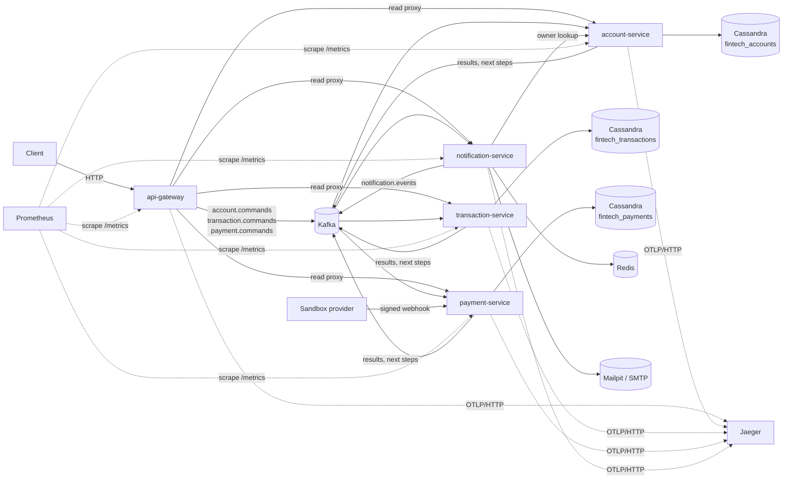
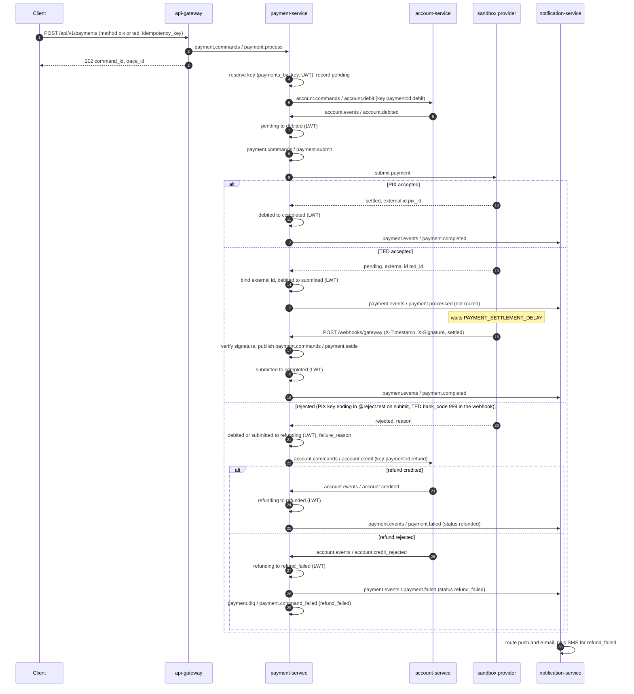
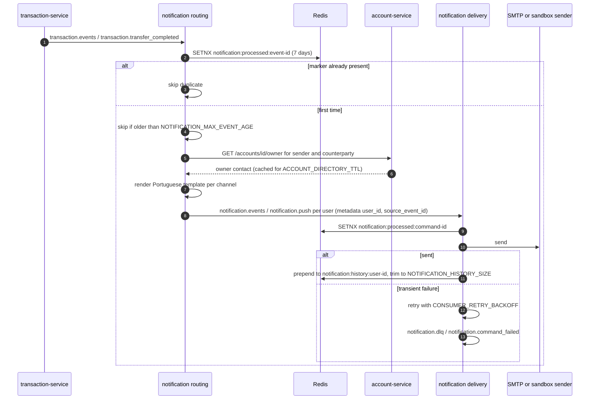
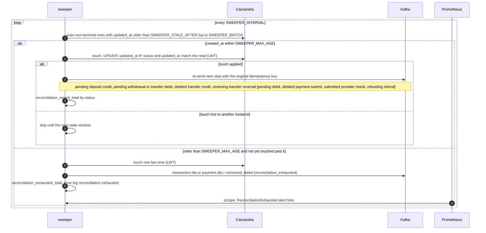

# Architecture

This document is the cross-service view of the platform: which component owns what, which topics connect them, how the sagas and the notification pipeline run, where idempotency is enforced, what happens on failure and how the whole thing is observed. Each service's own configuration and endpoints are described in the [README](../README.md); the shared packages are documented in [`pkg/README.md`](../pkg/README.md).

## Components

| Component | Port (container / published) | Responsibility | State |
|---|---|---|---|
| `api-gateway` | 8080 / 8081 | Validates HTTP writes and publishes them as commands (`202` with `command_id` and `trace_id`); proxies reads to the domain services; serves the OpenAPI document at `GET /api/v1/openapi.yaml`; guards the Kafka producer with a circuit breaker; CORS and per-IP rate limit | none |
| `account-service` | 8082 / 8082 | Customers and accounts; the only owner of balances — credits and debits are compare-and-set updates applied at most once per idempotency key; internal owner endpoint for the notification service | `fintech_accounts`: `accounts`, `customers`, lookup tables, `balance_operations`, `processed_events` |
| `transaction-service` | 8083 / 8083 | Deposits, withdrawals and transfers as sagas over `account.commands`, compensation of rejected transfer credits, reconciliation sweeper | `fintech_transactions`: `transactions`, `transactions_by_account`, `transactions_by_key`, `processed_events` |
| `payment-service` | 8084 / 8084 | PIX, TED and boleto as sagas: debit, submission to the sandbox provider, settlement (at once or by signed webhook), refund on rejection, reconciliation sweeper | `fintech_payments`: `payments`, `payments_by_account`, `payments_by_key`, `payments_by_external_id`, `processed_events` |
| `notification-service` | 8085 / 8085 | Routes result events into e-mail, SMS and push commands and delivers them; per-user history | Redis: processed markers and `notification:history:<user id>` |
| Kafka 3.7.1 (KRaft) | 29092 internal / 9092 | Every topic pre-created by `kafka-init` with 3 partitions; 24 h log retention | — |
| Prometheus, Grafana, Jaeger | 9090, 3000, 16686 | Metrics scraping and alerting, dashboards, trace storage and UI — root compose `observability` profile | — |

Commands and results travel as the `pkg/events` envelope: `id`, `type`, `version`, `source`, `timestamp`, `trace_id`, `metadata`, `payload`. The envelope's `trace_id` is the gateway's `X-Request-ID`, copied from each command to the events it causes; it is a business correlation id, separate from the OpenTelemetry trace id carried in the Kafka `traceparent` header (see [Traces](#traces)).

## Topics

Group names are the defaults (`KAFKA_GROUP_ID` of each service plus the suffix set in its `cmd/main.go`).

| Topic | Producers (event types) | Consumers (group) |
|---|---|---|
| `account.commands` | `api-gateway` (`account.create`, `account.update`, `account.delete`); `transaction-service` (`account.credit`, `account.debit`); `payment-service` (`account.debit`, and `account.credit` for refunds) | `account-service` (`account-service`) |
| `transaction.commands` | `api-gateway` (`transaction.create`, `transaction.transfer`) | `transaction-service` (`transaction-service`) |
| `payment.commands` | `api-gateway` (`payment.process`); `payment-service` itself (`payment.submit` after the debit and from the sweeper, `payment.settle` from the webhook handler) | `payment-service` (`payment-service`) |
| `account.events` | `account-service` (`account.created`, `account.updated`, `account.deleted`, `account.credited`, `account.debited`, `account.credit_rejected`, `account.debit_rejected`) | `transaction-service` (`transaction-service-replies`), `payment-service` (`payment-service-replies`), `notification-service` (`notification-service-accounts`) |
| `transaction.events` | `transaction-service` (`transaction.created`, `transaction.completed`, `transaction.failed`, `transaction.transfer_completed`, `transaction.transfer_failed`) | `notification-service` (`notification-service-transactions`) |
| `payment.events` | `payment-service` (`payment.created`, `payment.processed`, `payment.completed`, `payment.failed`) | `notification-service` (`notification-service-payments`) |
| `notification.events` | `notification-service` routing (`notification.email`, `notification.sms`, `notification.push`, keyed by user id) | `notification-service` delivery (`notification-service`) |
| `account.dlq` | `account-service` (`account.command_failed`) | none — inspected by operators |
| `transaction.dlq` | `transaction-service` (`transaction.command_failed`: processor failures on commands and on replies, `reversal_failed`, `reconciliation_exhausted`) | none |
| `payment.dlq` | `payment-service` (`payment.command_failed`: processor failures, `refund_failed`, `reconciliation_exhausted`) | none |
| `notification.dlq` | `notification-service` (`notification.command_failed`) | none |

The transaction and payment services each run two processors over one `processed_events` table and one dead-letter topic: one for their command topic and one for the account service's replies on `account.events`; a reply that does not match a known saga step is ignored.

## Flows

In the diagrams, an arrow between two services is a message published on Kafka and consumed by the other side; its label names the topic and the event type. "LWT" is a Cassandra lightweight transaction.

### Deposit

A withdrawal is the same flow with `account.debit` (key `id:debit`), settling on `account.debited` or failing on `account.debit_rejected` (`insufficient_funds`, `account_not_active`, `account_not_found`).

### Transfer with reversal

The counterparty credit is rejected with `account_not_found`, so the debit is compensated with a credit back to the source.

A rejected source debit fails the transfer directly (`pending` to `failed`, `transaction.transfer_failed` with status `failed`). A completed credit moves `debited` to `completed` and publishes `transaction.transfer_completed`, which notifies both parties.

### PIX and TED payments with refund

The debit step mirrors the withdrawal above; a rejected debit fails the payment outright (`pending` to `failed`, `payment.failed`) without reaching the provider. Boleto follows the TED path.

A settlement that arrives before its external id is bound, or while the payment is still `debited`, is a `conflict`: retried with the consumer backoff and dead-lettered if it never lands.

### Notification routing and delivery

Routing skips accounts the account service does not know (`404`), and the routing rules per event are the table in the README. Because the processed marker is written before the send, delivery is at most once across crashes (see [Failure semantics](#failure-semantics)).

### Reconciliation sweep and exhaustion

The transaction and payment services run the same sweeper; the payment service's next steps are shown in brackets.

A row that was touched after `created_at + SWEEPER_MAX_AGE` is left out of later scans, so each record raises the exhaustion alert once. `SWEEPER_MAX_AGE` must stay below the 30-day `balance_operations` TTL (the services refuse to start otherwise), because a re-send after the key expired would be applied again.

## Idempotency layers

| Layer | Where | Key | Guarantee |
|---|---|---|---|
| Client idempotency key | Required by the gateway on `POST /transactions`, `/transfers` and `/payments` (1–64 characters), reserved by the owning service with `INSERT ... IF NOT EXISTS` | `transactions_by_key` (key alone); `payments_by_key` (`account_id`, key) | A repeated key never creates a second transaction or payment; the duplicate command is logged and ignored |
| Processed events | Every processor, before dispatch (`pkg/processor`) | Event id in `processed_events` (Cassandra, `IF NOT EXISTS`, 7-day TTL) or `notification:processed:<event id>` (Redis `SETNX`, 7 days) | A redelivered message is skipped and counted as `messages_processed_total{outcome="duplicate"}`; a replay needs a new event id |
| Balance operations | `account-service` on every `account.credit` / `account.debit` | (`account_id`, `idempotency_key`) in `balance_operations`, 30-day TTL; saga keys `id:debit`, `id:credit`, `id:reversal` and `payment:id:debit`, `payment:id:refund` | Each balance change applies at most once; a repeated key replays the stored reply; a key reused for the other operation kind is `idempotency_key_reused`; a key still `pending` is `ambiguous_write` |
| LWT transitions | `transaction-service`, `payment-service` | `UPDATE ... IF status = <expected>`; sweeper touches add `AND updated_at = <read>` | A duplicate or stale reply cannot move a saga twice; only one instance acts on a stale record |

The sandbox provider deduplicates submissions by payment id; a real provider must be given the payment id as its idempotency key, since the sweeper may re-submit a `debited` or `submitted` payment.

## Failure semantics

- **Delivery.** Consumers commit each message after its handler returns, so delivery is at least once; the processed-events layer turns that into at-most-once processing per event id. On shutdown the in-flight message gets up to `CONSUMER_DRAIN_TIMEOUT` to finish; a consumer that stops on an error is rebuilt with `CONSUMER_RETRY_BACKOFF` while the HTTP API keeps serving.
- **Retries.** A dispatcher error is retried in process with `CONSUMER_RETRY_BACKOFF` (default `200ms,1s,5s`, so up to four attempts) unless it is permanent: invalid data (the domain code, such as `invalid_amount`), `not_found`, `ambiguous_write`, `unknown_command`, `bad_payload` or `panic` are dead-lettered at once. Transient errors that outlive the backoff are dead-lettered as `conflict` or `internal_error`. The dead-letter event is `<domain>.command_failed` with `error_code`, `error_message`, `retries` (dispatch attempts) and the original event.
- **Other dead-letter codes.** `invalid_event` for a message that is not a decodable envelope with a uuid id; `publish_failed` when a result could not be published (the event itself is dead-lettered and logged); `reversal_failed` and `refund_failed` when a compensation is rejected; `reconciliation_exhausted` from the sweepers.
- **Redelivery instead of dead-letter.** A cancelled context or a failure of the processed-events store returns the error to the consumer, which does not commit, so the message is processed again after the restart.
- **`ambiguous_write`.** A Cassandra write timeout or unavailable error, an unknown LWT outcome, a client-side timeout or a cancelled write context may or may not have applied, so it is never retried automatically. In the account service the balance operation stays `pending` and every re-send of that key gets `ambiguous_write` again until the sweeper reaches `SWEEPER_MAX_AGE` and raises `reconciliation_exhausted`; the record then needs manual resolution well within the 30-day TTL (check the balance and the `balance_operations` row before replaying anything).
- **Notifications.** The processed marker is written before the send, so a crash mid-delivery drops that notification (at most once), while an in-process retry after an ambiguous provider error, or a marker evicted from Redis (`allkeys-lru`, 128 MB), can repeat one. Routing skips source events older than `NOTIFICATION_MAX_EVENT_AGE`; delivery commands have no age check.
- **Gateway.** When the broker is unreachable or the circuit breaker is open, writes answer `503 PUBLISH_FAILED`; a down upstream answers `502 UPSTREAM_UNAVAILABLE` on reads.

## Observability

Every service builds its registry and tracer in `cmd/main.go` from three variables:

| Variable | Default | Effect |
|---|---|---|
| `METRICS_ENABLED` | `true` | Registers the metrics and mounts `GET /metrics` on the service's HTTP port; `false` leaves the route unmounted |
| `OTEL_EXPORTER_OTLP_ENDPOINT` | empty | OTLP/HTTP base URL (spans go to `/v1/traces`). Empty keeps a provider without exporter: spans still get ids, which propagate over HTTP and Kafka and appear in logs, but nothing is exported. A value that is not an `http`/`https` URL with a host stops the service at start-up |
| `OTEL_SAMPLER_RATIO` | `1.0` | Root sampling ratio (parent-based, so a sampled parent is always followed); `<= 0` or `> 1` means `1` |

### Metrics

All series carry a `service` label (`api-gateway`, `account-service`, `transaction-service`, `payment-service`, `notification-service`), next to the Go runtime and process collectors.

| Metric | Type | Labels | Recorded by |
|---|---|---|---|
| `http_requests_total` | counter | `method`, `route`, `status` | `pkg/metrics` middleware on every service; `route` is the chi pattern or `unmatched` |
| `http_request_duration_seconds` | histogram | `method`, `route` | same |
| `messages_processed_total` | counter | `type`, `outcome` (`ok`, `duplicate`, `dead_lettered`) | `pkg/processor`; undecodable messages use type `unknown` |
| `message_processing_duration_seconds` | histogram | `type` | `pkg/processor` |
| `message_retries_total` | counter | `type` | `pkg/processor`, dispatch attempts beyond the first |
| `messages_published_total` | counter | `topic`, `outcome` (`ok`, `error`) | `pkg/messaging` producer on every service |
| `kafka_consumer_lag` | gauge | `topic`, `group` | `pkg/messaging` consumer after every fetch: the lag of the partition the latest message came from, not a sum over partitions |
| `circuit_breaker_state` | gauge | — | `api-gateway` producer breaker: `0` closed, `1` half-open, `2` open |
| `reconciliation_resent_total` | counter | `status` | `transaction-service` and `payment-service` sweepers |
| `reconciliation_exhausted_total` | counter | — | same sweepers |
| `notifications_sent_total` | counter | `channel`, `outcome` (`ok`, `error`) | `notification-service` delivery |

A result publish that fails still counts the processed message as `ok`; the failure shows up as `messages_published_total{outcome="error"}` and as a `publish_failed` dead letter. The gateway's `/metrics` sits behind the same middleware chain as the API, including the per-IP rate limit.

### Traces

`tracing.Init` installs the W3C `traceparent`/`tracestate` and `baggage` propagators. The spans a request produces:

- **HTTP server** — `tracing.Middleware` on every router continues an incoming `traceparent` and names the span after the route (`POST /api/v1/transactions`).
- **HTTP client** — the gateway's read proxy uses `tracing.Transport`, so proxied reads continue into the domain service's server span.
- **Kafka publish** — `Producer.Publish` starts a `publish <topic>` producer span and injects `traceparent` into the message headers, next to the `event_type` and `trace_id` headers.
- **Kafka consume** — the consumer hands the handler a context extracted from those headers, and `Processor.Process` runs in a `process <event type>` consumer span; the store, the dispatcher and every publish use that span's context, so results and dead letters stay on the same trace.

A deposit is therefore one trace from the gateway's HTTP span through the transaction service, the account service, back to the transaction service and on to the notification service's routing and delivery. Three hops start a new trace instead: sweeper re-sends (they are not triggered by a message), the sandbox provider's webhook call and the notification service's owner lookup (both use a plain HTTP client, so the receiving server span is a new root).

Request log lines (`pkg/middleware.Logger`) and the processor's own log lines carry `otel_trace_id` and `otel_span_id`, so a log entry leads to its trace in Jaeger.

### Stack

The root compose's `observability` profile adds:

| Service | Image | UI | Notes |
|---|---|---|---|
| Prometheus | `prom/prometheus:v3.14.0` | `127.0.0.1:${PROMETHEUS_PORT:-9090}` | `observability/prometheus/prometheus.yml`: 15 s scrape and evaluation, one job per service at its compose hostname (`api-gateway:8080`, `account-service:8082`, `transaction-service:8083`, `payment-service:8084`, `notification-service:8085`); rules in `alerts.yml` |
| Grafana | `grafana/grafana:13.2.2` | `127.0.0.1:${GRAFANA_PORT:-3000}` | Anonymous Viewer access; `admin` / `GRAFANA_ADMIN_PASSWORD` (default `admin`) to edit. Provisioned Prometheus (default) and Jaeger data sources and the dashboard below as the home dashboard |
| Jaeger | `jaegertracing/jaeger:2.20.0` | `127.0.0.1:${JAEGER_UI_PORT:-16686}` | OTLP on 4317 (gRPC) and 4318 (HTTP), reachable only on the compose network as `jaeger` |

`STACK_OBSERVABILITY=1 scripts/stack.sh up` starts the profile and exports `OTEL_EXPORTER_OTLP_ENDPOINT=http://jaeger:4318` (unless already set) before starting the services, whose compose files pass the variable through; `wait` then also polls the three UIs. Prometheus reaches the services by their compose hostnames, so they must run in their compose stacks on the shared `fintech-bank-platform_fintech-network`.

### Dashboard

"Platform overview" (uid `fintech-overview`, folder Fintech, refreshed every 30 s, filtered by a `service` variable):

- **Health** — scrape targets up, circuit breaker state.
- **HTTP** — request rate, 5xx ratio and p95 latency by service and route.
- **Messaging** — messages processed by outcome, dead letters by service and type, consumer lag (latest fetched partition).
- **Reconciliation and notifications** — re-sent and exhausted records, notifications by channel and outcome.

A "Traces in Jaeger (Explore)" link opens the Jaeger data source filtered by the service picked in the `trace_service` variable.

### Alerts

`observability/prometheus/alerts.yml`, group `fintech`. Prometheus evaluates them and shows them on its Alerts page; no Alertmanager is configured.

| Alert | Expression | For | Severity |
|---|---|---|---|
| `ServiceDown` | `up == 0` | 1m | critical |
| `HighErrorRate` | 5xx share of `http_requests_total` per service over 5m `> 0.05` | 5m | warning |
| `DeadLettersGrowing` | `increase(messages_processed_total{outcome="dead_lettered"}[10m]) > 0 or (messages_processed_total{outcome="dead_lettered"} unless messages_processed_total{outcome="dead_lettered"} offset 10m)` | — | warning |
| `ConsumerLagHigh` | `kafka_consumer_lag > 1000` | 5m | warning |
| `ReconciliationExhausted` | `increase(reconciliation_exhausted_total[15m]) > 0` | — | critical |
| `CircuitBreakerOpen` | `circuit_breaker_state == 2` | 1m | critical |

A counter series only appears on its first increment, so `increase` alone never sees the first dead letter of a `service`/`type` pair; the `unless … offset 10m` branch fires for a series that did not exist 10 minutes earlier. The sweepers expose `reconciliation_exhausted_total` at `0` from start-up, so `increase` sees its first step. `DeadLettersGrowing` counts processor dead letters only; the saga alerts (`reversal_failed`, `refund_failed`) and the sweeper's `reconciliation_exhausted` event are published straight to the DLQ topics, and the last one has its own alert.
